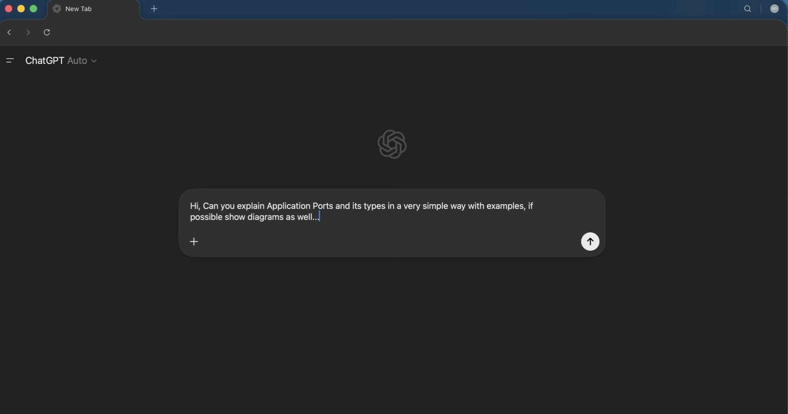
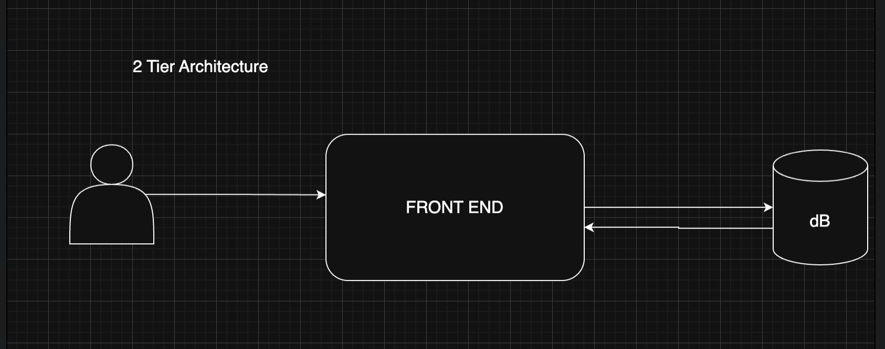
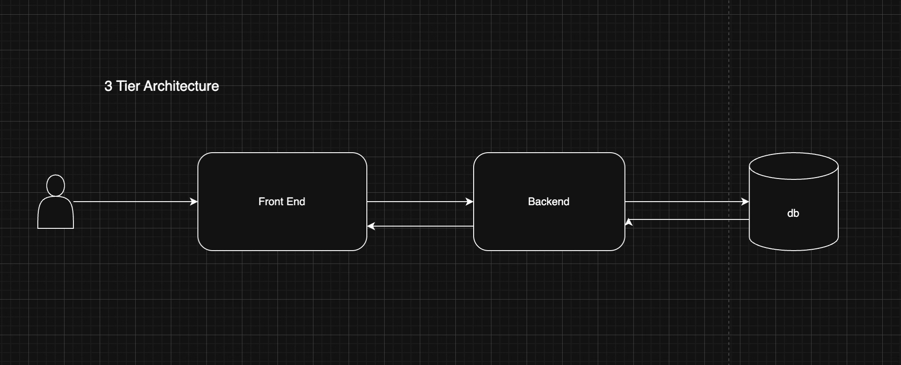
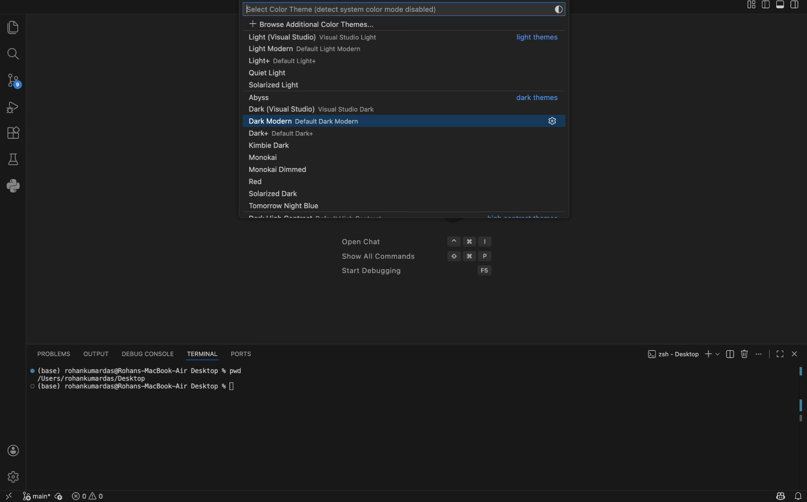

# Week 00 - Internet and Networking

Part of the DevOps Micro Internship (DMI) Cohort 3 with Agentic AI

---

# 🧑‍💻 Task 1: Using ChatGPT as Your Learning Assistant

## Scenario

You're new to DevOps and will frequently encounter technical questions. ChatGPT can be your learning companion.

## Your Task

Write a clear ChatGPT prompt to help you understand:

> "What is a protocol in networking? Explain with a simple real-life example."

Take a screenshot of your interaction showing:

* Your detailed prompt (with clear expectations)
* ChatGPT's simplified response with an example

## Screenshot




---

## What I Learned (2–3 lines)

Through this task I got to know how apps like chatgpt, gemini, claude could be so beneficial for our learning journey. 
For example, in this case , it has explained the concept of Application port so well using real world examples. 
It categorised the ports in 3 segments: Well known ports(HTTP,HTTPS,SSH), Registered Port(MySQL,PostgreSQL) and ephemeral ports.


---

# 🌐 Task 2: Internet and Networking

## Scenario

Your friend is launching an online bookstore named **EpicReads**.

He asked you to explain how users globally can access his website hosted in Finland.

## Your Task

Write a short explanation (**100–150 words**) that includes:

* Packet Switching
* IP Address
* TCP/IP
* HTTP/HTTPS

💡 **Tip:** You may use ChatGPT (as demonstrated in Task 1) to refine your explanation.

## Answer

To deliver a website (Epic Reads) from a server in Finland to a global user, the data follows a precise relay system:
Packet Switching: Website data is broken into small "packets" that travel independently across the fastest global routes. This ensures efficient delivery and prevents network congestion.
IP Address: Every device has a unique IP address, acting like a digital home address. This ensures data from Finland reaches the specific requesting device accurately.
TCP/IP(Transamission Control Protocol/Internet Protocol): This protocol suite governs the journey. TCP ensures all packets arrive error-free and in the correct order, while IP handles the routing to the destination.
HTTP/HTTPS: These are the rules for web communication. HTTP allows browsers to request content, while HTTPS adds encryption, ensuring that all data exchanged between the user and the server remains private and secure.
This combined architecture ensures the website loads quickly and safely, regardless of physical distance. 


---

# 🏗️ Task 3: Application Architecture & Stack

## Scenario

EpicReads bookstore has two application versions:

### Two-Tier Application

* Frontend
* Database

### Three-Tier Application

* Frontend
* Backend
* Database

## Your Task

* Draw simple diagrams (hand-drawn or tool-based such as draw.io)
* Label each layer clearly
* List at least two common technologies or tools used for each layer
* Submit a screenshot or photo clearly showing your own drawing

## Diagram Screenshot / Photo





---

## Technologies Used

### Frontend

* HTML, CSS, JS, Next.js


### Backend

* Node.js, Express.js


### Database

* MySQL

---

# 🌍 Task 4: Domain Name & DNS (Basic Concepts)

## Scenario

Your friend's bookstore **EpicReads** is currently accessible through:

```text
52.172.142.222:3000
```

He purchased the domain:

```text
epicreads.com
```

## Your Task

In **50–100 words**, explain in your own words:

1. What is DNS (Domain Name System)?
2. Which DNS record type should be used to connect the domain to the given IP, and why?

## Answer

1) Computers communicate via numerical IP addresses, however as human we are more adaptable to letters, words and names so instead of memorising and sharing addresses as IP address we purchase domain from registrars. DNS is like a phonebook which translates the human friendly names to their specific IP addresses.

2) Epic Reads is currently accessible via IP 52.172.142.222:3000.
52.172.142.222 is an IPV4 address.To connect the domain to the bookstore's IP, you should use an A Record (Address Record). This record type is specifically designed to map a domain name directly to an IPv4 address. By configuring this, any browser requesting the domain will be pointed to 52.172.142.222, allowing the website to load seamlessly for the user. 
By default all browsers consider port 80 as the default port for any web app. But here you specifically assigned port 3000.
So you may have to enter epicreads.com:3000 to load the website.


---

# 💻 Task 5: Visual Studio Code Setup (Hands-on)

## Your Task

Install Visual Studio Code (if not already installed).

Take a screenshot of your VS Code environment showing:

* Terminal open inside VS Code
* Running a basic command:

### Windows

```powershell
dir
```

### Linux / macOS

```bash
pwd
ls
```

* Your selected VS Code theme clearly visible


## Screenshot





---

# 🔗 Task 6: Publish Your Assignment as a LinkedIn Post

## Objective

Publishing on LinkedIn helps you:

* Build your professional online presence
* Reinforce your learning
* Document your DevOps journey publicly

## Your Task

Summarize your answers from Tasks 1–5 into a LinkedIn post.

Clearly structure your post into the following sections:

* ChatGPT
* Internet & Networking
* App Architecture
* DNS
* VS Code Setup

Add the following credit note at the end of your post:

> **P.S. This post is part of the DevOps Micro Internship (DMI) with Agentic AI — Cohort 3 — by Pravin Mishra. My graded progress is public: https://dmi.pravinmishra.com/s/YOUR-GITHUB-USERNAME.html · Start your DevOps journey: https://dmi.pravinmishra.com/?utm_source=student&utm_medium=ps-linkedin&utm_campaign=cohort3**

---

## LinkedIn Post URL

Paste your LinkedIn post URL here:

```
https://www.linkedin.com/posts/rohan-kumar-das-77aa771b3_devops-networking-softwarearchitecture-share-7459480018029826048-ZGV4?utm_source=share&utm_medium=member_desktop&rcm=ACoAADHQUo4BewhkN5s9P9q2BaWnpLFrMLZVnWM

```

---

## LinkedIn Post Backup Copy

Paste the full text of your LinkedIn post here:

🚀 DEVOPS JOURNEY: WEEK 0 COMPLETE 🎯

I’m excited to share that I’ve officially kicked off my DevOps Learning journey by completing Week 0 of the DevOps Micro-Internship Cohort! 💻☁️

Before diving into automation, CI/CD pipelines, and cloud infrastructure, I focused on building a rock-solid understanding of the fundamentals that power the modern web. 🌐

🔹 INTERNET & NETWORKING
Explored the first principles of how data moves across the internet through Packet Switching and the TCP/IP suite. Understanding how data travels globally is crucial for diagnosing and troubleshooting real-world infrastructure and connectivity issues. 📡

🔹 APPLICATION ARCHITECTURE
Learned the evolution of system design by comparing Monolithic, 2-Tier, and 3-Tier Architectures. Understanding the separation of presentation, business logic, and data layers is a key step toward building scalable and production-ready systems. 🏗️

🔹 DNS (DOMAIN NAME SYSTEM)
Dove into how DNS acts as the 📖 “phonebook of the internet” by translating human-readable domain names into IP addresses. This concept plays a massive role in high availability, traffic routing, and global load balancing. 🌍⚡

🔹 VS CODE OPTIMIZATION
Optimized my development environment by configuring VS Code, useful extensions, and terminal settings for a smoother and more productive workflow. 🛠️✨

🎯 FUTURE OUTLOOK
This is just the beginning! Building strong fundamentals is the first step toward becoming a skilled DevOps Engineer. 

🙌 Special thanks to Pravin Mishra for leading this FREE DevOps Micro-Internship Cohort and creating such valuable learning content.

P.S. This post is part of the FREE DevOps Micro Internship Cohort run by Pravin Mishra. You can start your DevOps journey for free from his YouTube Playlist.

#DevOps #Networking #SoftwareArchitecture #CloudComputing #Linux #Git #ContinuousLearning #TechCommunity #SystemDesign #DevOpsJourney

---

# Reflection – Week 0

### What did you find easy?

Task3: Application Architecture and Stack

---

### What was difficult?

Task2: Internet and Networking

---

### What will you improve next week?

Writing Blogs Consistently and in a very simple and articulate the findings so well that every person could understand.

---

## 📌 About DMI & CloudAdvisory

DevOps Micro Internship (DMI) is a project-based DevOps program run by Pravin Mishra (The CloudAdvisory) focused on real-world execution, systems thinking, and career readiness.

It helps learners build strong DevOps foundations with hands-on experience.


## 📌 Resources

- 🌐 **DMI Official Website:** https://pravinmishra.com/dmi  
- 🎓 **DevOps for Beginners (Udemy):** https://www.udemy.com/course/devops-for-beginners-docker-k8s-cloud-cicd-4-projects/  
- 🎓 **Ultimate Agentic AI DevOps with Clude Code** https://www.udemy.com/course/ultimate-agentic-ai-devops-with-claude-code/?referralCode=448389767BC96284087B
- 🎓 **DevOps with Claude Code: Terraform, EKS, ArgoCD & Helm** https://www.udemy.com/course/devops-with-claude-code-terraform-eks-argocd-helm/?referralCode=1C5B734505D65A010FA3
- ▶️ **YouTube Playlist (DMI Cohort 3):** https://www.youtube.com/playlist?list=PLFeSNDtI4Cho  
- 🔗 **Pravin Mishra (LinkedIn):** https://www.linkedin.com/in/pravin-mishra-aws-trainer/  
- 🏢 **CloudAdvisory (LinkedIn):** https://www.linkedin.com/company/thecloudadvisory/

---

*This submission is part of DevOps Micro Internship (DMI) Cohort 3 — Agentic AI Track*