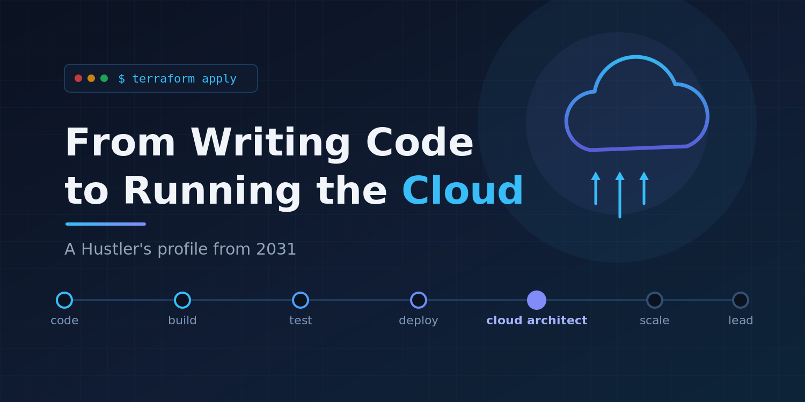
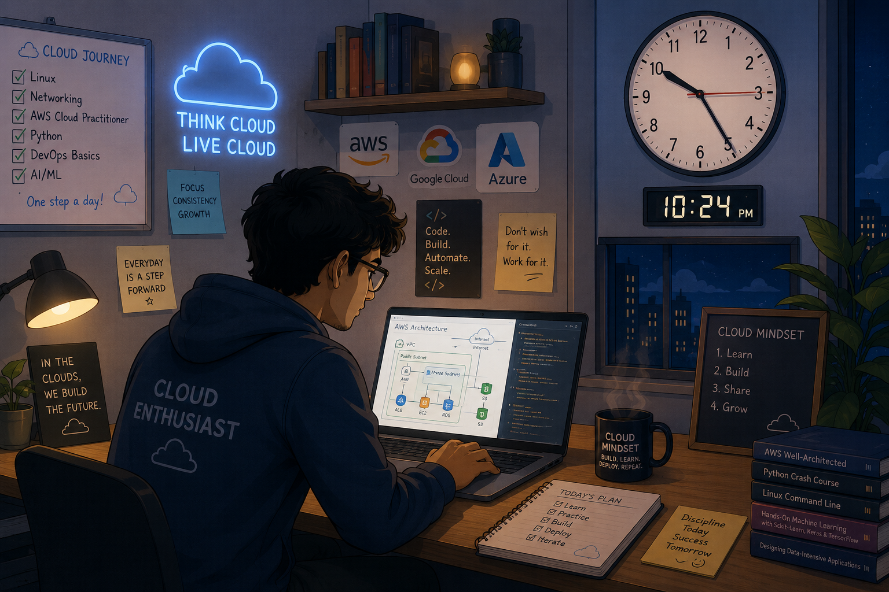

# Week 01 — Success Mindset (Mindset OS)

Part of the DevOps Micro Internship (DMI) Cohort 3 with Agentic AI

---

## Purpose (Read This First)

This week is not motivation homework.

This is you building your **Mindset OS** — the system you will use for the next 5 months (and honestly, for years).

### Expectations

* Be honest.
* Be specific.
* Be practical.
* Write like an adult professional: clear sentences, no one-liners.

You will reuse this in later weeks. So do it properly once.

---

# Assignment 1. What is something you believe to be true that most people around you would disagree with?

## Answer

To excel or to be successful in any domain, one thing which matters the most is interest. If something is not interesting to someone its very unlikely that person may get success.. 
Curiosity open doors for innovation and leads to a purposeful life. Every field in this world is trying to solve a problem. We shall be curious and interested to what we learn, if we aren’t curious, intersted and  just doing it just for the sake like someone told them this will bring them success it very hard to say that chances are very less. I feel this is something most people may disagree with. Most people in early days when ai was evolving was reluctant and commented that AI is bubble, will sink in few days and will not be able to code as humans, but we all know how ai evolved enormously in few years. Being reluctant and not being quickly  adaptable is the serious issue this generation is facing…
If you aren't happy inside, you may not be happy outside. If you are happy in home, you may outperform in office, if you arent happy somewhere, that synergizes to other places definitely.

---

# Assignment 2. What are the top 3 objective truths you discovered through experimentation and results?

### Definition

Objective truths do not depend on opinions. They hold true regardless of how people feel.

## Truth #1

### Truth
Consistency is the mother of skill. 

### Evidence from my life 

I tried to complete AWS Cloud Practioner for a long time, but without consistency I had to start fresh.. I committed 1 month straight and was able to get certified.

## Truth #2

### Truth

Being Calm during tensed situation is key

### Evidence from my life

Whenever I lost something I dont get crazy.. I observe, try to remember where it might have been left of, And take decision calmy and proceed step by step without rushing.

---

## Truth #3

### Truth

Dont Commit under pressure just to be someone's favourite.

### Evidence from my life

I used to accept multiple challenges parallely. That's a great mistake, multi-tasking doesnt work always efficiently. And later I felt even if I would have started just with one task standalone, that might get solved very quickly. Leaving me frustrated and questioning my self belief.

---

# Assignment 3. What does your 2.0 version look like?

### Instructions

Write as if a journalist is writing about you **3 to 7 years from now** (not 20 years).

**Minimum 300 words.**

### Rules

* Write in past tense, like it already happened.
* Don't use "likes to / wants to / hopes to."
* Use specifics:

  * built
  * shipped
  * led
  * published
  * earned
  * relocated
  * contributed
* Include skills proof:

  * projects
  * portfolios
  * GitHub
  * blogs
  * certifications
  * job role
  * leadership
  * community contribution
* Add 1–3 images if you can (optional but powerful).

### Publish It Publicly On Any ONE

* LinkedIn
* Medium
* WordPress
* Blogspot
* Personal blog
* Portfolio page

Include this line:

> **P.S. This post is a part of DevOps Micro Internship with Agentic AI Cohort-3 by [Pravin Mishra](https://www.linkedin.com/in/pravin-mishra-aws-trainer/). You can start your DevOps journey by joining this [Discord community](https://discord.pravinmishra.com/) ( https://discord.pravinmishra.com/ ).**

## Your Article

## From Writing Code to Running the Cloud: How Rohan Kumar Das Became the Architect Behind the Infrastructure

Five years ago, Rohan Kumar Das was a developer shipping application code and quietly wondering why deployments still broke on Friday evenings. Today, he is the Cloud Architect other engineers call when a platform needs to scale — and the reason his company’s deployments haven’t broken in two years.

His pivot started in 2026, when he graduated from DMI Cohort 3 by Pravin Mishra — the program that gave his transition structure and direction. While still working as a developer, he went on to earn the AWS Solutions Architect Associate certification, and within a year had stacked the Certified Kubernetes Administrator (CKA) and HashiCorp Terraform Associate credentials on top of it, and moved into his first cloud engineering role. He later completed the AWS Solutions Architect Professional, the certification he called “the one that changed how I think, not just what I know.” Alongside the certifications, he worked through foundational books cover to cover — Designing Data-Intensive Applications and Computer Networking: A Top-Down Approach — building the systems and networking depth that separated him from engineers who only knew the tooling.

The proof, though, was never the paper. It was the work. He led the migration of his company’s legacy monolith to a containerized microservices platform on EKS, cutting infrastructure costs by 40% and reducing deployment time from hours to minutes. He designed the CI/CD pipelines that took his team from weekly releases to shipping multiple times a day.

Along the way, he published a technical blog, Pipelines & Postmortems, where his write-ups on Kubernetes failure scenarios and cost-optimization patterns drew a steady readership of engineers facing the same problems he once did. He spoke at two regional DevOps meetups and mentored three junior developers through the same developer-to-cloud transition he made himself — one of whom now runs infrastructure at a fintech startup.

By 2031, Rohan led a platform engineering team of six, owning cloud architecture across three product lines. Asked what made the switch work, his answer was characteristically practical: “I stopped waiting to feel ready. I got certified, built things in public, and let the work speak.”

The work spoke. Loudly.

**P.S. This post is a part of DevOps Micro Internship with Agentic AI Cohort-3 by [Pravin Mishra](https://www.linkedin.com/in/pravin-mishra-aws-trainer/). You can start your DevOps journey by joining this [Discord community](https://discord.pravinmishra.com/) ( https://discord.pravinmishra.com/ ).**

### Public Link

**[Medium](https://medium.com/@rd43403/from-writing-code-to-running-the-cloud-how-rohan-kumar-das-became-the-architect-behind-the-7b49305a5780?sharedUserId=rd43403) **

---

# Assignment 4. Have you ever cut corners (unethical / dishonest / shortcut behavior — not necessarily illegal)? If yes, how did it make you feel?

### Important

You don't need to write the full story.

Focus on the feeling:

* guilt
* fear
* shame
* stress
* regret
* numbness
* etc.

This is about self-awareness, not judgment.

### Answer Format

**Yes / No**

If Yes: Shame, Regret

**What emotion did you feel?** (minimum 50–100 words)

## Answer

Its difficult to remember when we did anything like that, because as humans naturally have a perception we are the victims and the world is wrong with them..

But still if i need to recognize that would be during my college days.. College is a place where we are independent to have our thoughts, experiment, explore, and learn.

One thing which still today I feel is like I experimented less and listened to my fellow friends and always accepted and sabotaged my self belief. So anything planned during those days were never completed or you may say i withdrew very early.

Very less commited plans were fulfilled and always delayed the process until the last minute. 

It really gave me feeling of shame, regret later for many years...

---

# Assignment 5. What are 10 non-fiction books you plan to read in the next 1 year?

### Rules

* Mention **Title + Author**
* Any language allowed
* No fiction novels

### Tip

Choose books that improve:

* mindset
* communication
* productivity
* health
* money
* career
* leadership

## Book List
1. Wings of Fire - **APJ Abdul Kalam**
2. Steve Jobs - **Walter Issacson**
3. Hello World: How to be Human in the Age of the Machine - **Hannah Fry**
4. Four Thousand Weeks: Time Management for Mortals - **Oliver Burkeman**
5. Why your Strategy Sucks - **Sandeep Das**
6. How Business Storytelling Works: Increase Your Influence and Impact - **Sandeep Das**
7. The Upstarts - **Brad Stone**
8. The Everything Store: Jeff Bezos and the Age of Amazon - **Brad Stone**
9. Ikigai: The Japanese Secret to a Long and Happy Life - **Francesc Miralles and Hector Garcia**
10. India 2020: A Vision for the New Millennium  **A. P. J. Abdul Kalam and Yagnaswami Sundara Rajan**

---

# Assignment 6. What are the things you will measure regularly in your life and career?

### Rules

List topics only. No need to share numbers.

### Must Include

* Learning / skill
* Output / proof
* Health / energy
* Time / focus
* Money / finance (personal or business)

### Example

* Learning hours per week
* Deep work sessions per week
* Projects shipped / documented
* Steps / workouts
* Sleep hours
* Spending tracker

## My Metrics

* Learning Hours Record Per Day and Review Per Month
* Projects Shipped/built
* Reading books hour Per Week
* Spending Tracker
* Measuring Sleep Hour consistency
* Measuring Meditation minutes

---

# Assignment 7. Brain Dump + 5-Month System Plan

## Step 1: Brain Dump (Private)

Do a brain dump of everything in your mind into a notebook.

Examples:

* Bills
* Tasks
* Worries
* Goals
* Pending messages
* Ideas
* Responsibilities

### Did You Do It?

**Yes / No**

Answer: No

Sometimes when I am too stressed or get overwhelm. I write it on my notebook. But I will keep a note of everything from now onwards and I will do so in a notepad in my Laptop..

---

## Step 2: Your 5-Month Routine + Focus Blocks

Create a simple plan you can realistically follow for the next 5 months.

### Weekly Routine

Example:

* Mon–Thu: 60 min deep work
* Sat: DMI session
* Sun: Weekly review

#### My Weekly Routine

* Mon - Fri : 3 hour deep work
* Sat - DMI Session
* Sun - Weekly review, 3 hour deep work.

---

### Focus Blocks

#### When Will You Do DMI Work? (Days + Time)

* Mon - Fri : Morning 7.30 AM to 10:30 AM, Evening: 9.30PM to 10.30PM
* Sun :  Morning 10.30 AM to 1.30PM

#### How Many Sessions Per Week?

* Morning : 5 sessions (Mandatory), Evening Session: Mainly for Review and Recall and next day planning.

---

### Distraction Rules

Examples:

* Phone rules
* Social media rules
* Environment setup

#### My Distraction Rules

* Phone on Silent mode or in another room strictly during sessions.

* Social Media usage only during my travel hours to and from office only not every day only when time permits.. No social media usage during DMI Sessions.

* Library visit to concentrate on deep work session for long hours.

---

# Reflection – Week 1

### Biggest insight I got about myself this week

I used to deep dive and chase perfection on every topic. 
But as DMI session started with the quote: "Concentrate on Completion not on Perfection" I need to keep this on my mind.

### My biggest weakness/loop I noticed

Time Management is a weakness. I dont waste time less on leisure and fun but still I lose track of my time.

Always late or delayed. Time Management is the biggest weakness as of now.

### One system I will implement from this week (exact habit + time)

Respect Time and Do activity as per planning and not getting lazy easily.

### LinkedIn Post

Week 1 of DMI Cohort 3 with Pravin Mishra — and I'm already rethinking how I work. 💡

The very first session opened with a line that hit me hard:

"Concentrate on Completion, not on Perfection."

I've always been the person who deep-dives into every topic, chasing perfection before moving forward. It feels productive, but the truth is — it slows me down. This week made me realize that finishing matters more than polishing endlessly.

The second, more uncomfortable insight? Time management is my biggest weakness right now. I don't waste much time on leisure, yet I still lose track of it — always running late, always delayed. Recognizing the loop is the first step to breaking it.

So here's the system I'm committing to from this week:
✅ Respect time — treat my schedule as a promise, not a suggestion
✅ Execute as per plan, not as per mood
✅ Ship it, then improve it — completion over perfection

Week 1 down. Excited (and a little nervous) for what's ahead.

Thank you Pravin Mishra Sir and the DMI community for setting the tone. 🙏

hashtag#DMI hashtag#Cohort3 hashtag#Learning hashtag#GrowthMindset hashtag#TimeManagement hashtag#WeekOneReflection

---

## 10. Proof of Work

- LinkedIn Post URL: **[Linked In Post](https://www.linkedin.com/posts/rohan-kumar-das-77aa771b3_dmi-cohort3-learning-share-7478300189817069568-IJ1o/?utm_source=share&utm_medium=member_desktop&rcm=ACoAADHQUo4BewhkN5s9P9q2BaWnpLFrMLZVnWM)**  
- Blog / Medium : **[MEDIUM](https://medium.com/@rd43403/from-writing-code-to-running-the-cloud-how-rohan-kumar-das-became-the-architect-behind-the-7b49305a5780?sharedUserId=rd43403)**  

---

## 📌 About DMI & CloudAdvisory

DevOps Micro Internship (DMI) is a project-based DevOps program run by Pravin Mishra (The CloudAdvisory) focused on real-world execution, systems thinking, and career readiness.

It helps learners build strong DevOps foundations with hands-on experience.

## 📌 Resources

- 🌐 **DMI Official Website:** https://pravinmishra.com/dmi  
- 🎓 **DevOps for Beginners (Udemy):** https://www.udemy.com/course/devops-for-beginners-docker-k8s-cloud-cicd-4-projects/  
- 🎓 **Ultimate Agentic AI DevOps with Clude Code** https://www.udemy.com/course/ultimate-agentic-ai-devops-with-claude-code/?referralCode=448389767BC96284087B
- 🎓 **DevOps with Claude Code: Terraform, EKS, ArgoCD & Helm** https://www.udemy.com/course/devops-with-claude-code-terraform-eks-argocd-helm/?referralCode=1C5B734505D65A010FA3
- ▶️ **YouTube Playlist (DMI Cohort 3):** https://www.youtube.com/playlist?list=PLFeSNDtI4Cho  
- 🔗 **Pravin Mishra (LinkedIn):** https://www.linkedin.com/in/pravin-mishra-aws-trainer/  
- 🏢 **CloudAdvisory (LinkedIn):** https://www.linkedin.com/company/thecloudadvisory/

---

*This submission is part of DevOps Micro Internship (DMI) Cohort 3 — Agentic AI Track*