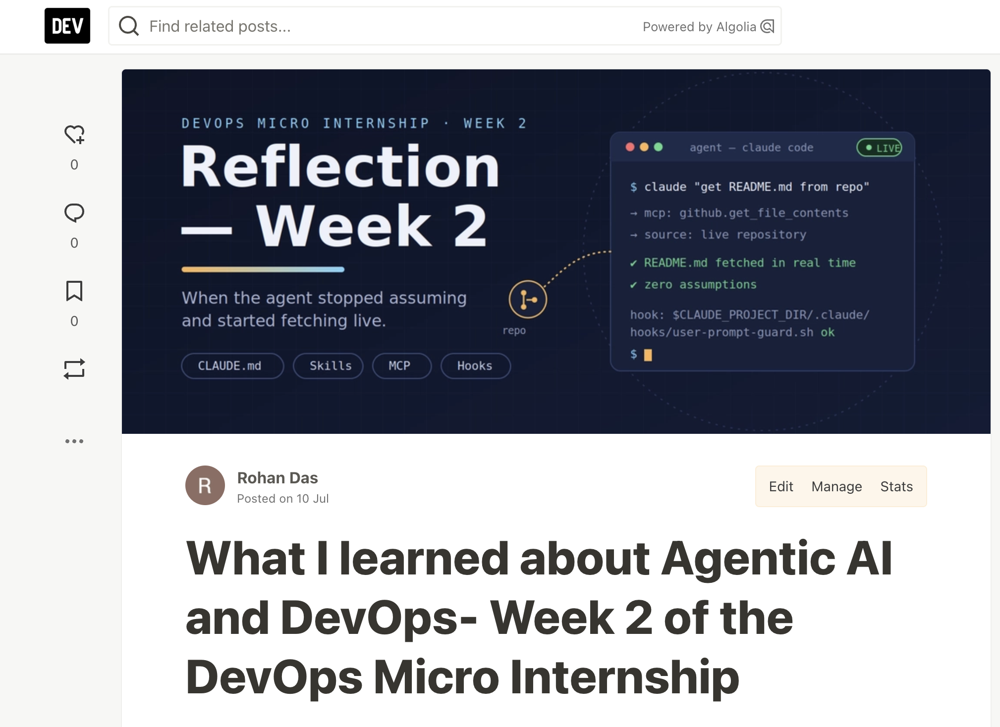
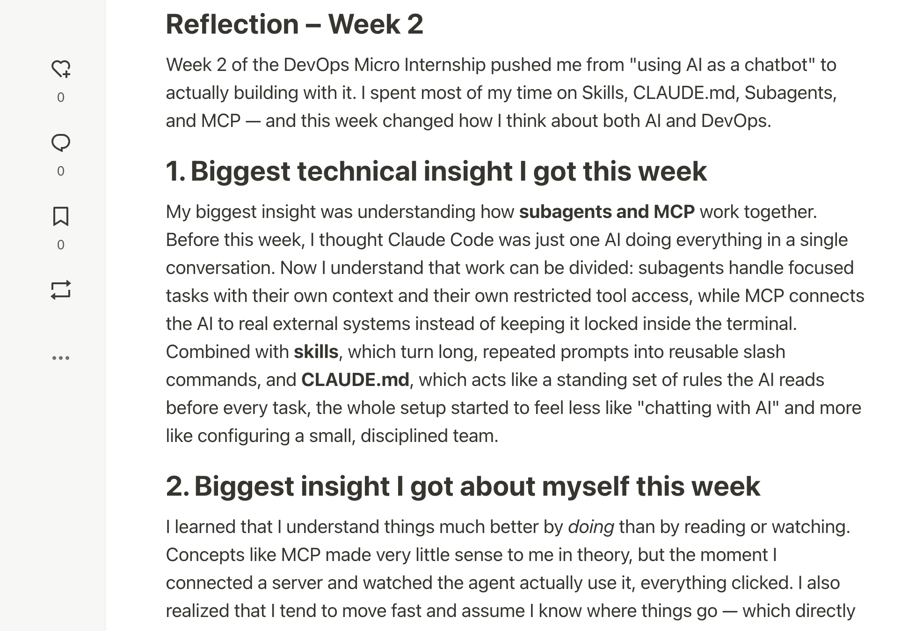
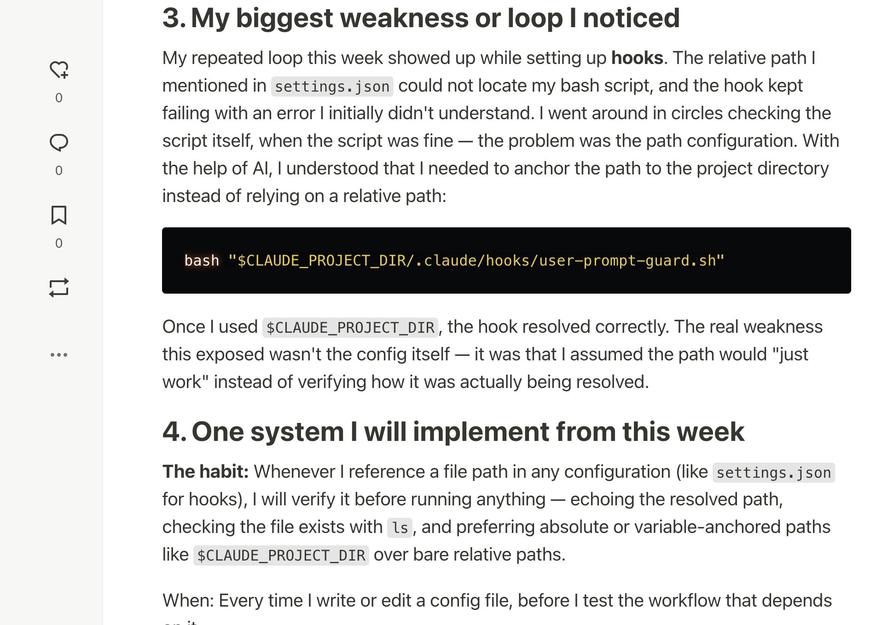
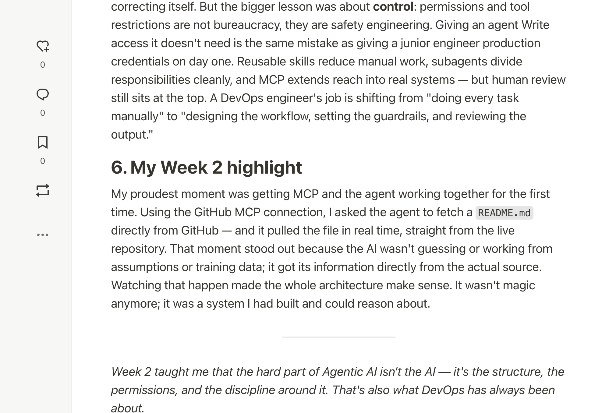
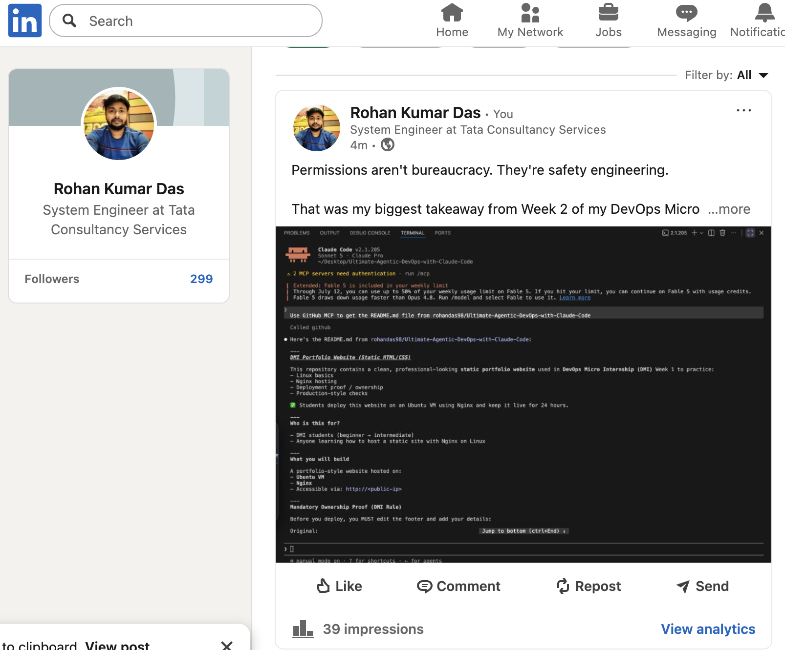

# Assignment 8 — Week 2 Reflection Blog

Part of the DevOps Micro Internship (DMI) Cohort 3 with Agentic AI

---

# Purpose

In this assignment, you will reflect on your Week 2 learning journey and write a short blog capturing your experience working with Agentic AI tools such as Claude Code, Skills, Subagents, MCP, Hooks, Permissions, and Memory.

You will also publish a LinkedIn post summarizing your learning and share both links for evaluation.

---

# Task 1 — Write Your Reflection Blog

## Goal

Write a reflection blog covering your Week 2 learning experience.

### Blog Requirements

Your blog must include:

* Title: **Reflection – Week 2**
* Minimum 300 words
* At least 2–3 topics from Week 2 (Claude Code, Skills, Subagents, MCP, Hooks, Permissions, Memory)
* Honest personal reflection (learning, challenges, mindset)
* One habit/system you plan to implement
* Your full name clearly visible

### Allowed Platforms

You can publish your blog on:

* Hashnode
* Medium
* Dev.to
* LinkedIn Article
* GitHub Markdown file
* Substack

---

### Evidence

#### Screenshot 1 — Blog published and visible






---

### Submission Field

Blog Link:

<<<<<<< HEAD
**[!Dev.to](https://dev.to/rohan_das_32be6304bddb383/what-i-learned-about-agentic-ai-and-devops-week-2-of-the-devops-micro-internship-25pl)**
=======
`Add your URL here`
>>>>>>> upstream/main

---

# Task 2 — Create LinkedIn Post

## Goal

Permissions aren't bureaucracy. They're safety engineering.

That was my biggest takeaway from Week 2 of my DMI, working with Agentic AI and Claude Code.

I went in thinking AI = answering questions and generating snippets.

I came out understanding that Agentic AI can follow structured, multi-step workflows: plan → execute → verify → self-correct.

And with that power, control becomes the real skill:

• An agent with Write access it doesn't need = a junior engineer with prod credentials on day one
• Reusable skills cut manual work
• Subagents split responsibilities cleanly
• MCP connects the agent to real systems — I watched it pull a README.md live from GitHub, no assumptions
• And human review still sits at the top

The role of a DevOps engineer is shifting from doing every task manually to designing workflows, setting guardrails, and reviewing output.

That's not less engineering. It's a different kind of engineering.

Full Week 2 reflection on my blog — link in the comments.

#DevOps #AgenticAI #ClaudeCode #MCP #Automation #LearningInPublic

---

### LinkedIn Post Requirements

Your post must include:

* One screenshot from any Week 2 assignment
* Short reflection (what you learned or built)
* Required P.S. line exactly as given below

---

### Required P.S. Line (Must Include Exactly)

> **P.S. This post is part of the DevOps Micro Internship (DMI) with Agentic AI — Cohort 3 — by [Pravin Mishra](https://www.linkedin.com/in/pravin-mishra-aws-trainer/). My graded progress is public: https://dmi.pravinmishra.com/s/YOUR-GITHUB-USERNAME.html · Start your DevOps journey: https://dmi.pravinmishra.com/?utm_source=student&utm_medium=ps-linkedin&utm_campaign=cohort3**

---

### Suggested Hashtags

#DMIByPravinMishra #AgenticAI #ClaudeCode #DevOps #LearningInPublic

---

### Evidence

#### Screenshot 2 — LinkedIn post published



---

### Submission Field

LinkedIn Post Content (copy-paste here):

```
Permissions aren't bureaucracy. They're safety engineering.

That was my biggest takeaway from Week 2 of my DevOps Micro Internship, working with Agentic AI and Claude Code.

I went in thinking AI = answering questions and generating snippets.

I came out understanding that Agentic AI can follow structured, multi-step workflows: plan → execute → verify → self-correct.

And with that power, control becomes the real skill:

• An agent with Write access it doesn't need = a junior engineer with prod credentials on day one
• Reusable skills cut manual work
• Subagents split responsibilities cleanly
• MCP connects the agent to real systems — I watched it pull a README.md live from GitHub, no assumptions
• And human review still sits at the top

The role of a DevOps engineer is shifting from doing every task manually to designing workflows, setting guardrails, and reviewing output.

That's not less engineering. It's a different kind of engineering.

My highest regards to Anjana Muthunayake & Ranbir Kaur for the support..
```

---

### LinkedIn Post Link:

<<<<<<< HEAD
**[Linked In Post](https://www.linkedin.com/posts/rohan-kumar-das-77aa771b3_devops-agenticai-claudecode-share-7481370066769522688-GPRO/?utm_source=share&utm_medium=member_desktop&rcm=ACoAADHQUo4BewhkN5s9P9q2BaWnpLFrMLZVnWM)**
=======
`Add your URL here`
>>>>>>> upstream/main

---

# Submission Instructions

* Blog must be publicly accessible
* LinkedIn post must be visible (public or unlisted where applicable)
* All required fields must be filled
* Screenshot proofs must be added to GitHub repository
* Do not include sensitive information in blog or post

---

# Completion Checklist

* [✅] Blog written with required structure
* [✅] Blog includes at least 2–3 Week 2 topics
* [✅] Blog is publicly accessible
* [✅] LinkedIn post created
* [✅] Required P.S. line included
* [✅] LinkedIn post content copied in submission field
* [✅] Blog link added
* [✅] LinkedIn post link added
* [✅] Screenshots added to GitHub repo

---

# About DMI & CloudAdvisory

DevOps Micro Internship (DMI) is a project-based DevOps program run by Pravin Mishra (The CloudAdvisory), focused on real-world execution, systems thinking, and agentic AI workflows.

It helps learners build strong DevOps foundations through hands-on experience.

---

# Resources

* 🌐 DMI Official Website: [https://pravinmishra.com/dmi](https://pravinmishra.com/dmi)
* 🎓 DevOps for Beginners (Udemy): [https://www.udemy.com/course/devops-for-beginners-docker-k8s-cloud-cicd-4-projects/](https://www.udemy.com/course/devops-for-beginners-docker-k8s-cloud-cicd-4-projects/)
* 🎓 Agentic AI DevOps with Claude Code: [https://www.udemy.com/course/ultimate-agentic-ai-devops-with-claude-code/](https://www.udemy.com/course/ultimate-agentic-ai-devops-with-claude-code/)
* 🎓 DevOps with Claude Code: Terraform, EKS, ArgoCD & Helm: [https://www.udemy.com/course/devops-with-claude-code-terraform-eks-argocd-helm/](https://www.udemy.com/course/devops-with-claude-code-terraform-eks-argocd-helm/)
* ▶️ YouTube Playlist: [https://www.youtube.com/playlist?list=PLFeSNDtI4Cho](https://www.youtube.com/playlist?list=PLFeSNDtI4Cho)
* 🔗 Pravin Mishra (LinkedIn): [https://www.linkedin.com/in/pravin-mishra-aws-trainer/](https://www.linkedin.com/in/pravin-mishra-aws-trainer/)
* 🏢 CloudAdvisory (LinkedIn): [https://www.linkedin.com/company/thecloudadvisory/](https://www.linkedin.com/company/thecloudadvisory/)

