# Assignment 3 — Production Maintenance Drill (OPS Checklist)

Part of the DevOps Micro Internship (DMI) Cohort 3 with Agentic AI

---

## Purpose

In this assignment, you will treat your already deployed React application (on Ubuntu VM with Nginx) as a live production system. You will perform structured operational checks covering network validation, service health, log analysis, resource monitoring, configuration verification, and incident simulation with recovery — mirroring real on-call DevOps responsibilities.

---

# Task 1 — Server Access & Networking Validation

## Goal

Verify that the deployed React application is reachable from the browser and confirm basic network connectivity of the Ubuntu VM.

### Evidence

#### Screenshot 1 — Browser showing the React app with your Full Name visible on the UI

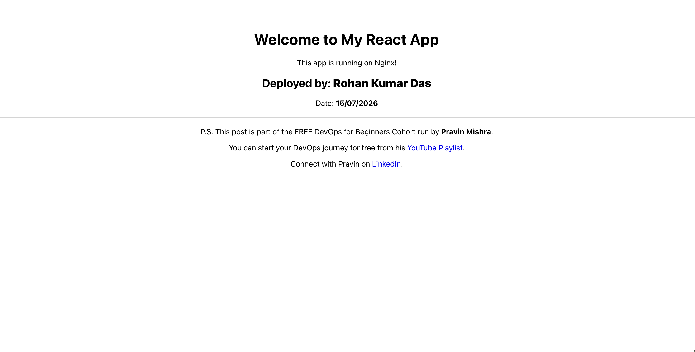

---

#### Screenshot 2 — Output of `ip a`

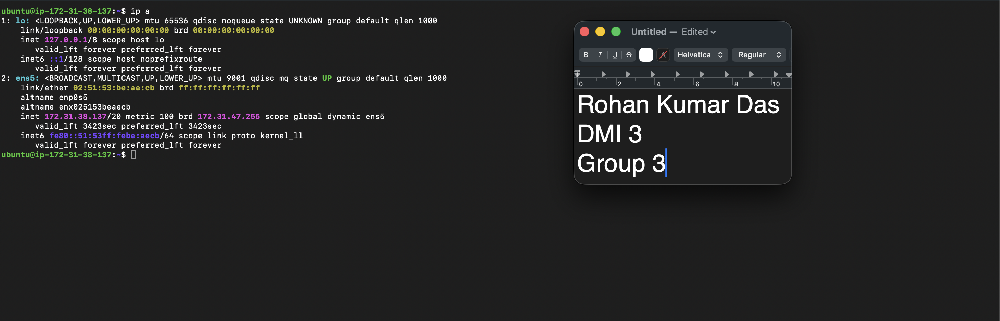

---

#### Screenshot 3 — Output of `sudo ss -tulpen`

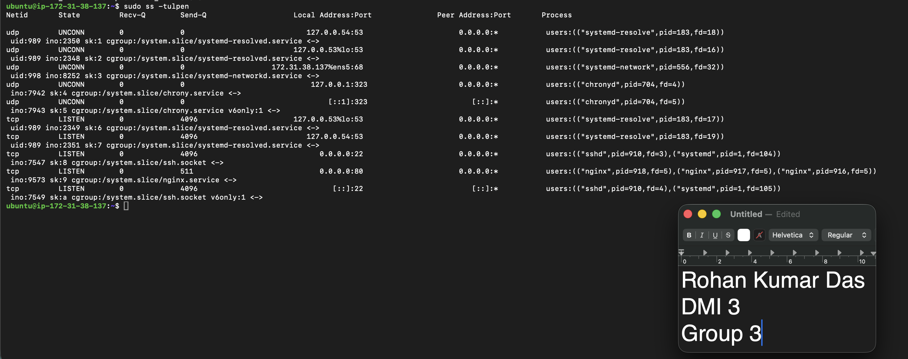

---

#### Screenshot 4 — Output of `sudo ufw status`

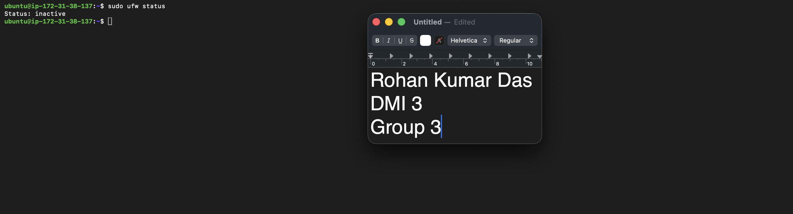

---

### Notes

Answer the following in your own words:

**1. What proves Nginx is listening on 0.0.0.0:80?**

To verify this, I used the command sudo ss -tulpen, which lists all TCP and UDP sockets that are in listening state, along with the process that owns each socket.

In the output, I found this line:
tcp   LISTEN   0   511   0.0.0.0:80   0.0.0.0:*   users:(("nginx",pid=918),("nginx",pid=917),("nginx",pid=916))

This proves Nginx is listening on 0.0.0.0:80 because:

The State is LISTEN, meaning the socket is actively waiting for incoming connections.
The Local Address:Port is 0.0.0.0:80, meaning it is bound to port 80 on all network interfaces of the server (not just localhost).
The Process column clearly shows nginx as the owner of the socket, with its master and worker process IDs.

So the same line of output confirms the port (80), the bind address (0.0.0.0 = all interfaces), and the process (nginx) together.

---

**2. What proves SSH is active on port 22?**

Using the same command, sudo ss -tulpen, I found these lines in the output:
tcp   LISTEN   0   4096   0.0.0.0:22   0.0.0.0:*   users:(("sshd",pid=910))
tcp   LISTEN   0   4096   [::]:22      [::]:*      users:(("sshd",pid=910))
This proves SSH is active on port 22 because:

The State is LISTEN, meaning the SSH service is up and waiting for connections.
The Local Address:Port shows 0.0.0.0:22 (all IPv4 interfaces) and [::]:22 (all IPv6 interfaces).
The Process column shows sshd (the SSH daemon) is the process bound to this port.

Additionally, the fact that I was connected to the server through an SSH session while running this command is itself practical proof that SSH is working on port 22.

---

**3. Did you find any unexpected open ports? Explain briefly.**

No, I did not find any unexpected open ports. I reviewed the full output of sudo ss -tulpen and every listening socket belongs to a known, legitimate service:

Port 22 (sshd) — expected, this is the SSH service I use to access the server.
Port 80 (nginx) — expected, this is the web server I installed intentionally.
Port 53 on 127.0.0.53 and 127.0.0.54 (systemd-resolved) — this is Ubuntu's built-in local DNS resolver. It is bound only to localhost, so it is not accessible from outside the server.
Port 68 (systemd-networkd) — this is the DHCP client, which keeps the server's IP address assigned. Normal system behavior.
Port 323 on 127.0.0.1 (chronyd) — this is the time synchronization service (NTP), also bound only to localhost.

The important check was that only ports 22 and 80 are exposed on 0.0.0.0 (all interfaces), and both were opened intentionally. All other listening ports are bound to 127.0.0.1/localhost, which means they cannot be reached from the network. So there are no unknown or suspicious services listening on this server.

---

# Task 2 — Service Health & Systemd Validation (Nginx)

## Goal

Verify that Nginx is properly installed, running, enabled at boot, and safely configured.

### Evidence

#### Screenshot 1 — Output of `systemctl status nginx --no-pager`

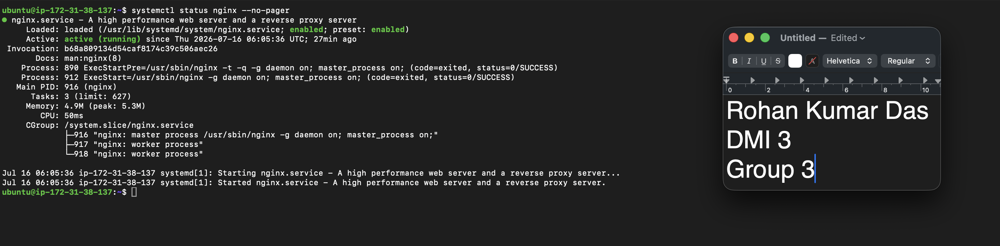

---

#### Screenshot 2 — Output of `sudo nginx -t`

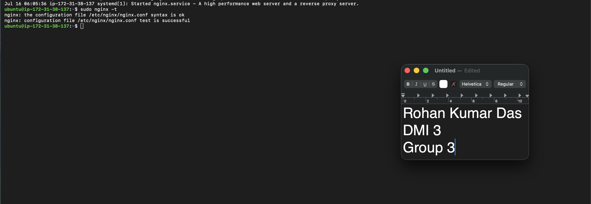

---

#### Screenshot 3 — Output of `sudo ss -lptn '( sport = :80 )'`

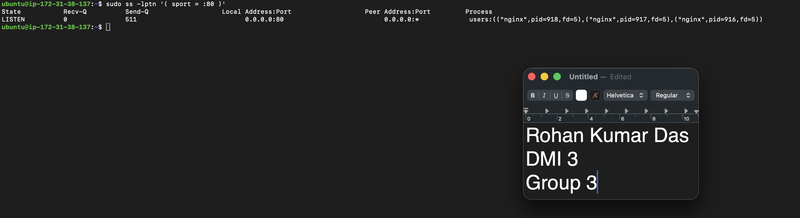

---

### Notes

Answer the following in your own words:

**1. What happens if Nginx fails to restart in production?**

If Nginx fails to restart in production, the web server stops serving traffic, which means the website or application becomes completely unreachable for all users — every request results in a connection error. This is a full outage, and it lasts until the problem is fixed.
This usually happens when a restart is attempted with a broken configuration file. The dangerous part is the difference between restart and reload: **sudo systemctl restart nginx** stops the old process first and then tries to start a new one — so if the new config is invalid, the old working process is already gone and nothing is left running. In contrast, **sudo systemctl reload nginx** keeps the old workers serving traffic and only applies the new config if it loads successfully.

 This is exactly why the safe practice is to always run sudo nginx -t to validate the configuration before restarting or reloading — it catches errors while the working server is still running.

---

**2. What's your basic rollback plan?**

My rollback plan is based on always keeping a known-good copy of the configuration before making any change:

1) Backup before editing: Before touching any config file, I make a copy, e.g. sudo cp /etc/nginx/nginx.conf /etc/nginx/nginx.conf.bak (or keep configs in git for proper version history).
2) Test before applying: After editing, I run sudo nginx -t. If the test fails, I fix or revert immediately — I never reload with a failing config.
3) Prefer reload over restart: I apply changes with sudo systemctl reload nginx, so the running server stays up even if something goes wrong.
4) If something still breaks: I restore the backup (sudo cp /etc/nginx/nginx.conf.bak /etc/nginx/nginx.conf), run sudo nginx -t again to confirm it's valid, then reload. This brings the service back to its last working state within seconds.
5) Verify recovery: I confirm the service is healthy with sudo systemctl status nginx, check it's listening with sudo ss -lptn '( sport = :80 )'

---

# Task 3 — Logs & Request Trace

## Goal

Verify real traffic flow and analyze logs to understand system behavior and errors.

### Evidence

#### Screenshot 1 — Output of `sudo tail -n 30 /var/log/nginx/access.log`

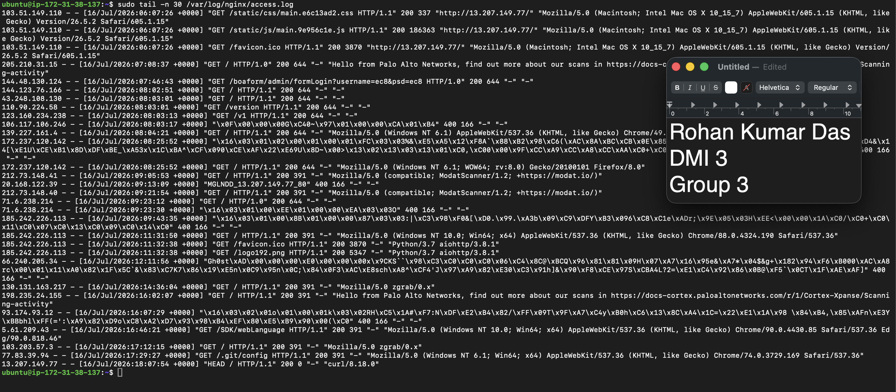

---

#### Screenshot 2 — Output of `sudo tail -n 30 /var/log/nginx/error.log`

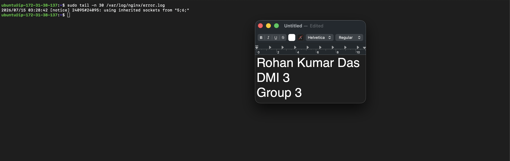

---

#### Screenshot 3 — Output of `sudo journalctl -u nginx --no-pager -n 50`

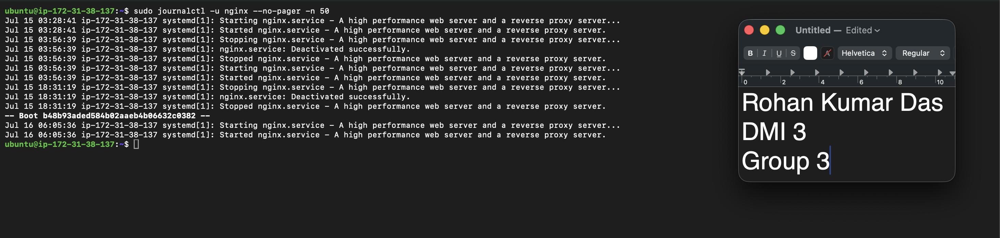

---

### Notes

Answer the following in your own words:

**1. Were there any errors in the logs?**

- If yes, mention 1–2 example error lines from the logs and explain what each one means in simple terms.
- If no, explain what it means if the error log is empty or shows no recent errors during your check.

**Answer**

No, there were no actual errors in the logs. I checked the last 30 lines of the Nginx error log using:

sudo tail -n 30 /var/log/nginx/error.log

The only entry present was:
2026/07/15 03:28:42 [notice] 24095#24095: using inherited sockets from "5;6;"

Although this line appears in the error log, it is not an error. The severity tag is [notice], which is only an informational message — Nginx writes all of its diagnostic messages to this file, and the tag tells you how serious each one is (notice/info are normal, while error, crit, and emerg indicate real problems).

---

**2. If there were no errors, what does that indicate about the system?**

This particular message actually indicates healthy behavior: it means a new Nginx process started and inherited the already-open listening sockets (like the one on port 80) from the previous process. In simple terms, when Nginx was restarted or reloaded, the new process took over the port directly from the old one without ever closing it — so there was no moment where the server was down, and no incoming connections were dropped. This is Nginx's normal zero-downtime handover mechanism.

The absence of any [error], [crit], or [emerg] entries during my check means that Nginx has been running cleanly: no failed requests due to missing files or permissions, no configuration problems, and no crashes. Combined with my earlier checks — sudo nginx -t passing, the service in LISTEN state on port 80 (ss), and successful responses from curl — an effectively clean error log confirms the web server is healthy and serving requests without issues.

---

**3. Based on the access logs, were your curl requests visible in the log entries? What does that prove about traffic flow?**

Yes, my curl request was clearly visible in the access log. I checked the log using:
sudo tail -n 30 /var/log/nginx/access.log

and found my request recorded as the most recent entry:
13.207.149.77 - - [16/Jul/2026:18:07:54 +0000] "HEAD / HTTP/1.1" 200 0 "-" "curl/8.18.0"

I could identify this entry as my own request from three details: the user agent field shows curl/8.18.0 (the tool I used), the method shows HEAD (because I ran curl -I, which requests headers only), and the response size is 0 bytes (a HEAD response sends headers with no body, unlike the GET requests in the log that show sizes like 644 bytes).

This proves the traffic flow works end to end. Since I ran curl against the server's public IP, the request travelled the full external path: from curl → to the EC2 public IP (13.207.149.77) → through the AWS security group allowing inbound port 80 → to Nginx listening on 0.0.0.0:80 → which processed it, returned 200 OK, and instantly recorded the transaction in the access log.
---

# Task 4 — System Resource Health Check (Capacity Red Flags)

## Goal

Assess server capacity and detect potential performance or failure risks.

### Evidence

#### Screenshot 1 — Output of `uptime`

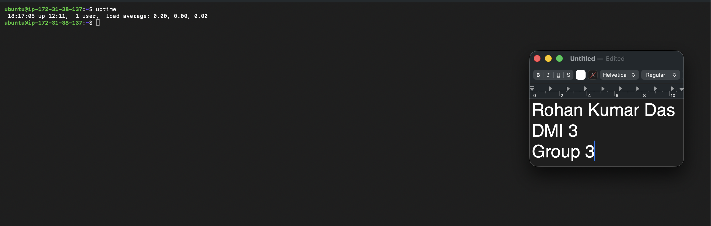

---

#### Screenshot 2 — Output of `free -h`

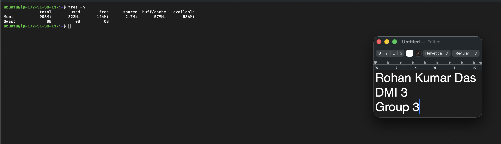

---

#### Screenshot 3 — Output of `df -h`

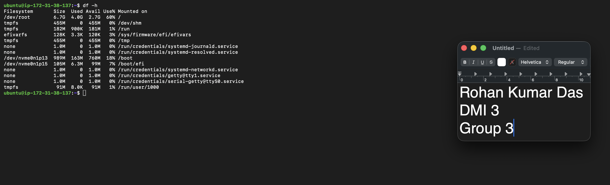

---

#### Screenshot 4 — Output of `sudo du -sh /var/* | sort -h`

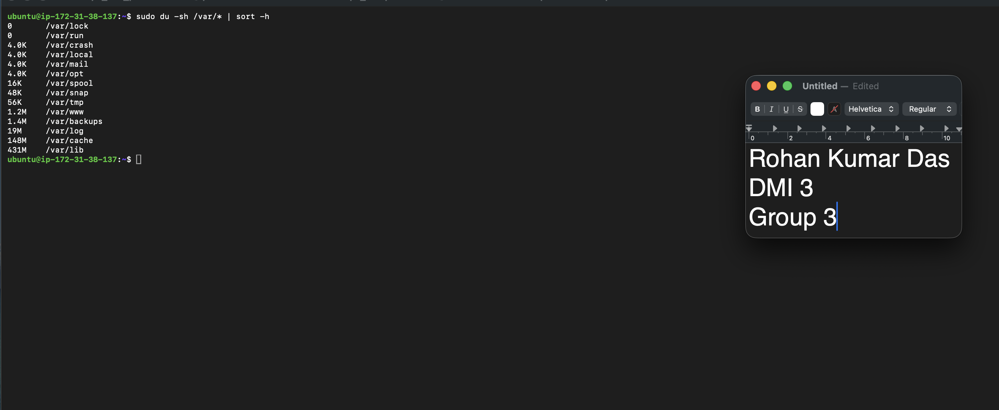

---

### Notes

Answer the following in your own words:

**1. Which resource looks most critical right now? (CPU/load, memory, or disk) Explain why.**
Based on my checks, disk looks the most critical of the three right now — though it's important to say upfront that nothing is in a dangerous state; disk simply has the least remaining headroom.

---

**2. What happens if disk becomes 100% full in a production server?**

When the disk reaches 100%, the server doesn't shut down — it enters a broken, unpredictable state where anything that needs to write to disk starts failing. This makes it one of the nastiest production problems, because the failures appear in many unrelated places at once:

1) Logging stops. Nginx can no longer write to access.log or error.log, and the systemd journal can't record events. This is doubly bad: services misbehave and the evidence trail goes dark at exactly the moment I'd need it for debugging.

2) Services fail to restart. A running Nginx might keep serving static files for a while (reads still work), but the moment it needs to restart or reload, it can fail — because starting a service involves writing PID files, temp files, and logs. So a "mostly working" server becomes unrecoverable the moment anyone touches it.

3) Applications break in strange ways. Anything that writes — file uploads, caches, databases, session storage — starts throwing errors. Databases are especially dangerous: a full disk during a write can corrupt data.

4) System operations fail. apt can't install or update packages, temporary files can't be created, and even simple commands that need temp space start failing. SSH login can sometimes fail too, since it writes session and log entries — potentially locking me out at the worst time.

5) The errors are misleading. The most confusing part is that nothing says "disk full" directly — I'd see "No space left on device" buried in logs (if logs even work), failed restarts, 500 errors, or crashing services. Without knowing this pattern, it's easy to waste time debugging the wrong thing.

---

# Task 5 — Configuration & Deployment Verification

## Goal

Ensure the correct React build is deployed and Nginx is serving it properly.

### Evidence

#### Screenshot 1 — Output of `ls -lah /var/www/html | head -n 20`

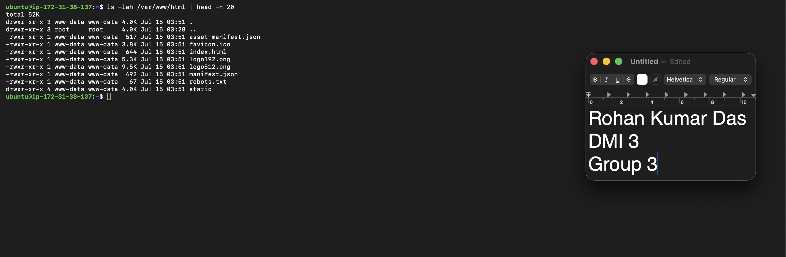

---

#### Screenshot 2 — Output of `grep -R "Deployed by" -n /var/www/html 2>/dev/null | head`

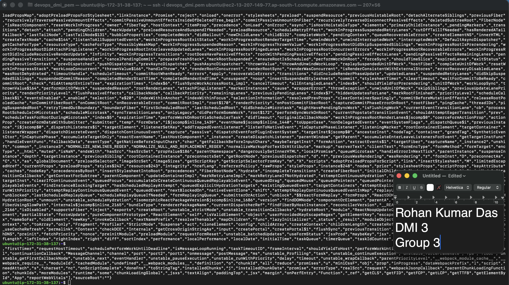

---

#### Screenshot 3 — Output of `grep -n "try_files" /etc/nginx/sites-available/default`

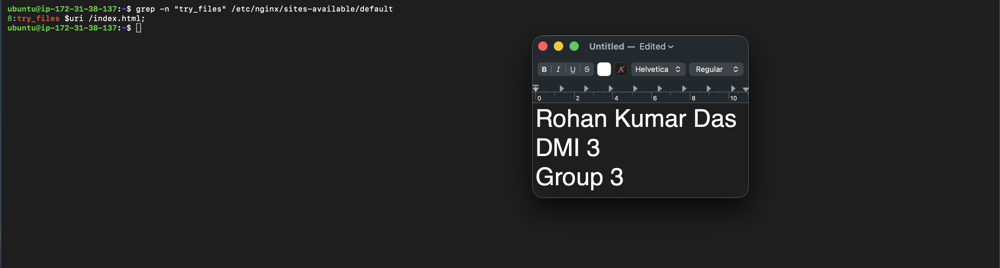

---

### Notes

Answer the following in your own words:

**1. How do you confirm that the correct version of the application is deployed?**

I confirm the correct version is deployed by cross-checking a few things. First, I list the contents of /var/www/html to make sure the expected React build artifacts (index.html, the static/ or assets/ directory with hashed JS/CSS bundles) are present and their modification timestamps match the time of the most recent deployment. 

---

# Task 6 — Nginx Configuration Failure Simulation

## Goal

Simulate a real-world Nginx misconfiguration and recover the service safely.

### Evidence

#### Screenshot 1 — Output of `sudo nginx -t` showing the syntax error (broken config)

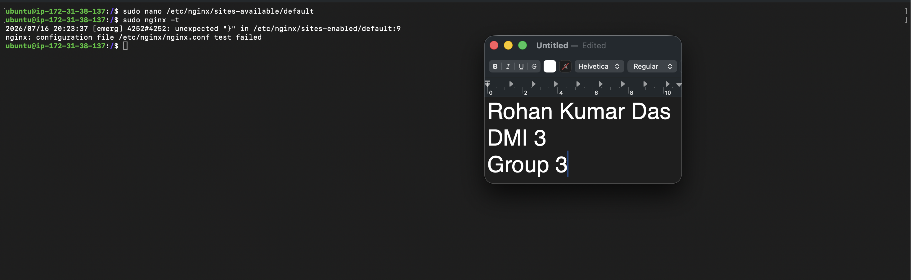

---

#### Screenshot 2 — Output of `sudo nginx -t` showing syntax ok (fixed config)

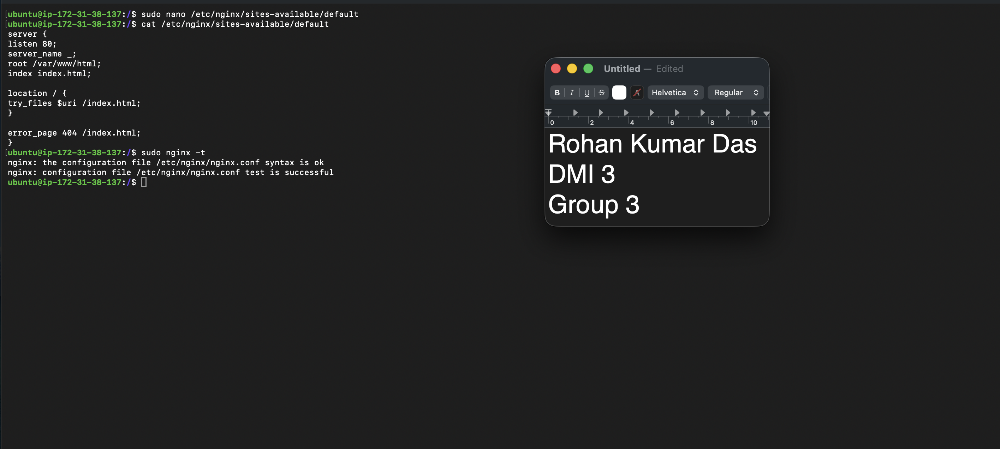

---

#### Screenshot 3 — Output of `curl -I http://<public-ip>` confirming recovery (200 OK)

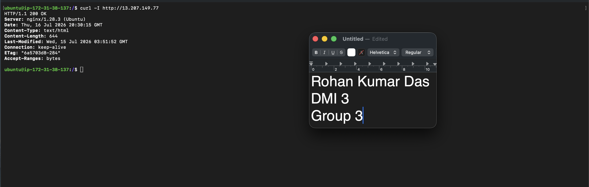

---

### Notes

Answer the following in your own words:

**1. What caused the configuration failure?**

There was semicolon missing in one of the statement in default file of nginx configuration.

---

**2. How did you fix the issue?**

The semicolon placed back on the correct position.

---

**3. How can you avoid this kind of issue in real production systems?**

After every change do run sudo nginx -t for syntax error and validation.

---

# Task 7 — Web Application Failure Simulation

## Goal

Simulate missing deployment content and recover the application safely.

### Evidence

#### Screenshot 1 — Output of `curl -I http://<public-ip>` showing failure (non-200 response)

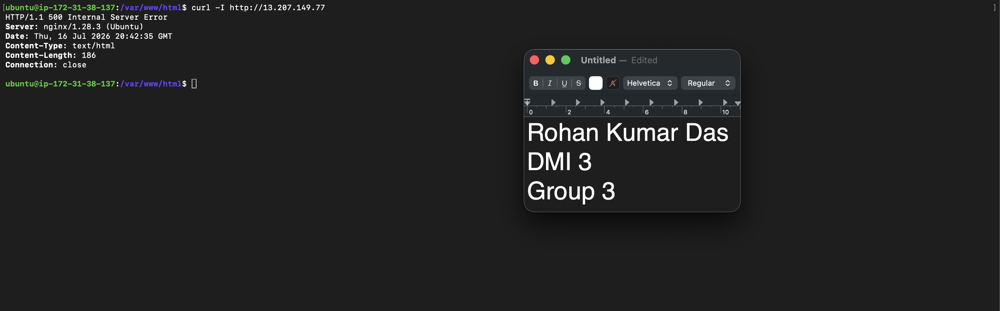

---

#### Screenshot 2 — Output of `curl -I http://<public-ip>` confirming recovery (200 OK)

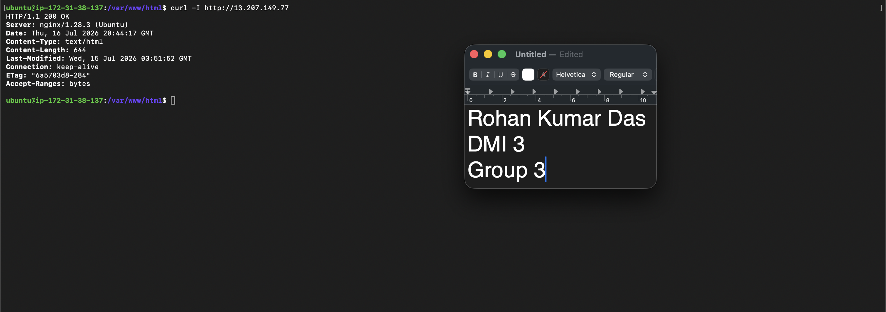

---

### Notes

Answer the following in your own words:

**1. What caused the application to break in this scenario?**

The index.html and other files were completely moved from /var/www/html to /var/www/html_backup. Due to absence of index.html and others the app broke.

---

**2. How did you fix the issue and restore the application?**

The files were reinstated back to /var/www/html from /var/www/html_backup

---

**3. What steps would you take to prevent this kind of issue in real production systems?**

Always take a backup before making any changes. Before touching /var/www/html, copy the current files to a safe location using a command like sudo cp -r /var/www/html /var/www/html_backup. This way, if something goes wrong during deployment, the previous version can be restored quickly.

---

# Task 8 — Security & Reliability Review

## Goal

Review and reflect on the security and reliability practices applied during this assignment.

### Security & Reliability Notes

Answer the following in your own words:

**1. Why is SSH key-based authentication more secure than sharing passwords?**

SSH key-based authentication is more secure than sharing passwords for a few key reasons:

1) Keys can't realistically be brute-forced. An SSH key is thousands of bits long, while passwords are short enough to be guessed by dictionary or brute-force attacks.

2)The private key never leaves your machine. Only the public key sits on the server, so nothing sensitive is transmitted during login. Passwords, in contrast, have to be sent to the server every time.

3) Nothing has to be shared. Each user generates their own key pair, so there's no shared secret that can leak through chat, email, or reuse across systems.

---

**2. Why should only required ports be open on a production server?**

Only required ports should be open on a production server because every open port is a potential entry point for attackers. Keeping unnecessary ports closed reduces the attack surface.

---

**3. Why is it important for Nginx to be enabled on boot?**

Enabling Nginx on boot ensures that the web server automatically starts whenever the system powers on or reboots — whether due to a planned restart, a crash, a power outage, or a cloud provider maintenance event. Without this, the server would come back online but the website would stay down until someone manually logged in and ran sudo systemctl start nginx, causing unnecessary downtime. In production, servers are expected to recover on their own and resume serving traffic immediately, so enabling the service with sudo systemctl enable nginx is a standard step to guarantee reliability and minimize manual intervention.

---

**4. What are the risks of sharing secrets, keys, or credentials publicly?**

Sharing secrets, keys, or credentials publicly is risky because anyone who finds them gets the same access you have. Bots constantly scan GitHub and public sites for exposed credentials, often within minutes of them being posted.
On AWS, a leaked access key is especially dangerous — attackers can spin up expensive resources like GPU instances or crypto miners, running up huge bills in hours. 

---

**5. Why should cloud resources be stopped or terminated when they are no longer needed?**

Cloud resources like EC2 instances, RDS databases, and load balancers are billed by the hour (or even by the second) as long as they exist, whether or not they're actively being used. Leaving them running when they're no longer needed leads to unnecessary charges that add up quickly — a forgotten instance can quietly cost hundreds of dollars a month.

---

# LinkedIn Post (Required)

## Evidence

#### LinkedIn Post URL

Paste your LinkedIn post URL here:

`https://www.linkedin.com/posts/rohan-kumar-das-77aa771b3_devops-linux-nginx-share-7483632258227224577-L1G0/?utm_source=share&utm_medium=member_desktop&rcm=ACoAADHQUo4BewhkN5s9P9q2BaWnpLFrMLZVnWM`

---

#### Screenshot — Published LinkedIn post

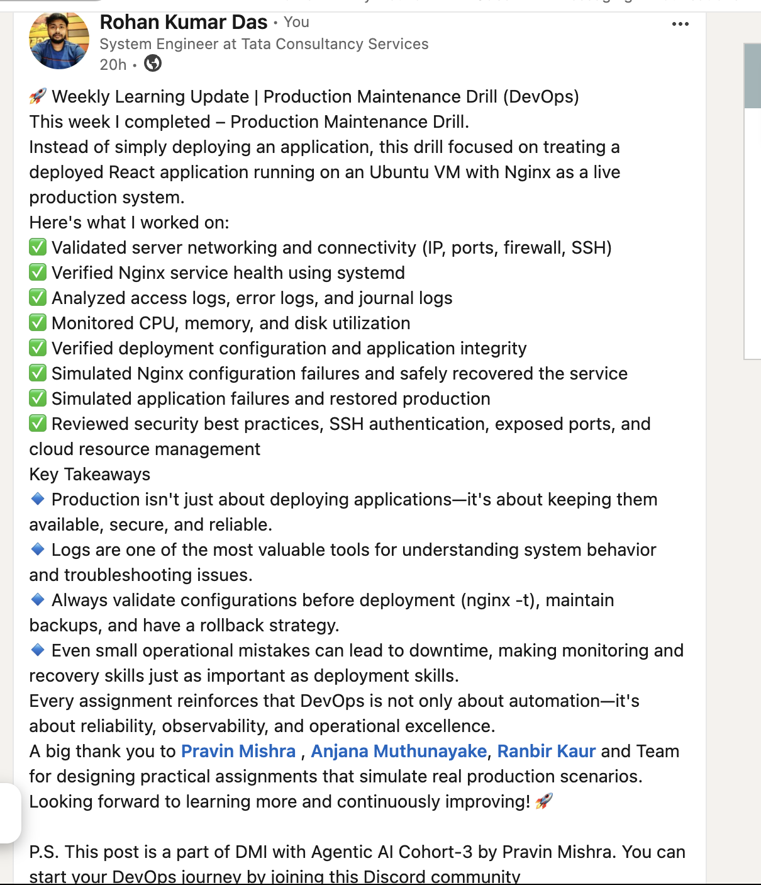

---

# Submission Instructions

- Add all required screenshots in your submission
- Full name must be visible in required screenshots
- Do not expose sensitive information (keys, passwords, account IDs)

---

# Completion Checklist

- [✅] Task 1: Screenshots (browser, ip a, ss -tulpen, ufw status) + Notes answered
- [✅]Task 2: Screenshots (nginx status, nginx -t, ss port 80) + Notes answered
- [✅] Task 3: Screenshots (access log, error log, journalctl) + Notes answered
- [✅] Task 4: Screenshots (uptime, free -h, df -h, du -sh) + Notes answered
- [✅] Task 5: Screenshots (ls html, grep deployed by, grep try_files) + Notes answered
- [✅] Task 6: Screenshots (nginx -t fail, nginx -t pass, curl recovery) + Notes answered
- [✅] Task 7: Screenshots (curl failure, curl recovery) + Notes answered
- [✅] Task 8: Security & Reliability Notes answered
- [✅] LinkedIn post published and URL submitted
- [✅] Full Name visible in all required screenshots
- [✅] No sensitive data exposed

---

## 📌 About DMI & CloudAdvisory

DevOps Micro Internship (DMI) is a project-based DevOps program run by Pravin Mishra (The CloudAdvisory) focused on real-world execution, systems thinking, and career readiness.

It helps learners build strong DevOps foundations with hands-on experience.

---

## 📌 Resources

- 🌐 DMI Official Website: https://pravinmishra.com/dmi  
- 🎓 DevOps for Beginners (Udemy): https://www.udemy.com/course/devops-for-beginners-docker-k8s-cloud-cicd-4-projects/  
- 🎓 Agentic AI DevOps with Claude Code: https://www.udemy.com/course/ultimate-agentic-ai-devops-with-claude-code/  
- 🎓 DevOps with Claude Code: Terraform, EKS, ArgoCD & Helm: https://www.udemy.com/course/devops-with-claude-code-terraform-eks-argocd-helm/  
- ▶️ YouTube Playlist: https://www.youtube.com/playlist?list=PLFeSNDtI4Cho  
- 🔗 Pravin Mishra (LinkedIn): https://www.linkedin.com/in/pravin-mishra-aws-trainer/  
- 🏢 CloudAdvisory (LinkedIn): https://www.linkedin.com/company/thecloudadvisory/

---

*This submission is part of DevOps Micro Internship (DMI) Cohort 3 — Agentic AI Track.*