# Assignment 5 — Bash Script Automation Drill (OPS Checklist)

Part of the DevOps Micro Internship (DMI) Cohort 3 with Agentic AI

---

## Purpose

In this assignment, you will practice Bash scripting by building a series of small automation scripts covering environment setup, variables, arrays, loops, file conditionals, if-else logic, and functions. These scripts form the foundation of real-world Linux automation used in DevOps, cloud, and production support environments.

---

# Task 1 — Bash Environment & Workspace Setup

## Goal

Verify that Bash is available on your system and create a clean workspace for this assignment.

### Evidence

#### Screenshot 1 — Output of `echo $SHELL` and `bash --version`

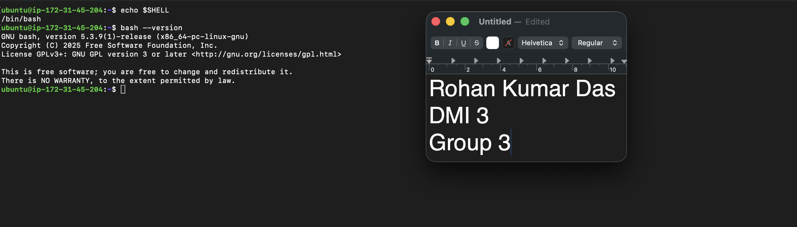

---

#### Screenshot 2 — Output of `pwd` and `ls -lah` showing the scripts directory

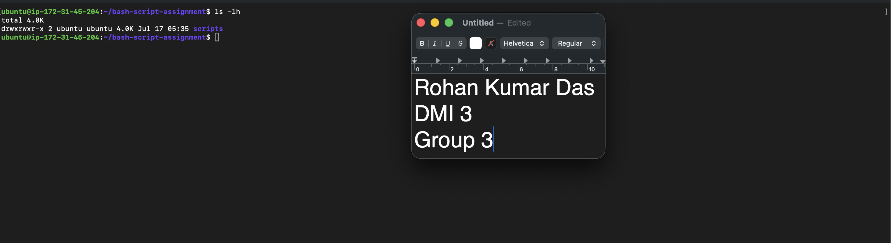

---

### Notes

Answer the following in your own words:

**1. What is Bash?**

Bash is a program on Linux that lets you talk to your computer by typing commands instead of clicking buttons. Its name stands for "Bourne Again Shell."

In simple words: when you open a terminal and type something like ls or cd, Bash is the program that reads what you typed, figures out what you meant, and tells the operating system to do it. It's like a translator sitting between you and the computer.
Bash can also read commands from a file (a script) and run them one by one automatically — which is why it's so useful for automation in DevOps. Instead of typing 20 commands every day, you write them once in a script and run it whenever you need.

---

**2. What is the difference between shell and Bash?**

A shell is the general name for any program that takes your typed commands and passes them to the operating system. It's a category, not one specific program. There are many shells: sh (the original Bourne shell), Bash, Zsh, Fish, Ksh, and others.
Bash is one specific shell — the most popular one, and the default on most Linux systems.
A simple way to think about it: "shell" is like the word car, and Bash is like Toyota. A Toyota is a car, but not every car is a Toyota. In the same way, Bash is a shell, but not every shell is Bash.

---

**3. Why is it important to confirm the Bash version before writing scripts?**

Confirming the Bash version matters because not all Bash versions support the same features. Bash has evolved over the years, and newer versions added things that older ones simply don't understand.

---

# Task 2 — Your First Bash Script

## Goal

Create your first Bash script, make it executable, and run it from the terminal.

### Evidence

#### Screenshot 1 — Content of `first-script.sh`

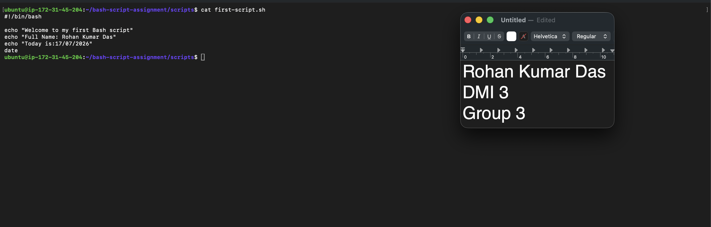

---

#### Screenshot 2 — Output of `./first-script.sh`

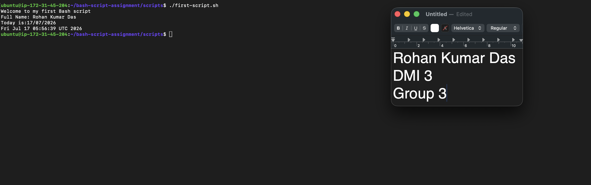

---

#### Screenshot 3 — Output of `ls -l first-script.sh` showing executable permission

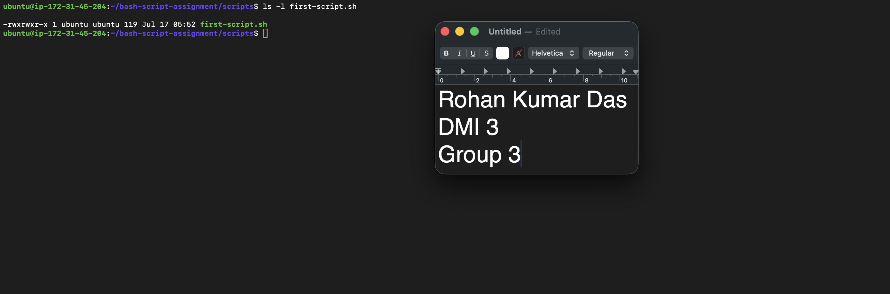

---

### Notes

Answer the following in your own words:

**1. What is the purpose of `#!/bin/bash`?**

The line #!/bin/bash is called a shebang (hash + bang). It must be the very first line of a script, and its job is to tell the operating system which program should be used to run the script.

---

**2. Why do we use `chmod +x` before running a script?**

When you create a new file in Linux, it's just a text file — the system treats it as something you can read and write, but not something you can run. Linux controls this with file permissions, and by default new files don't have the execute permission.
chmod +x adds that execute permission, which tells Linux: "this file is allowed to be run as a program."

---

**3. What is the difference between running a script using `./script.sh` and `bash script.sh`?**

./script.sh — running the file directly. Here you're telling Linux "execute this file as a program." For this to work, two things are needed: the file must have execute permission (that's why we did chmod +x), and Linux reads the shebang line (#!/bin/bash) to decide which interpreter to use. So the script itself controls how it runs.

bash script.sh — running Bash and giving it the file. Here you're starting the bash program yourself and handing it your file as input to read. Because Bash is doing the reading (not the kernel executing your file), two things change:

No execute permission needed — the file just needs to be readable.
The shebang is ignored — you've already chosen the interpreter yourself by typing bash. Even if the script's shebang said #!/bin/sh or pointed to Python, it would still run under Bash.

---

# Task 3 — Variables: User Information Script

## Goal

Use variables to store and display user-related information.

### Evidence

#### Screenshot 1 — Content of `user-info.sh`

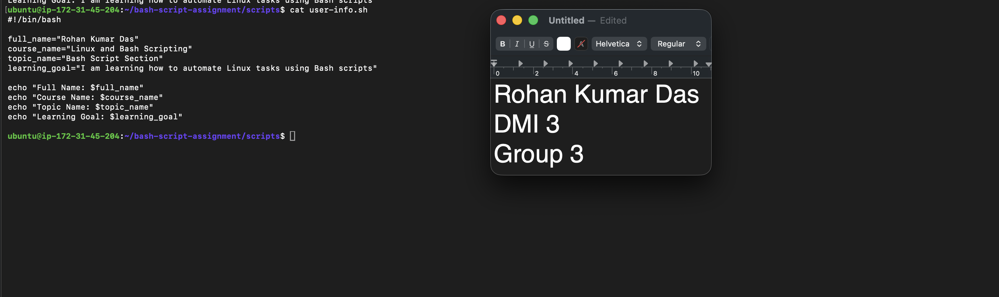

---

#### Screenshot 2 — Output of `./user-info.sh`

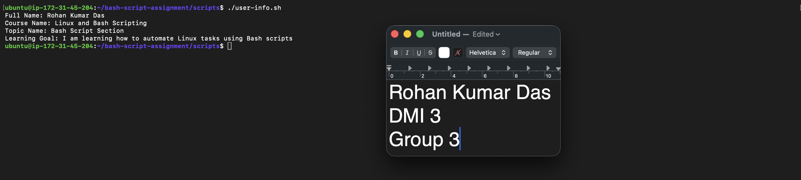

---

### Notes

Answer the following in your own words:

**1. What is a variable in Bash?**

A variable in Bash is a named storage box that holds a value — like a piece of text or a number — so you can save it once and use it many times in your script.

---

**2. Why should we avoid spaces around the `=` sign when creating variables?**

Because of how Bash reads a command line, spaces completely change the meaning of what you typed.
The rule: name="Arjun" works, but name = "Arjun" fails.

It doesn't see an assignment at all. It thinks the first word is a command — so it tries to run a program called name, with = and Arjun as its arguments. The result is an error

---

**3. How do you access the value stored inside a Bash variable?**

You access a variable's value by putting a dollar sign ($) before its name.
eg: name="Arjun"
echo $name
---

# Task 4 — Arrays & Loops: Tools Checklist Script

## Goal

Use arrays and loops to print a checklist of tools used in Bash scripting.

### Evidence

#### Screenshot 1 — Content of `tools-checklist.sh`

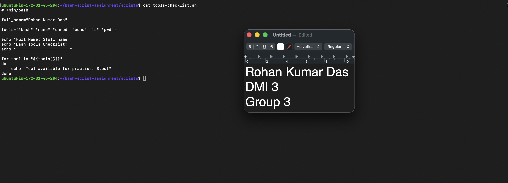

---

#### Screenshot 2 — Output of `./tools-checklist.sh`

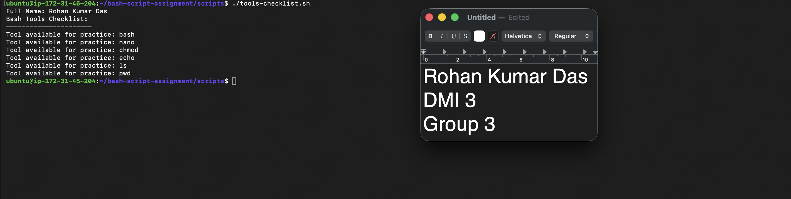

---

### Notes

Answer the following in your own words:

**1. What is an array in Bash?**

An array in Bash is a single variable that can hold multiple values at once — like a list.

Eg: tool="git"
tools=("git" "docker" "kubernetes" "terraform" "ansible")

---

**2. Why are arrays useful in scripts?**

Arrays are useful because real automation almost always deals with groups of things — servers, files, packages, users — not just single values. Arrays let a script handle a whole group cleanly.

One name instead of many variables. Without an array you'd write tool1="git", tool2="docker", tool3="ansible"... With an array, it's one line.
They work perfectly with loops. This is the big one. You can process every item in an array with a single loop:
for tool in "${tools[@]}"; do
  echo "Checking: $tool"
done

---

**3. What does `"${tools[@]}"` mean?**

"${tools[@]}" means: "give me every item in the tools array, each one kept as its own separate, intact word."

---

**4. What is the purpose of the `for` loop in this script?**

To go through the tools array and run the echo command once for every item in it.

---

# Task 5 — Loops: Number Counter Script

## Goal

Use loops to repeat a task multiple times.

### Evidence

#### Screenshot 1 — Content of `counter.sh`

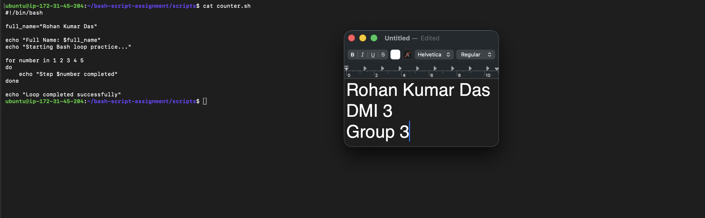

---

#### Screenshot 2 — Output of `./counter.sh`

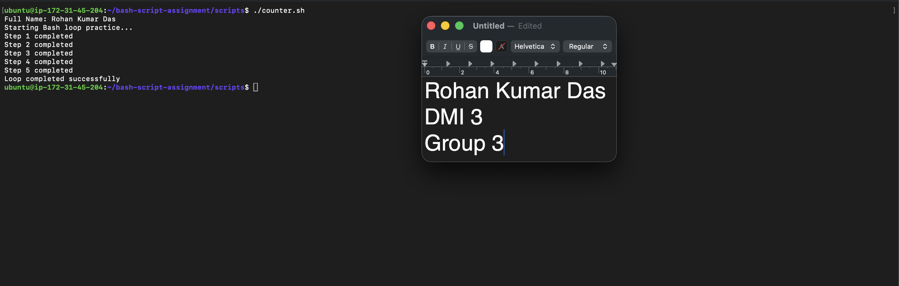

---

### Notes

Answer the following in your own words:

**1. What is a loop?**

A loop is a way to make the computer repeat a block of code multiple times, instead of you writing the same lines over and over.

---

**2. Why do we use loops in Bash scripting?**

We use loops because the entire point of scripting is automation — and automation almost always means doing the same thing many times. Loops are how a script does the repeating for us.

---

**3. How many times did the loop run in your script?**

5 times.

---

**4. What would you change if you wanted the loop to run 10 times?**

Add more 5 numbers along with the exiting ones

---

# Task 6 — Files & Conditionals: File Validation Script

## Goal

Use file checks and conditionals to verify whether files and directories exist.

### Evidence

#### Screenshot 1 — Output of `ls -lah ../test-folder`

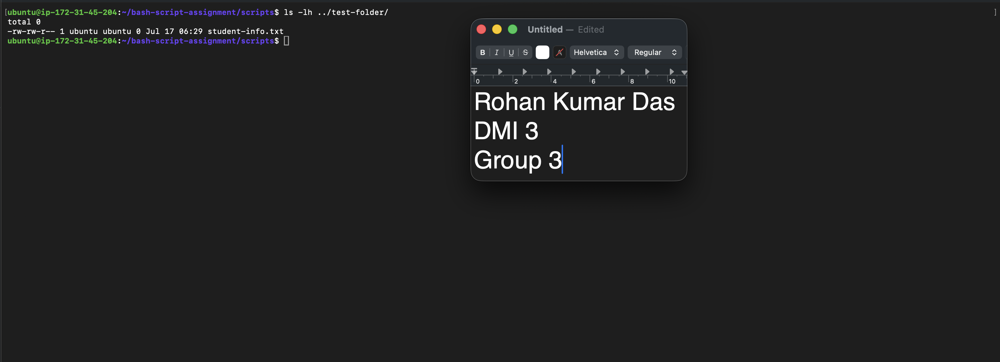

---

#### Screenshot 2 — Content of `file-check.sh`

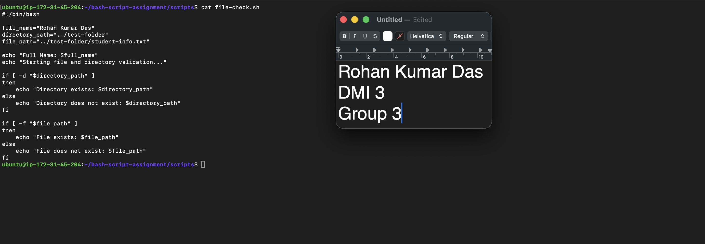

---

#### Screenshot 3 — Output of `./file-check.sh`

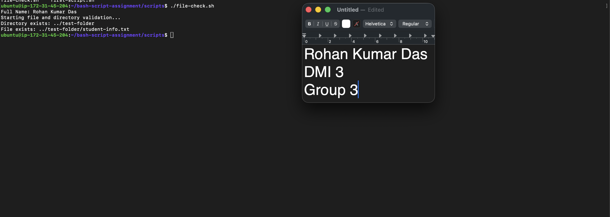

---

### Notes

Answer the following in your own words:

**1. What does `-d` check in Bash?**

-d is a file test operator that checks whether a path exists and is a directory (a folder).

---

**2. What does `-f` check in Bash?**

-f is a file test operator that checks whether a path exists and is a regular file (a normal file like a text file — not a directory).

---

**3. Why should file and directory paths be stored in variables?**

One place to change. The path is defined once at the top. If the folder moves or gets renamed tomorrow, you edit one line — and every check, echo, and command that uses $directory_path updates automatically. If the path were typed out by hand in five places, you'd have to find and fix all five (and miss one, and get a confusing bug).
---

**4. What happens if the file does not exist?**

If the file does not exist, the test [ -f "$file_path" ] returns false, so the script skips the then branch and runs the else branch instead. 

---

# Task 7 — Conditionals: Pass or Retry Script

## Goal

Use if-else conditionals to make decisions based on a variable value.

### Evidence

#### Screenshot 1 — Content of `score-check.sh` with `score=85`

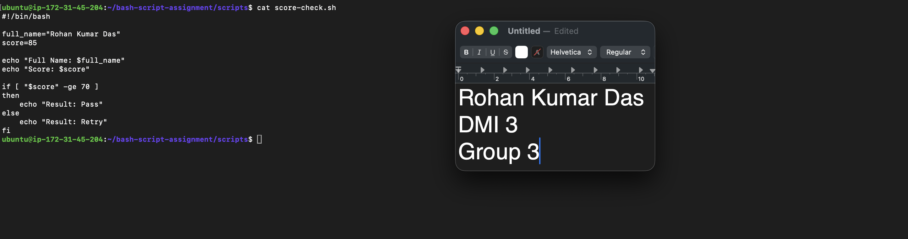

---

#### Screenshot 2 — Output showing `Result: Pass`

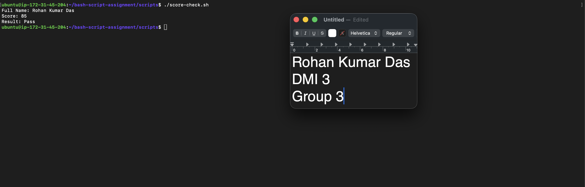
---

#### Screenshot 3 — Content of `score-check.sh` with `score=55`

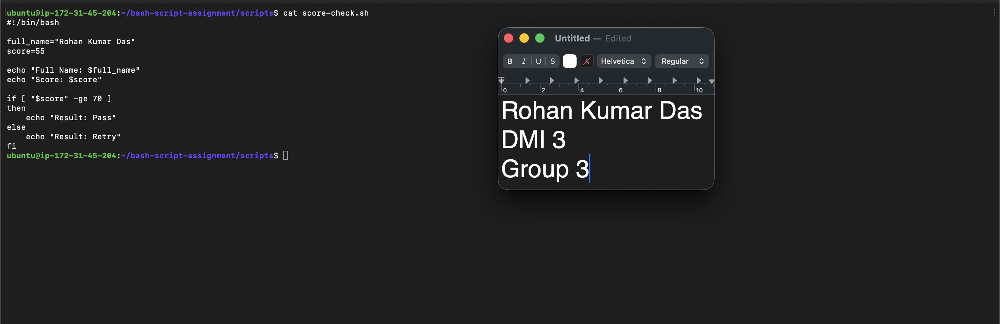

---

#### Screenshot 4 — Output showing `Result: Retry`

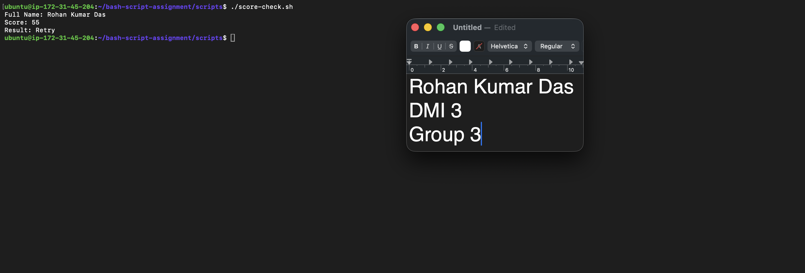

---

### Notes

Answer the following in your own words:

**1. What is the purpose of if-else in Bash?**

If-else lets a script make a decision: it checks a condition, and then runs one block of code if the condition is true, or a different block if it's false.

---

**2. What does `-ge` mean?**

-ge means "greater than or equal to" — it's a numeric comparison operator in Bash.

---

**3. Why should conditions be tested with different values?**

Testing with different values proves that both paths of our logic actually work — not just the one we happened to try first.
That's exactly why Task 7 makes you run the script twice:

score=85 → should print Result: Pass
score=55 → should print Result: Retry

---

**4. How can conditionals help in automation scripts?**

Conditionals are what let an automation script react intelligently to real situations instead of blindly executing the same commands no matter what. Real environments are unpredictable — files go missing, services crash, disks fill up — and conditionals are how a script handles that safely, without a human watching.

---

# Task 8 — Functions: Final Bash Automation Script

## Goal

Create a final Bash script using functions to organize reusable code.

### Evidence

#### Screenshot 1 — Content of `final-automation.sh`

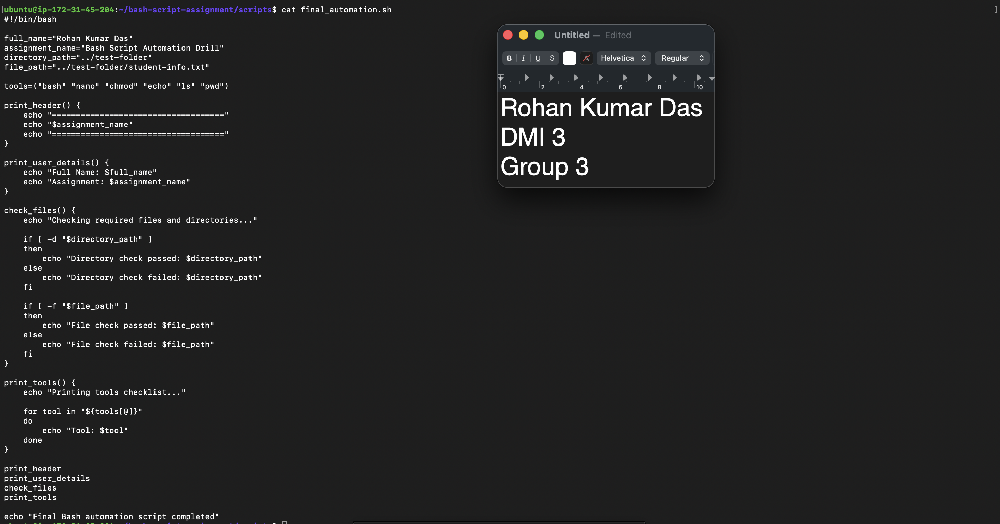

---

#### Screenshot 2 — Output of `./final-automation.sh`

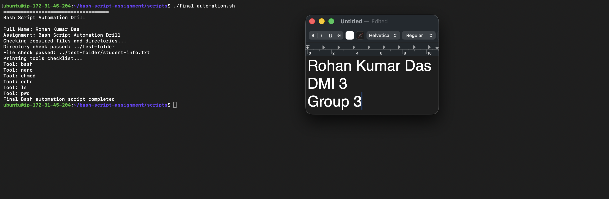

---

#### Screenshot 3 — Output of `ls -lah` showing all created scripts

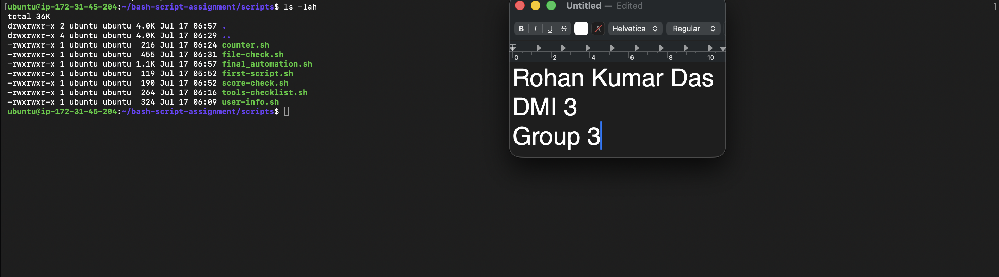

---

### Notes

Answer the following in your own words:

**1. What is a function in Bash?**

A function in Bash is a named block of code that we define once and can then run any time by calling its name — like creating our own custom command inside the script.

---

**2. Why are functions useful in scripts?**

Functions are useful because they turn a long, flat list of commands into organized, named, reusable units — which makes scripts easier to read, change, and trust as they grow.

---

**3. Which functions did you create in this script?**

print_header
print_user_details
check_files
print_tools

---

**4. How does this final script combine variables, arrays, loops, conditionals, files, and functions?**

The script combines every concept in one program. Variables at the top store the name, assignment title, and file paths, and are reused throughout. An array holds the six tools as a single list. Inside the print_tools function, a for loop iterates over that array and prints each tool. Inside check_files, if-else conditionals use -d and -f file tests on the path variables to verify the directory and file exist, reporting pass or fail. Finally, functions organize all of this into four named units, and the main section simply calls them in order. The concepts work together in layers — variables and arrays provide the data, loops and conditionals provide the logic, and functions provide the structure — which is exactly how real automation scripts are built.

---

# LinkedIn Post (Required)

## Evidence

#### LinkedIn Post URL

Paste your LinkedIn post URL here:

`https://www.linkedin.com/posts/rohan-kumar-das-77aa771b3_devops-nginx-linux-share-7483780914737528832-JPqL/?utm_source=share&utm_medium=member_desktop&rcm=ACoAADHQUo4BewhkN5s9P9q2BaWnpLFrMLZVnWM`

---

#### Screenshot — Published LinkedIn post

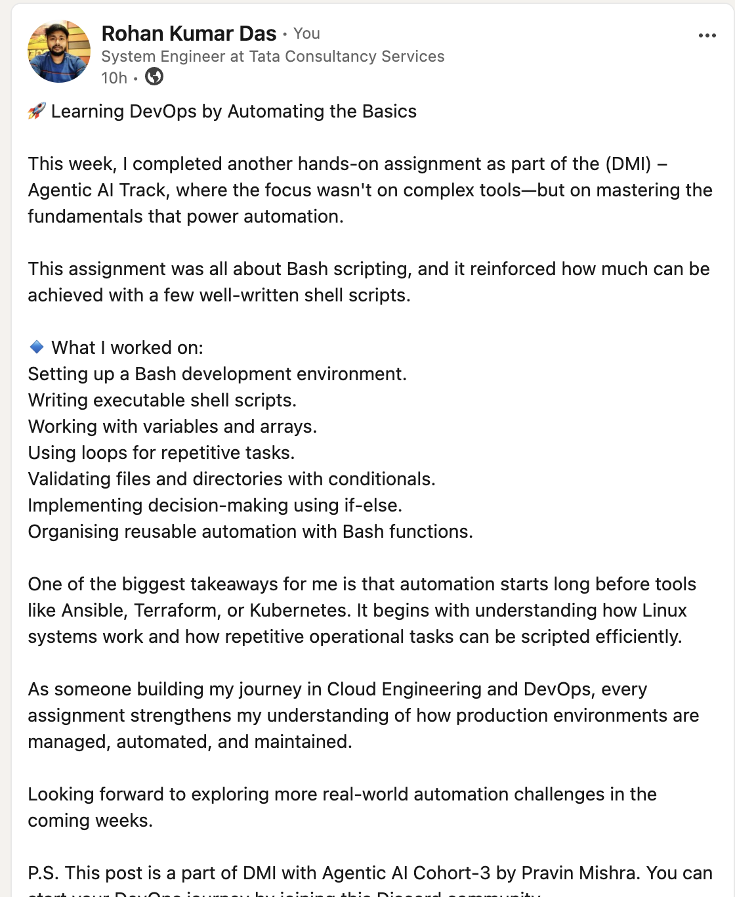

---

# Submission Instructions

- Add all required screenshots in your submission
- Full name must be visible in required screenshots
- All script files must be created and run successfully
- Required notes must be answered clearly for every task
- Do not expose sensitive information (keys, passwords, credentials)

---

# Completion Checklist

- [✅] Task 1: Environment setup verified, workspace created (Screenshots 1–2, Notes answered)
- [✅] Task 2: First script created, executed, permissions verified (Screenshots 1–3, Notes answered)
- [✅] Task 3: Variables script created and run (Screenshots 1–2, Notes answered)
- [✅] Task 4: Arrays and loops script created and run (Screenshots 1–2, Notes answered)
- [✅] Task 5: Counter loop script created and run (Screenshots 1–2, Notes answered)
- [✅] Task 6: File validation script created and run (Screenshots 1–3, Notes answered)
- [✅] Task 7: Pass/Retry conditional script tested with both values (Screenshots 1–4, Notes answered)
- [✅] Task 8: Final automation script created and run (Screenshots 1–3, Notes answered)
- [✅] All scripts run without errors
- [✅] Full Name visible in all required screenshots
- [✅] LinkedIn post published and URL submitted
- [✅] No sensitive data exposed

---

## 📌 About DMI & CloudAdvisory

DevOps Micro Internship (DMI) is a project-based DevOps program run by Pravin Mishra (The CloudAdvisory) focused on real-world execution, systems thinking, and career readiness.

It helps learners build strong DevOps foundations with hands-on experience.

---

## 📌 Resources

- 🌐 DMI Official Website: https://pravinmishra.com/dmi  
- 🎓 DevOps for Beginners (Udemy): https://www.udemy.com/course/devops-for-beginners-docker-k8s-cloud-cicd-4-projects/  
- 🎓 Agentic AI DevOps with Claude Code: https://www.udemy.com/course/ultimate-agentic-ai-devops-with-claude-code/  
- 🎓 DevOps with Claude Code: Terraform, EKS, ArgoCD & Helm: https://www.udemy.com/course/devops-with-claude-code-terraform-eks-argocd-helm/  
- ▶️ YouTube Playlist: https://www.youtube.com/playlist?list=PLFeSNDtI4Cho  
- 🔗 Pravin Mishra (LinkedIn): https://www.linkedin.com/in/pravin-mishra-aws-trainer/  
- 🏢 CloudAdvisory (LinkedIn): https://www.linkedin.com/company/thecloudadvisory/

---

*This submission is part of DevOps Micro Internship (DMI) Cohort 3 — Agentic AI Track.*