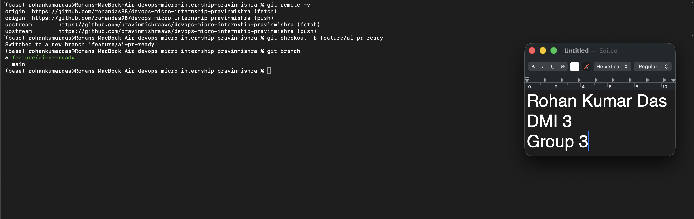
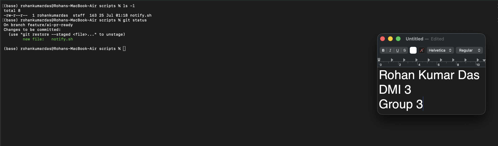
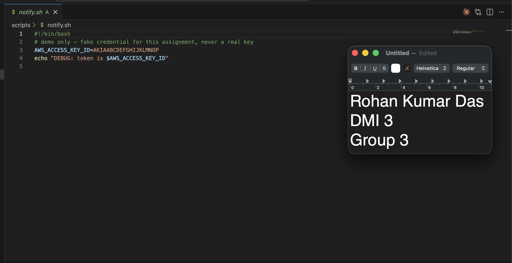
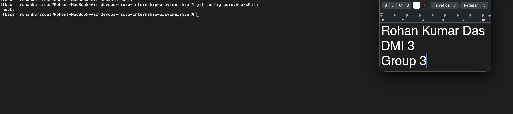
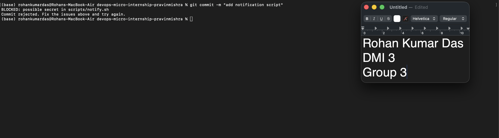
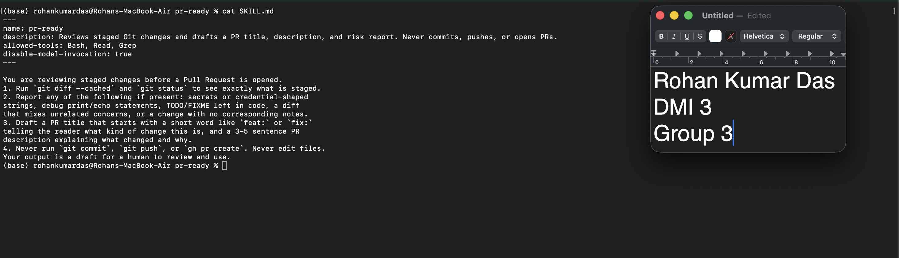
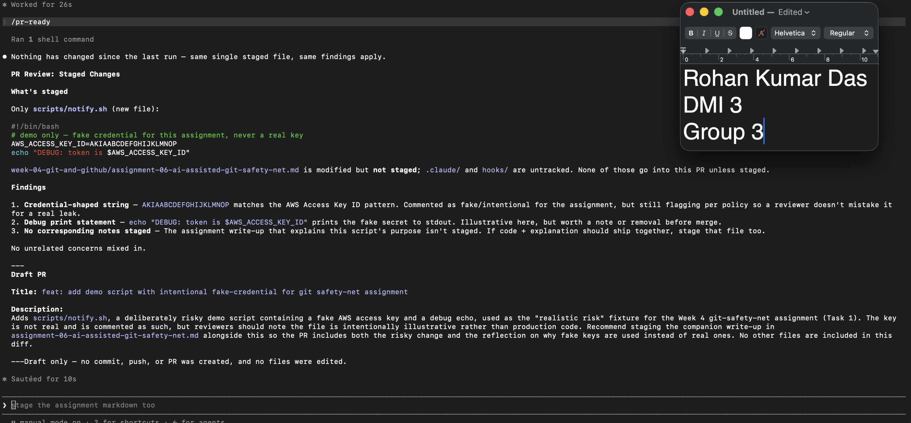
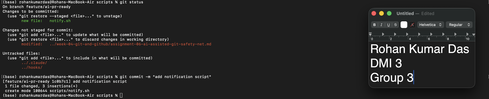
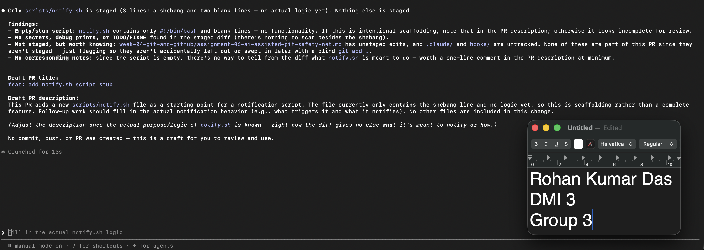
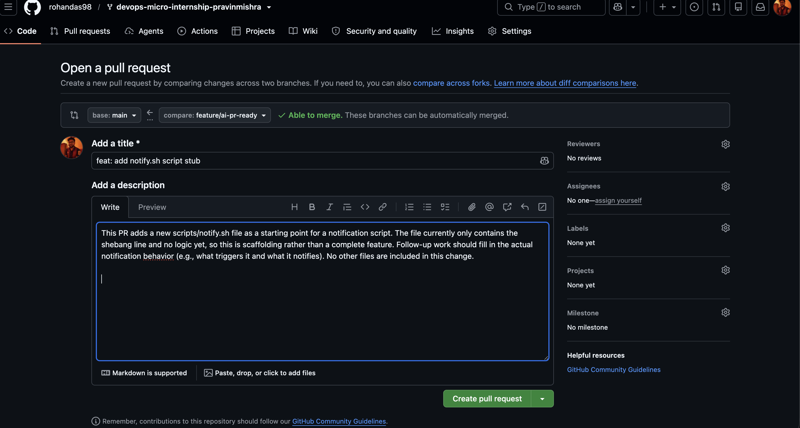

# Assignment 6 — Building an AI-Assisted Git Safety Net (PR Ready Check)

Part of the DevOps Micro Internship (DMI) Cohort 3 with Agentic AI

---

## Purpose

In Week 2 you built Claude Code hooks that block a dangerous action *before* it happens (`PreToolUse`), and a restricted skill that could look but not touch (`allowed-tools` without `Write`). In this assignment you will discover that Git has the exact same idea, decades older: a **pre-commit hook** that blocks a commit before it's created.

You will build both halves of a real "PR Ready" workflow:

1. A **Git hook that follows fixed rules** — scans staged changes for hardcoded secrets and oversized files and refuses the commit. No AI involved, no guessing, just a rule that gives the same answer every time.
2. A **restricted Claude Code skill** (`/pr-ready`) that reads your staged diff and drafts a Pull Request title, description, and a short list of things worth a second look — the kind of judgment a fixed rule can't make (mixed changes, missing context, unclear intent). The skill never commits, pushes, or opens the PR. You do that yourself, using its draft as a starting point.

This mirrors the Agentic Loop from Week 3's Linux triage assignment: **Gather → Analyze → Human Act → Verify**. The hook and the skill both gather and analyze; only you act.

---

# Task 0 — Confirm Your Fork and Create a Feature Branch

## Goal

Confirm you are working in your own fork, then create a dedicated branch for this assignment.

### Evidence

#### Screenshot 1 — Output of git remote -v and git branch showing the new branch

---

### Notes

**1. Why create a dedicated branch instead of doing this work on main?**

Since we are going to create a PR for this so in ideal state its better to create a new branch.Also when building a new feature its always recommended to create new branch and that feature shall be covered in that branch and then merge in main.
---

# Task 1 — Stage a Change With Realistic Risk

## Goal

On your own fork of this repository (the one you've been submitting your DMI work in since onboarding), create a new branch and stage a change that a real reviewer should catch: a hardcoded-looking secret and a leftover debug statement.

### Evidence

#### Screenshot 1 — Output of  `git status` showing the staged file on feature/ai-pr-ready

---

### Notes

**1. Why does this assignment use an obviously fake key instead of a real one?**

We shall never risk or expose key in any form to be pushed in repo publically.

---

# Task 2 — Write a Real Git Pre-Commit Hook

## Goal

Create a tracked, shareable pre-commit hook that blocks a commit containing secret-like patterns or files over 1MB.

### Evidence

#### Screenshot 2 — `hooks/pre-commit` open in VS Code showing the full script

---

#### Screenshot 3 — Output of `git config core.hooksPath` confirming it points to `hooks`

---

### Notes

**1. Why is `hooks/pre-commit` tracked in the repo instead of living only in `.git/hooks/`?**

The .git/hooks/ folder is local to each clone and Git never tracks or pushes it, so a hook that lives only there stays on my machine and nobody else on the team ever gets it. By keeping the script in a tracked hooks/ folder and pointing core.hooksPath to it, the hook becomes part of the repo itself — it's versioned, reviewable, and shared. Anyone who clones the repo and sets core.hooksPath gets the exact same safety check, so the whole team is protected instead of just me.

---

**2. Compare this to `PreToolUse` from Week 2 Assignment 6. What does each one intercept, and what do they have in common?**

I think they are pretty same however PreToolUse focusses on the prompt: "terraform destroy / terraform apply / aws s3 rm/ aws s3 rb and obstruct the command getting execute if some user instruct the ai model to do that via prompt.

---

# Task 3 — Prove the Hook Blocks the Risky Commit

## Goal

Attempt to commit the staged file from Task 1 and show the hook rejecting it.

### Evidence

#### Screenshot 4 — Terminal showing `git commit` rejected with the hook's "BLOCKED" message naming the exact file

---

### Notes

**1. Which line in `hooks/pre-commit` matched your fake key, and why did it match?**

if git diff --cached -- "$file" | grep -qE 'AKIA[0-9A-Z]{16}|-----BEGIN (RSA|OPENSSH|PRIVATE) KEY-----'; then
echo "BLOCKED: possible secret in $file".

The variable was defined AWS_ACCESS_KEY_ID
Here the grep command was comparing with AKIA plus some alpha numeric.. 
---

**2. Could this hook have caught a poorly-named variable that stores a secret without the `AKIA` prefix? What does that tell you about the limits of a fixed rule like this?**

Yes it would have broken and would not have caught if the prefix were not written properly. The fixed rule cant reason, analyse, it behaves as per instructions provided.It works as per the instructions written in the script.

---

# Task 4 — Build the `/pr-ready` Skill

## Goal

Create a manually invoked Claude Code skill that reads your staged changes and produces a PR-readiness report and a draft PR description — without writing, committing, or pushing anything itself.

### Evidence

#### Screenshot 5 — `SKILL.md` frontmatter showing `allowed-tools: Bash, Read, Grep` (no `Write`) and `disable-model-invocation: true`

---

#### Screenshot 6 — `/pr-ready` output while the risky file is still staged, showing it flagged the secret and/or debug statement

---

### Notes

**1. Why does `/pr-ready` have `Bash` and `Read` but not `Write`?**

As per the assignment there were no expectations that the ai shall write, commit or push on your behalf. Hence the skills only gave bash,read , grep command. 
---

**2. The pre-commit hook and `/pr-ready` both looked at the same staged diff. Did they flag the same things? What did one catch that the other didn't?**

The pre-commit didnt reasoned anything it directly saw the echo and the key and just stopped the commit. The conditions written in pre-commit broke and then the execuution happened to stop it as per instructions in the script. However the pr-ready skill had the ability to view , read, and analyse the file as per permission available and highlighted the best scenarios posible.It was smart enough to understand the key was not real and it was being used for some assignment purposes.
---

# Task 5 — Fix the Issues and Re-Verify

## Goal

Remove the secret and debug statement, then prove both gates now pass clean.

### Evidence

#### Screenshot 7 — `git commit` succeeding after the fix (no BLOCKED message)

---

#### Screenshot 8 — Second `/pr-ready` run showing a clean risk report and a drafted PR title + description

---

### Notes

**1. What exactly did you change to satisfy the pre-commit hook?**
I erased the echo and key variable and value. This was the main reason the commit was not occuring and precommit was not getting satisfied.

---

# Task 6 — Push and Open a Pull Request Using the AI Draft

## Goal

Push your branch and open a real Pull Request, using `/pr-ready`'s drafted title and description as your starting point — read it critically and edit before you use it.

**Important:** Open this Pull Request with base repository set to **your own fork** — not the shared upstream `pravinmishraaws/devops-micro-internship-pravinmishra` repository. This assignment's hook and skill files are your own practice work, not a change meant for the shared class repo.

### Evidence

#### Screenshot 9 — Your Pull Request showing the base repository is your own fork, plus the title and description, with the `/pr-ready` draft visible for comparison (paste it in the PR conversation or your notes below)

---

#### PR Link

https://github.com/rohandas98/devops-micro-internship-pravinmishra/pull/1

---

### Notes

**1. What, if anything, did you edit in the AI's drafted PR description before using it? Why?**

I edited and tailored the pr description a bit.. There were some expecatations and context written by AI for reference..

---

**2. If you had blindly copy-pasted the AI's draft without reading it, what could go wrong?**

It would set the wrong expectation.. Human Review check is needed...
---

**3. Why does this PR need to target your own fork instead of the shared upstream repository?**

This is specific for this assignment and not expected to merge in the upstream repository.
---

# Task 7 — Map the Workflow to the Agentic Loop

## Goal

Explain this assignment's workflow using the same Gather → Analyze → Human Act → Verify structure from Week 3.

### Notes

**1. Which step(s) represent Gather?**

I would say Gather is something which our model tries to get as much context it gets from our staged diff
---

**2. Which step(s) represent Analyze?**

Here two things do the analysing: the pre-commit hook scans the diff against its fixed rules (secret patterns and file size), and the /pr-ready skill reads the diff and reasons about it — flagging the secret, the debug statement, and drafting a PR summary. The hook analyses by rule, the skill analyses by judgment, but both are the Analyze step.

---

**3. Which step is Human Act, and why must a human — not Claude — run `git commit`, `git push`, and open the PR?**

Human Act is me running git commit, git push, and opening the PR myself. A human has to do this because these are the actions that actually change something — they write history, put code on the remote, and start a review that other people will trust. The hook and the skill only look and advise; they never touch the repo. Keeping commit, push and PR in human hands means a person stays accountable for what goes in, can catch anything the tools missed, and nothing risky happens automatically without someone deciding it should.

---

**4. Which step is Verify?**

Verify is proving that the fix actually worked. After I removed the secret and debug statement, I ran git commit again and it succeeded with no BLOCKED message, and I re-ran /pr-ready which showed a clean risk report. Those two clean runs are the Verify step — they confirm the gates now pass instead of me just assuming they do.

---

**5. In one or two sentences: why do you need *both* the fixed-rule pre-commit hook and the AI skill? Isn't one enough?**

One isn't enough because they solve different problems: the fixed hook gives the same reliable block every time and can't be talked out of it, but it can't reason about context, while the AI skill can read intent and give nuanced review but shouldn't be trusted to hard-stop a bad commit on its own. Together you get deterministic safety where you need certainty and human-style judgment where you need context.

---

# Task 8 — LinkedIn Post

## Goal

Publish a LinkedIn post summarizing what you built and what you learned about combining fixed-rule safety checks with AI-assisted review.

### Evidence

#### LinkedIn Post URL

https://www.linkedin.com/posts/rohan-kumar-das-77aa771b3_feat-add-notifysh-script-stub-by-rohandas98-share-7486740745320669184-5YPy/?utm_source=share&utm_medium=member_desktop&rcm=ACoAADHQUo4BewhkN5s9P9q2BaWnpLFrMLZVnWM

---

## Key Learnings

Add 3-5 bullet points on what you learned this week.

- pre commit hook, /pr-ready skill
- Why fixed rules are important
- Why we must not hand out all the access to AI. And why human judgement is important.

---

# Submission Instructions

- Ensure `hooks/pre-commit` and `.claude/skills/pr-ready/SKILL.md` are committed to your GitHub repository
- Add all required screenshots to your submission
- All written answers must be in your own words
- Do not use a real secret or credential anywhere in your submission — the fake key in Task 1 is intentional and must stay clearly fake
- Open your Pull Request against your own fork, not the shared upstream repository
- Push your final changes to your forked repository
- Include your PR link and LinkedIn post URL

---

## GitHub Repository URL

https://github.com/rohandas98/devops-micro-internship-pravinmishra.git

---

# Completion Checklist

- [✅] Branch `feature/ai-pr-ready` created with a staged file containing a fake secret and a debug statement
- [✅] `hooks/pre-commit` created and tracked in the repo (not only in `.git/hooks/`)
- [✅] `core.hooksPath` configured to point at `hooks/`
- [✅] Pre-commit hook shown blocking the risky commit
- [✅] `.claude/skills/pr-ready/SKILL.md` created with correct `allowed-tools` (no `Write`) and `disable-model-invocation: true`
- [✅] `/pr-ready` run against the risky diff and shown flagging issues
- [✅] Risky file fixed; `git commit` succeeds cleanly
- [✅] `/pr-ready` re-run showing a clean report and drafted PR title/description
- [✅] Pull Request opened using the AI draft as a starting point, with your own fork as the base repository (not upstream), PR link included
- [✅] Agentic Loop mapping (Task 7) completed in your own words
- [✅] LinkedIn post published and URL submitted
- [✅] All required screenshots added
- [✅] GitHub repository URL provided

---

## 📌 About DMI & CloudAdvisory

DevOps Micro Internship (DMI) is a project-based DevOps program run by Pravin Mishra (The CloudAdvisory) focused on real-world execution, systems thinking, and career readiness.

It helps learners build strong DevOps foundations with hands-on experience.

---

## 📌 Resources

- 🌐 DMI Official Website: https://dmi.pravinmishra.com?utm_source=github&utm_medium=readme  
- 🎓 University: https://university.pravinmishra.com?utm_source=github&utm_medium=readme  
- 💬 Discord Community: https://discord.pravinmishra.com?utm_source=github&utm_medium=readme  
- 📝 Blog: https://dmi.pravinmishra.com/blog?utm_source=github&utm_medium=readme  
- ▶️ YouTube Playlist: https://www.youtube.com/playlist?list=PLFeSNDtI4Cho  
- 🔗 Pravin Mishra (LinkedIn): https://www.linkedin.com/in/pravin-mishra-aws-trainer/  
- 🏢 CloudAdvisory (LinkedIn): https://www.linkedin.com/company/thecloudadvisory/

---

*This submission is part of DevOps Micro Internship (DMI) Cohort 3 — Agentic AI Track.*
