# Assignment 4 — Gotto Job: Backlog Refinement & Sprint 1 in Jira

Part of the DevOps Micro Internship (DMI) Cohort 3 with Agentic AI

---

## Purpose

In this 90-minute, time-boxed exercise, you will act as a Scrum team — or run in Solo Mode, playing every role yourself — to turn the Gotto Job template into a value-ordered backlog, estimate the work in story points, plan Sprint 1, open the burndown chart, and ship one small UI-only increment (text, color, spacing, a label, or a CTA — no backend changes).

---

# Task 1 — Roles & Mode Setup (Team vs Solo)

## Goal

Choose Team Mode or Solo Mode, and document how each Scrum role (Product Owner, Scrum Master, Dev Lead, DevOps Lead) was handled.

### Evidence

#### Screenshot 1 — Jira "Create project" screen, or the project sidebar after creation

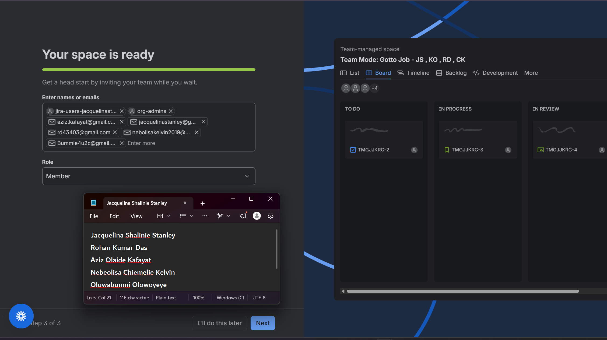

---

### Notes

Write one line for each role: PO (what you prioritized), SM (how you ensured process), Dev Lead (what you built), DevOps Lead (how you shipped).

Paste this directly into a Markdown (`.md`) file in VS Code, then preview it to see the grid:

| Role | Explanation | Team Member Name |
| --- | --- | --- |
| Scrum Masters | Maintained the 90-minute time box, followed the Scrum workflow, documented the Sprint Goal, and ensured that the backlog and sprint remained transparent. | Jacquelina Shalinie Stanley, Rohan Kumar Das, Aziz Olaide Kafayat, Nebeolisa Chiemelie Kelvin, Oluwabunmi Olowoyeye |
| Product Owner | Prioritised the backlog based on customer visibility, usability, trust, and the effort required to deliver each improvement. | Jacquelina Shalinie Stanley |
| Dev Lead 1 | Reviewed the Gotto Job source code and implemented a small UI-only improvement without making backend changes for Story 7 and 8. | Aziz Olaide Kafayat |
| Dev Lead 2 | Reviewed the Gotto Job source code and implemented a small UI-only improvement without making backend changes for Story 1, 2 and 3. | Nebeolisa Chiemelie Kelvin |
| Dev Lead 3 | Reviewed the Gotto Job source code and implemented a small UI-only improvement without making backend changes for Story 4, 5 and 6. | Oluwabunmi Olowoyeye |
| DevOps Lead | Committed the change with Git, deployed it to a live environment, verified the result, and recorded deployment evidence. | Rohan Kumar Das |

---

# Task 2 — Create the Jira Project (Team-managed → Scrum)

## Goal

Create a Team-managed Scrum project named `Gotto Job – Team <#>` (Team Mode) or `Gotto Job – <YourName>` (Solo Mode).

### Evidence

#### Screenshot 2 — Project created page showing the project name and key

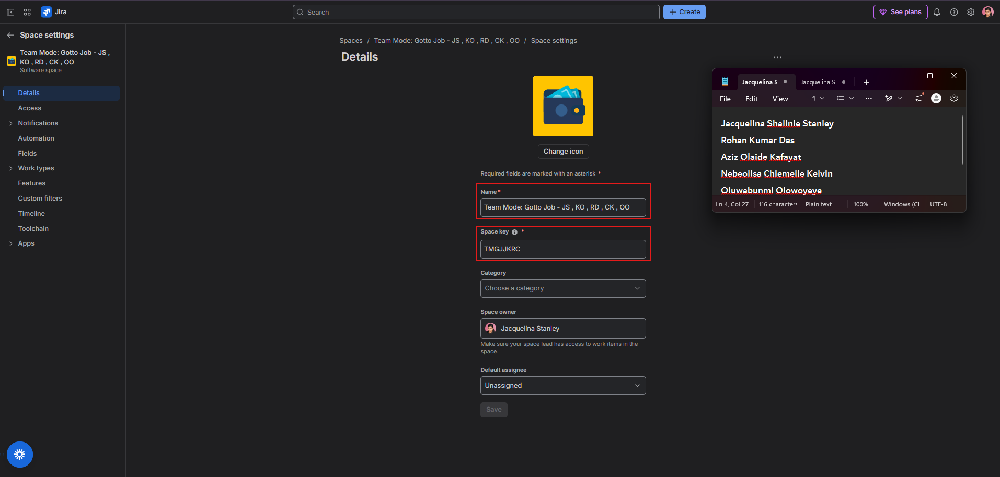

---

# Task 3 — Create the Epic

## Goal

Create the Epic `Improve Gotto Job UI discoverability & trust` to group the UI improvement initiative.

### Evidence

#### Screenshot 3 — Backlog showing the Epic panel with the Epic visible

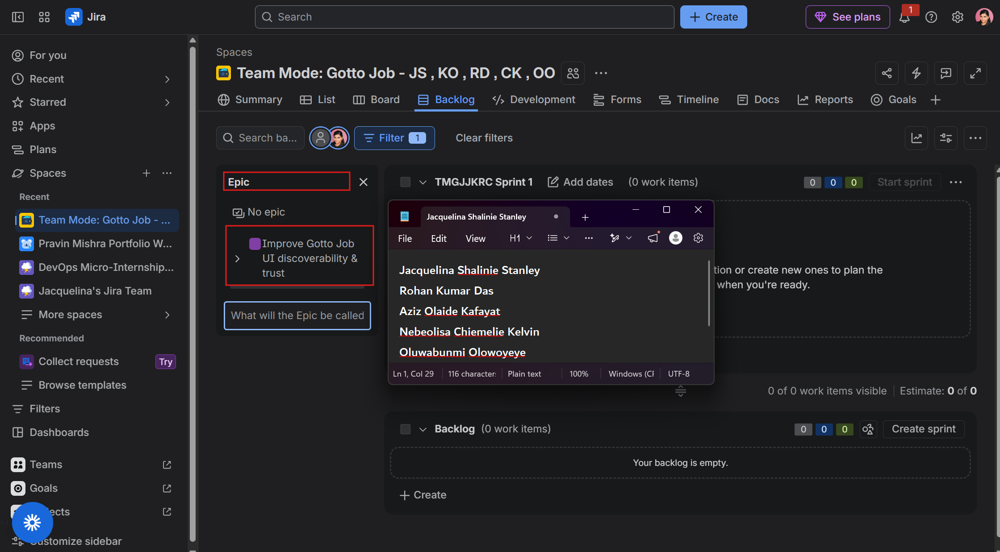

---

# Task 4 — Seed the Product Backlog (6–8 Stories + Fibonacci Points + Ranking)

## Goal

Create at least six Stories under the Epic, estimate each with 1, 2, or 3 story points, and rank them by value.

### Evidence

#### Screenshot 4 — Backlog showing the Epic and at least six Stories under it

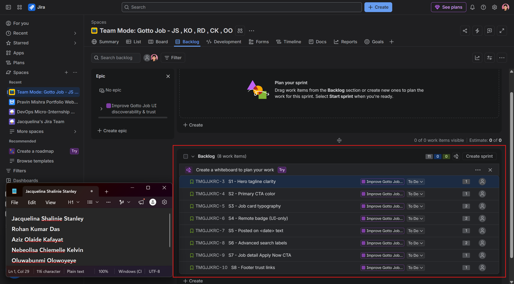

---

#### Screenshot 5 — One Story opened showing its Story Points and acceptance criteria filled in

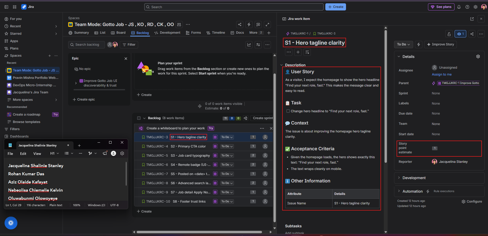

---

# Task 5 — Planning Poker (Estimate + Debate Notes)

## Goal

Confirm the Story Points (1, 2, or 3) for each Story and record brief reasoning for each estimate.

### Evidence

#### Screenshot 6 — Backlog showing Story Points visible, or two or three Stories opened showing their points

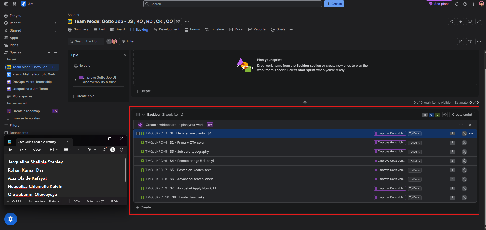
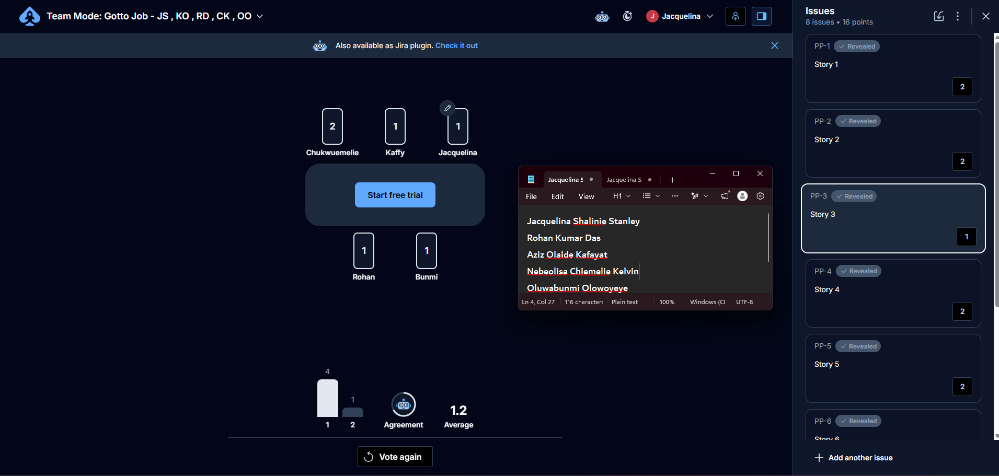
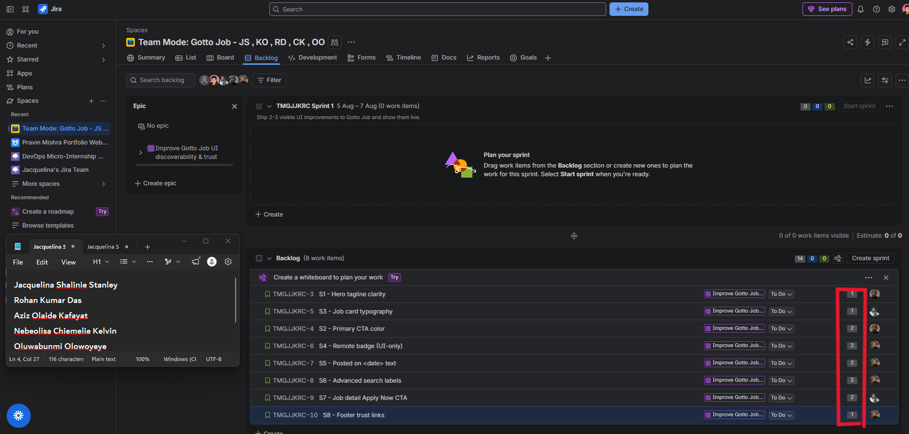

---

### Notes

For each story, explain in one or two lines why it is a 1, 2, or 3 (mention any debate, even in Solo Mode).

| Story | Final Estimate | Reason |
| --- | --- | --- |
| Story 1 | 2 | Estimated as **2** because it involves implementing a small feature with some testing and verification. A brief discussion considered whether it was a 1 or 2, but the team agreed the extra validation justified a 2. |
| Story 2 | 2 | Estimated as **2** because it requires moderate development effort and testing. There was some debate between a 1 and 2, but the additional implementation work made 2 the more suitable estimate. |
| Story 3 | 1 | Estimated as **1** because it is a straightforward, low-complexity task with minimal implementation effort. Most participants agreed it could be completed quickly without significant risk. |
| Story 4 | 2 | Estimated as **2** because it requires updates across multiple components and verification after implementation. The team agreed it was more than a simple change but not complex enough for a higher estimate. |
| Story 5 | 2 | Estimated as **2** because it combines implementation and testing, requiring moderate effort. The discussion concluded that it involved more work than a simple one-point task. |
| Story 6 | 3 | Estimated as **3** because it includes implementation, deployment, and validation activities, making it the most complex story in the sprint. The team agreed the additional coordination and testing justified a higher estimate. |
| Story 7 | 2 | Estimated as **2** because it requires implementing a feature and confirming it works correctly after deployment. There was minor discussion, but the moderate amount of work supported the estimate. |
| Story 8 | 2 | Estimated as **2** because it involves implementation and final verification before completion. The team agreed it required more effort than a quick change but remained manageable within the sprint. |

---

# Task 6 — Sprint Planning: Create Sprint 1 + Sprint Goal + Scope

## Goal

Create Sprint 1, move three or four Stories into it (approximately 3–6 points), set the Sprint Goal, and break each selected Story into Build, Verify, Deploy, and Screenshot Sub-tasks.

### Evidence

#### Screenshot 7 — Sprint 1 with the selected Stories inside it

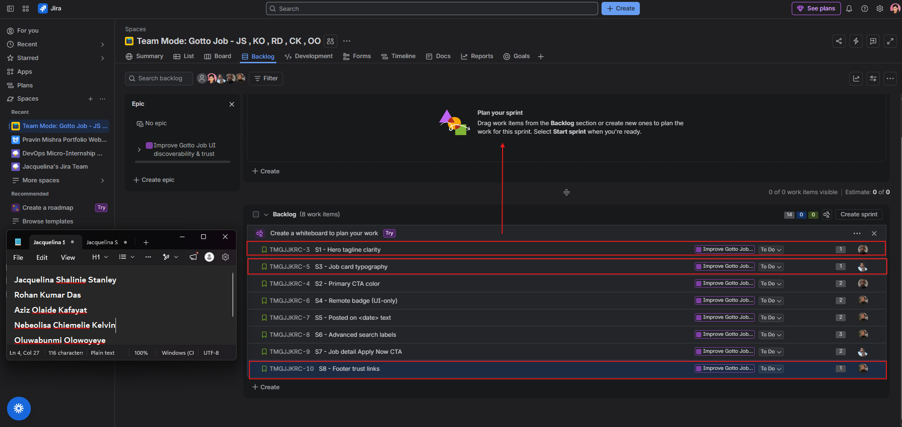
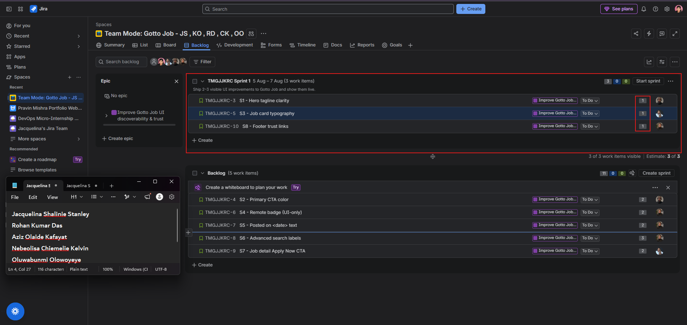
---

#### Screenshot 8 — One Story showing the Sub-tasks created

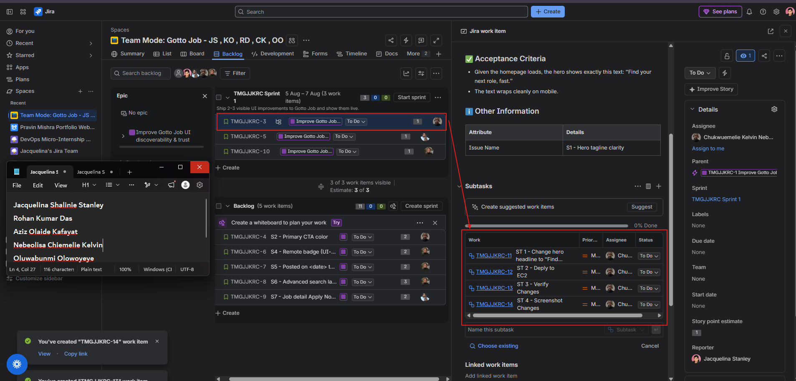

---

# Task 7 — Reports: Open Burndown Chart

## Goal

Open the Burndown Chart and confirm it exists for Sprint 1. It is acceptable if the chart is not yet populated.

### Evidence

#### Screenshot 9 — Burndown Chart page opened, even if empty

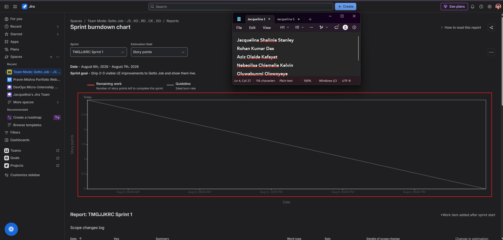

---

# Task 8 — Ship One Small Increment (Build + Deploy + Proof)

## Goal

Implement one small UI-only Story from Sprint 1, commit it, deploy it live, and move the Story and its Sub-tasks to Done in Jira.

### Evidence

#### Screenshot 10 — Jira board showing the Story moved to Done

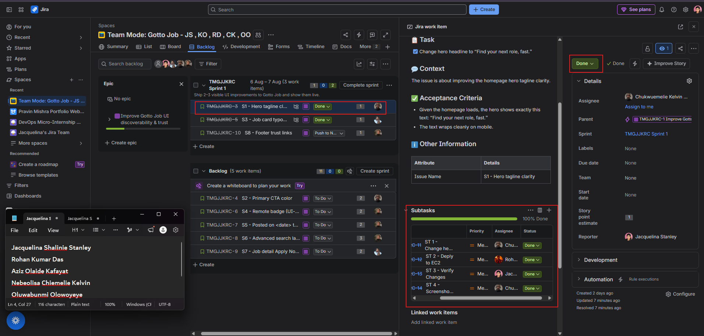

---

#### Screenshot 11 — Git commit output

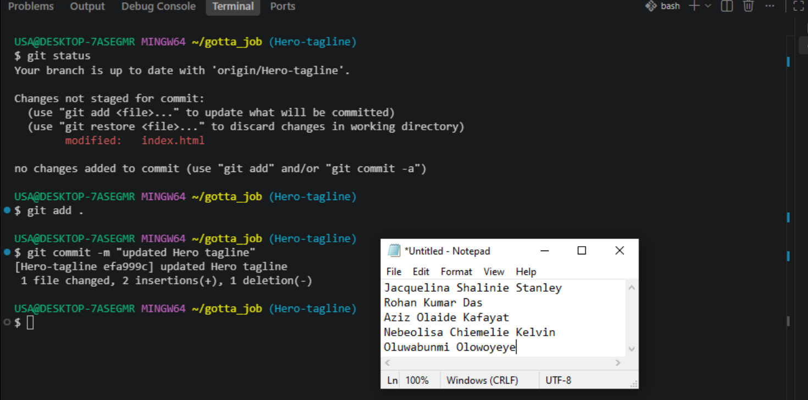

---

#### Screenshot 12 — Live URL in the browser showing the UI change, with the URL visible

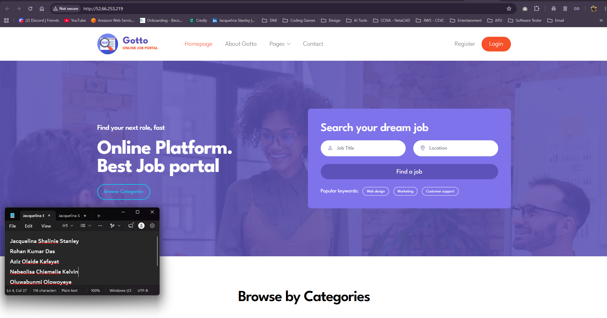

---

# Task 9 — Retro Notes (Scrum Pillar + Value)

## Goal

Add a retro comment covering what went well, what to improve, one Scrum pillar observed (Transparency, Inspection, or Adaptation), and one Scrum value (Openness, Focus, Commitment, Courage, or Respect).

### Evidence

#### Screenshot 13 — Jira retro comment visible

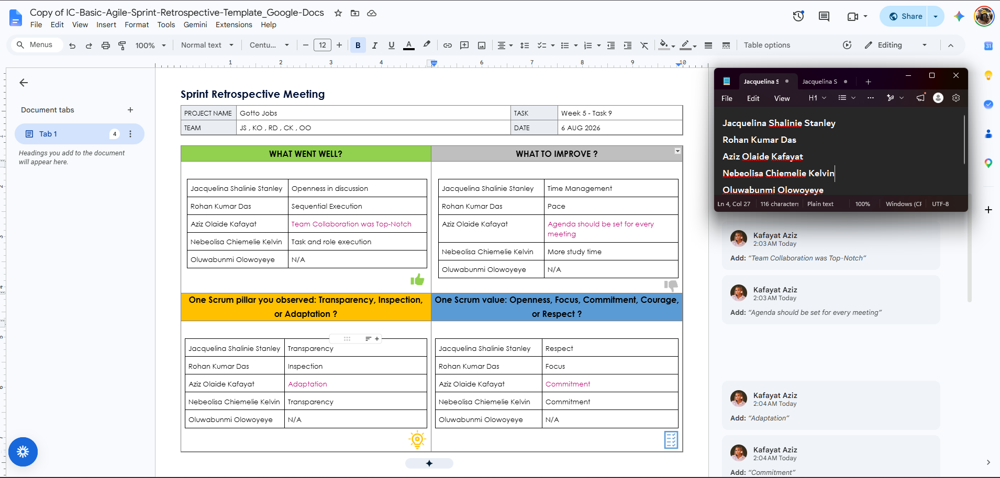
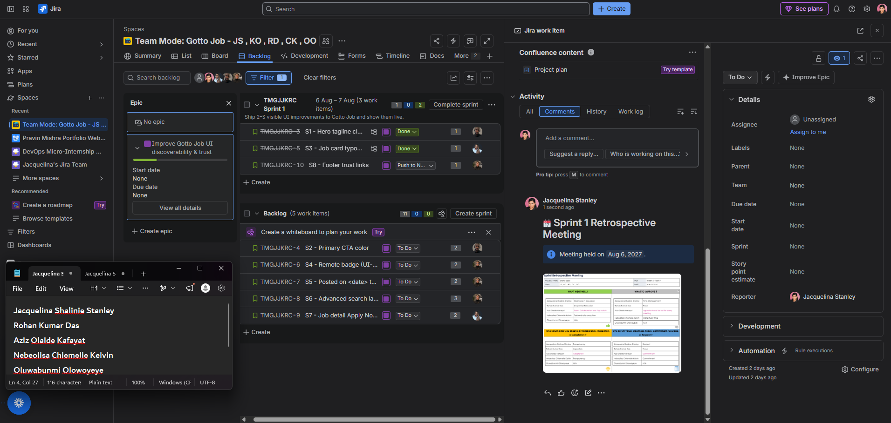

---

# Task 10 — LinkedIn Post (Mandatory)

## Goal

Publish a LinkedIn post about what you delivered, including your live URL, three to five lines on what you did and learned, and one screenshot (Burndown Chart, Sprint board, or the live UI change).

## Evidence

#### LinkedIn Post URL

Paste your LinkedIn post URL here:

(https://www.linkedin.com/posts/rohan-kumar-das-77aa771b3_devops-agile-scrum-share-7493738999656857600-Axky/?utm_source=share&utm_medium=member_desktop&rcm=ACoAADHQUo4BewhkN5s9P9q2BaWnpLFrMLZVnWM)

---

#### Screenshot 14 — Published LinkedIn post

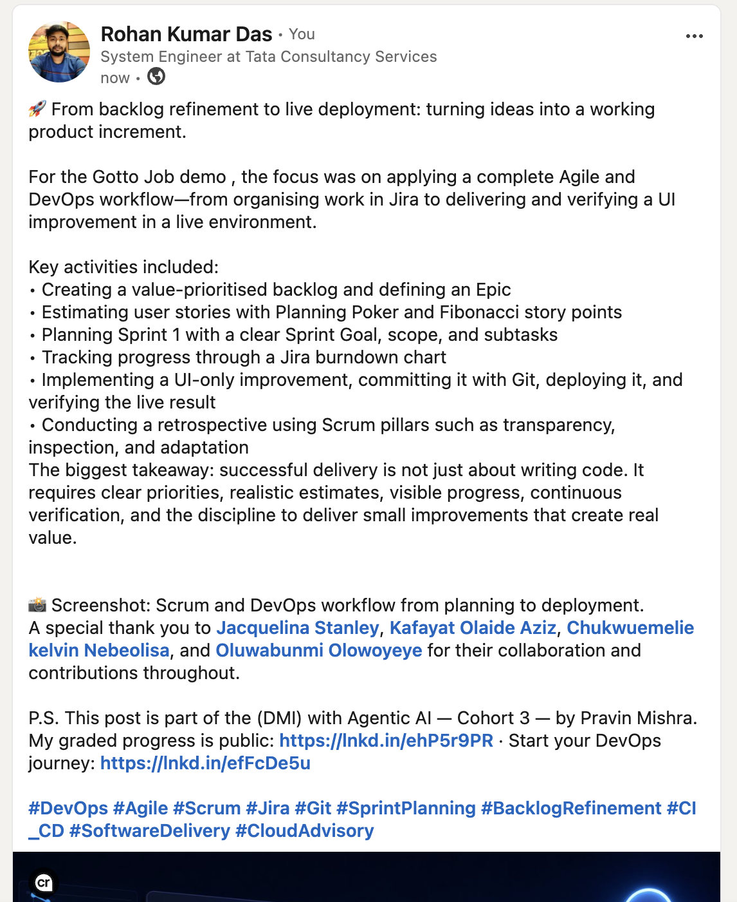
---

# Submission Instructions

- Add all 14 required screenshots
- Full name must be visible in required screenshots
- Do not expose sensitive information (keys, passwords, account IDs)

---

# Completion Checklist

- [✅] Task 1: Team Mode or Solo Mode selected and all four roles documented (Screenshot 1 & Notes)
- [✅] Task 2: Team-managed Scrum project created with the required name (Screenshot 2)
- [✅] Task 3: UI improvement Epic created (Screenshot 3)
- [✅] Task 4: 6–8 Stories added under the Epic and ranked by value (Screenshots 4 & 5)
- [✅] Task 5: Story Points set (1, 2, or 3) with reasoning recorded (Screenshot 6 & Notes)
- [✅] Task 6: Sprint 1 created with Sprint Goal, 3–4 Stories, and Sub-tasks (Screenshots 7 & 8)
- [✅] Task 7: Burndown Chart opened (Screenshot 9)
- [✅] Task 8: One UI-only increment implemented, committed, deployed, and verified (Screenshots 10–12)
- [✅] Task 9: Retro comment with one Scrum pillar and one Scrum value (Screenshot 13)
- [✅] Task 10: Mandatory LinkedIn post published with the live URL, backlog refinement, Sprint planning, one shipped increment, proof, and Screenshot 14
- [✅] Full Name visible in required screenshots
- [✅] No sensitive data exposed

---

## 📌 About DMI & CloudAdvisory

DevOps Micro Internship (DMI) is a project-based DevOps program run by Pravin Mishra (The CloudAdvisory) focused on real-world execution, systems thinking, and career readiness.

It helps learners build strong DevOps foundations with hands-on experience.

---

## 📌 Resources

- 🌐 DMI Official Website: https://dmi.pravinmishra.com?utm_source=github&utm_medium=readme  
- 🎓 University: https://university.pravinmishra.com?utm_source=github&utm_medium=readme  
- 💬 Discord Community: https://discord.pravinmishra.com?utm_source=github&utm_medium=readme  
- 📝 Blog: https://dmi.pravinmishra.com/blog?utm_source=github&utm_medium=readme  
- ▶️ YouTube Playlist: https://www.youtube.com/playlist?list=PLFeSNDtI4Cho  
- 🔗 Pravin Mishra (LinkedIn): https://www.linkedin.com/in/pravin-mishra-aws-trainer/  
- 🏢 CloudAdvisory (LinkedIn): https://www.linkedin.com/company/thecloudadvisory/

---

*This submission is part of DevOps Micro Internship (DMI) Cohort 3 — Agentic AI Track.*
