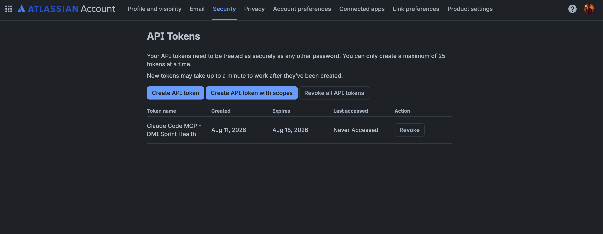
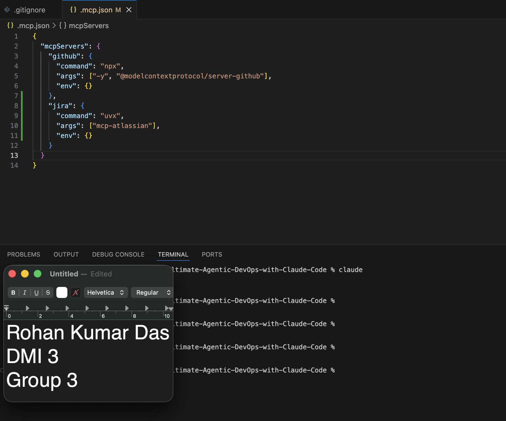
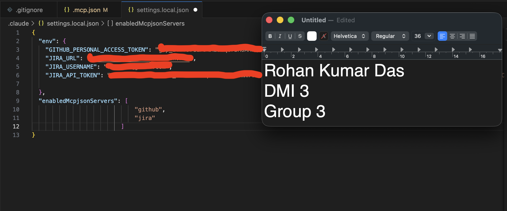
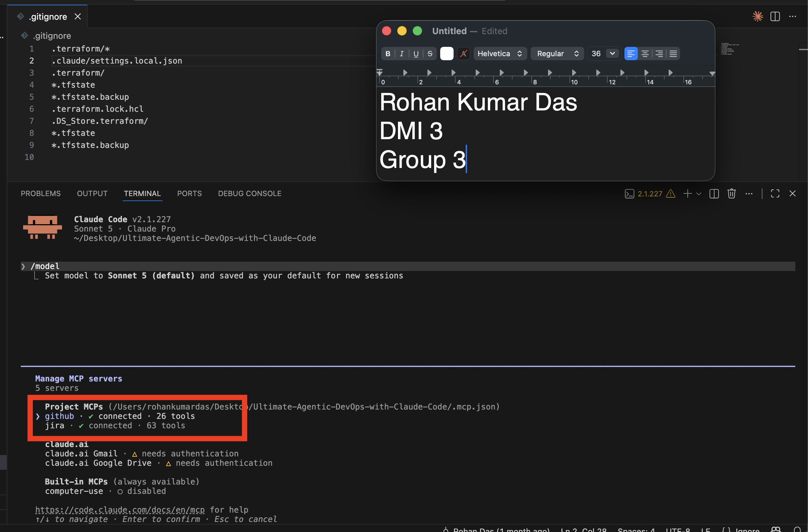
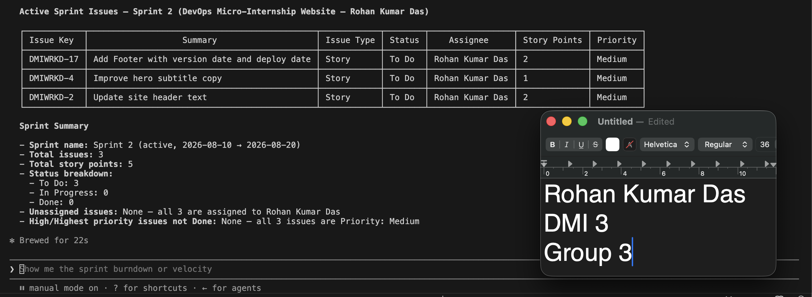
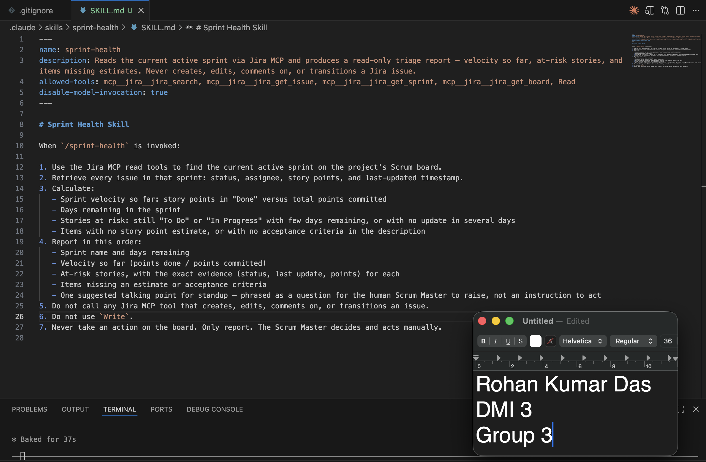
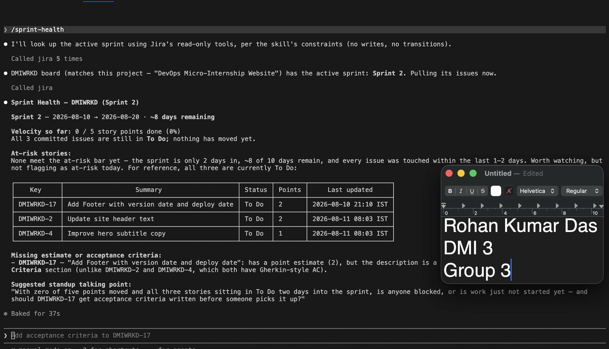
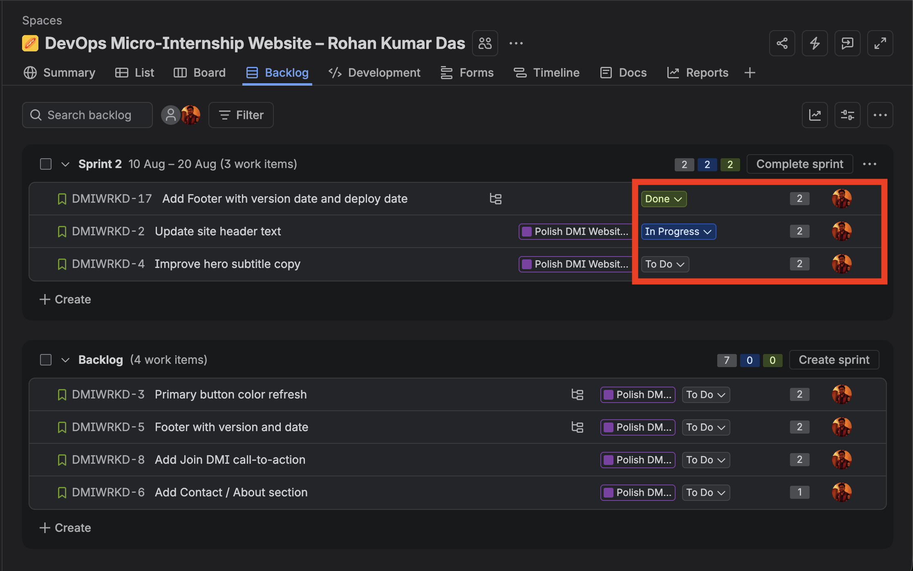
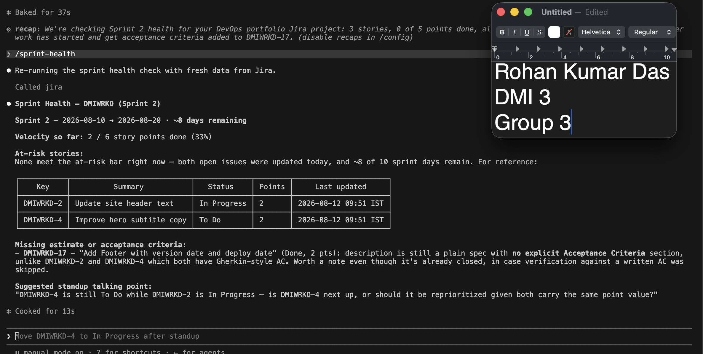

# Assignment 5 — AI-Assisted Sprint Health Report via Jira MCP

Part of the DevOps Micro Internship (DMI) Cohort 3 with Agentic AI

---

## Purpose

In this assignment, you will connect Claude Code to your Jira board through an MCP server, the same way you connected it to GitHub in Week 2, and build a read-only `/sprint-health` skill. The skill reads your current sprint through Jira's API and reports sprint velocity, stories at risk of missing the sprint, and items missing an estimate — but it must never create, edit, comment on, or transition a single ticket itself. You will prove that boundary holds by making a real change on the board yourself and confirming the skill only ever reports, never acts.

---

# Task 1 — Create a Jira API Token

## Goal

Generate an API token from your Atlassian account that the MCP server will use to authenticate with your Jira site. Do not screenshot the token value itself.

### Evidence

#### Screenshot 1 — Jira API token creation confirmation page showing the token name, with the token value not visible

### Notes You Must Write (Very Important):

Why does the MCP server need your site URL and account email in addition to the token?

The API token by itself is not enough to make a valid Jira request, because it
answers only one of three questions the server needs to resolve:

- **Site URL — *where* to send the request.** An Atlassian API token is tied to
  my Atlassian *account*, not to a single Jira site. My account could have access
  to several sites, so nothing in the token says which instance to talk to. The
  MCP server needs the base URL (e.g. `https://myname.atlassian.net`) to know
  which host to hit and which board's data to read.

- **Account email — *who* is making the request.** Atlassian Cloud's REST API
  uses HTTP Basic authentication, where the email address is the username and
  the API token is the password. The two are sent together as one encoded
  credential pair. The token is not a self-contained bearer token that carries
  identity on its own, so without the email there is no complete credential to
  send and the request comes back 401.

In short: the URL is the address, the email is the identity, and the token is
the proof. All three are needed before a single Jira API call can succeed.

---

# Task 2 — Create .mcp.json at the Project Root

## Goal

Create or update `.mcp.json` at your project root with a Jira MCP server block, following the same shape as the GitHub MCP server you configured in Week 2.

### Evidence

#### Screenshot 2 — `.mcp.json` open in VS Code showing the Jira server configuration

### Notes You Must Write (Very Important):

Compare this jira block to the github block from Week 2 Assignment 5. The GitHub server ran via npx (a Node.js package); this one runs via uvx (a Python package) — what stays exactly the same shape despite that difference, and why doesn't Claude Code care which language a given MCP server is written in?

Because MCP is a *protocol*, not a library. Claude Code never imports the server
or links against it — it just runs whatever `command` I give it and exchanges
JSON-RPC messages over the process's stdin/stdout. Everything Claude Code needs
to know (which tools exist, what arguments they take, what they return) is
discovered at runtime through the protocol's `tools/list` handshake, not from
reading the server's source.

That means `npx` vs `uvx` is nothing more than "which launcher installs and
starts this package." Node.js, Python, Go, Rust, or a compiled binary — as long
as the process speaks MCP over stdio, it is interchangeable from Claude Code's
side. This is exactly the value of an open protocol: the same client config
pattern works for every server, and adding a new integration is a config change,
not a code change.

---

# Task 3 — Add Your Credentials to settings.local.json

## Goal

Add your Jira site URL, account email, and API token to `.claude/settings.local.json`, and confirm that file is listed in `.gitignore` so it is never committed.

### Evidence

#### Screenshot 3 — `settings.local.json` open in VS Code showing the `env` section, with the actual token value blurred or covered

### Notes You Must Write (Very Important):

Why must JIRA_API_TOKEN live in settings.local.json and never in .mcp.json?

Because the two files have opposite jobs, and only one of them is safe to share.

**`.mcp.json` is committed configuration.** It sits at the project root and is
meant to be checked into Git so every teammate who clones the repo gets the same
MCP servers wired up automatically. Anything I put in it is shared — with my
team, with anyone the repo is shared with, and permanently with Git history.

**`.claude/settings.local.json` is per-developer and gitignored.** It holds the
values that are specific to *me* — my site URL, my account email, my token —
and it is listed in `.gitignore` precisely so it never leaves my machine.

So the split is: `.mcp.json` declares *what server to run and which variables it
needs*, referencing the secret only by name (`${JIRA_API_TOKEN}`);
`settings.local.json` supplies *the actual value* at runtime. The committed file
stays useful to everyone while containing nothing sensitive.

---

# Task 4 — Verify the Connection with /mcp

## Goal

Restart Claude Code and confirm the Jira MCP server shows as connected.

### Evidence

#### Screenshot 4 — `/mcp` output showing `jira: connected`

---

# Task 5 — Run a Live Query to Prove Real Board Data

## Goal

Ask Claude to list the issues in your current active sprint through the Jira MCP connection, and confirm the result matches what you see on your live board in the browser.

### Evidence

#### Screenshot 5 — Claude's response showing the live sprint issue list retrieved via Jira MCP

### Notes You Must Write (Very Important):

How did you confirm this was real board data and not something Claude guessed?

I compared the same by visiting the Jira platform from browser and compared the status and sprint.

---

# Task 6 — Build the /sprint-health Skill

## Goal

Create a `/sprint-health` skill restricted to read-only Jira tools plus `Read`, with no issue-mutating tools and no `Write`. Run it and confirm it produces a report covering sprint velocity, at-risk stories, and items missing an estimate.

### Evidence

#### Screenshot 6 — `SKILL.md` frontmatter showing `allowed-tools` limited to read-only Jira tools plus `Read`, with `disable-model-invocation: true`

#### Screenshot 7 — `/sprint-health` output showing the full triage report against your real sprint

### Notes You Must Write (Very Important):

1. Which Jira MCP tools does this skill's allowed-tools list include, and which mutating tools (create issue, update issue, transition issue, add comment) does it deliberately exclude?

**Included — four read-only Jira tools plus `Read`:**

| Tool | What it does |
|---|---|
| `mcp__jira__jira_get_board` | Locates the project's Scrum board |
| `mcp__jira__jira_get_sprint` | Identifies the current active sprint and its start/end dates |
| `mcp__jira__jira_search` | Runs JQL to pull every issue in that sprint |
| `mcp__jira__jira_get_issue` | Fetches per-issue detail: status, assignee, story points, last-updated |
| `Read` | Reads local project files (e.g. the skill's own definition) |

Every one of these is a GET-shaped operation. Together they are exactly enough
to answer "what is the state of the sprint right now" and nothing more.

**Deliberately excluded — every mutating tool:**

- `jira_create_issue` — cannot add tickets to the board
- `jira_update_issue` — cannot fill in a missing story point estimate,
  reassign, or change a due date
- `jira_transition_issue` — cannot move a story to In Progress or Done
- `jira_add_comment` / `jira_add_worklog` — cannot post on a ticket as me
- `jira_delete_issue`, `jira_link_issues`, sprint create/update tools
- `Write`, `Edit`, and `Bash` are also absent, so the skill cannot write files
  or shell out to `curl` and reach the Jira REST API around the MCP layer

`disable-model-invocation: true` closes the last gap: the skill only ever runs
when I type `/sprint-health` myself. Claude cannot decide to invoke it mid-task.

2. Why does a Scrum Master need this restriction more than almost any other role in this course?

Because for a Scrum Master, the board *is* the deliverable — and it is a shared
social artifact, not private working state.

- **The board is the team's single source of truth.** A developer's AI agent
  editing a local file affects one branch, and a bad change is caught in review
  and reverted with `git revert`. A Scrum Master's tool edits the record the
  whole team, the Product Owner, and management read to decide what is真 true.
  There is no pull request between the agent and the board.

- **Jira has no meaningful undo.** There's no diff, no `git revert`, no staging
  area. A transitioned ticket, an auto-filled estimate, or a comment posted
  under my name is immediately visible to everyone and hard to fully unwind —
  and it fires notifications and automation rules the moment it lands.

- **The failure mode here is quiet and plausible.** The most tempting "helpful"
  actions are precisely the destructive ones: the report says three stories have
  no estimate, so the agent helpfully guesses 3 points each; the sprint is
  ending, so it helpfully closes stale tickets. These changes look reasonable
  and may go unnoticed for days — while corrupting velocity data that future
  sprint planning depends on.

- **Estimates and status are human judgments, not data lookups.** A story point
  value is a negotiated team consensus about complexity; moving a ticket to Done
  is an assertion that the Definition of Done was met. An agent inferring either
  from ticket text is fabricating a judgment only the team can make.

- **Actions are attributed to me.** Any write goes to Jira through my API token,
  so a comment or transition appears with my name on it. My teammates would have
  no way to tell what I decided from what my agent decided.

- **It protects the ceremony itself.** The Scrum Master's job is to surface
  problems so the *team* resolves them at standup. An agent that silently
  "fixes" a missing estimate has erased the exact signal the standup exists to
  discuss. The point of the report is to make the conversation happen, not to
  make the problem disappear from the board.

That's why the skill's final output is a *question* for standup rather than an
action taken: the agent's job is to observe and surface, and the human's job is
to decide and act.

---

# Task 7 — Prove the Skill Never Mutates the Board

## Goal

Manually update one ticket on your board in the browser (for example, move a story to "Done" or add a missing estimate), then run `/sprint-health` again and confirm the new report reflects your change — proving the skill only ever reads live state and never wrote to the board itself.

### Evidence

#### Screenshot 8 — Second `/sprint-health` run showing the report now reflects your manual board change

### Notes You Must Write (Very Important):

Map this assignment to Gather → Analyze → Human Act → Verify from Week 3 Assignment 6. Which step did you perform manually in the browser, and why must that step stay human?

Map this assignment to Gather → Analyze → Human Act → Verify. Which step did you
perform manually in the browser, and why must that step stay human?

**Gather (agent).** `/sprint-health` calls the read-only Jira MCP tools —
`jira_get_board`, `jira_get_sprint`, `jira_search`, `jira_get_issue` — to pull
the live state of the active sprint: every issue with its status, assignee,
story points, and last-updated timestamp. Nothing is invented; every number in
the report traces back to a real API response.

**Analyze (agent).** The skill turns that raw data into judgment-free
observations: points done versus points committed, days remaining, which stories
are still open with little time left or have gone stale, and which items have no
estimate or no acceptance criteria. Each finding is reported with its evidence
attached, and the output ends in a *question* for standup rather than a
recommendation to execute.

**Human Act (me, in the browser) — this is the step I performed manually.** I
opened the board in Jira and made the change myself: [describe your actual
change, e.g. "I moved DMIWRKD-17 from To Do to Done and added a 2-point
estimate to DMIWRKD-4"]. The agent had no ability to do this — the mutating tools
are absent from `allowed-tools`, so the write could only ever come from a human
hand on the board.

**Verify (agent + me).** I ran `/sprint-health` a second time. The new report
showed the updated velocity. That second run proves two things at once: the skill
reads genuinely live state rather than caching or guessing, and the only thing
that changed the board was me. The agent bookends the human decision — it
informs it beforehand and confirms it afterward — but never makes it.

**Why Human Act must stay human:**

- **It is the only irreversible step.** Gather, Analyze, and Verify are all
  reads: run them a hundred times and the board is untouched. Act is the one
  step that changes shared reality, and in Jira it changes it for the whole team
  at once, with no diff, no review, and no `git revert`.

- **The judgment isn't in the data.** Marking a story Done asserts that the
  Definition of Done was met — something only the person who did the work knows.
  A story point value is a negotiated team consensus about complexity, not a
  field that can be derived from ticket text. An agent filling either in is
  fabricating a human judgment, not automating a lookup.

- **Accountability needs an author.** The write goes through my API token, so
  anything the agent did would appear under my name. Keeping the act human means
  every change on the board has a person who decided it and can explain why.

- **Separating read from write is what makes the agent trustworthy.** Because
  the skill *cannot* act, I can run it as often as I like without wondering what
  it touched. The value of the report comes precisely from the fact that it has
  no side effects.

- **It preserves the ceremony.** The report exists to surface problems so the
  *team* resolves them at standup. An agent that silently fixed the missing
  estimate would have erased the exact signal the standup exists to discuss.

The pattern generalizes beyond Jira: let the agent do the tedious, error-prone
gathering and correlating, keep the consequential decision with the human, and
use the agent again to confirm the change landed as intended.

---

# Submission Instructions

Complete all tasks in sequence.

Your submission must include:
- All 8 required screenshots
- All the required notes

---

# Completion Checklist

- [✅] Task 1: Jira API token created, value never screenshotted (Screenshot 1)
- [✅] Task 2: `.mcp.json` has the Jira server block (Screenshot 2)
- [✅] Task 3: Credentials stored in `settings.local.json`, token blurred, file gitignored (Screenshot 3)
- [✅] Task 4: `/mcp` shows the Jira server connected (Screenshot 4)
- [✅] Task 5: Live query returned real sprint data, verified against the browser (Screenshot 5)
- [✅] Task 6: `/sprint-health` skill created with correct read-only `allowed-tools`, and produced a full report (Screenshots 6–7)
- [✅] Task 7: A manual board change was reflected in a second `/sprint-health` run (Screenshot 8)
- [✅] Skill never created, edited, transitioned, or commented on any issue
- [✅] Reflection answered (Notes)
- [✅] No API token value exposed

---

## 📌 About DMI & CloudAdvisory

DevOps Micro Internship (DMI) is a project-based DevOps program run by Pravin Mishra (The CloudAdvisory) focused on real-world execution, systems thinking, and career readiness.

It helps learners build strong DevOps foundations with hands-on experience.

---

## 📌 Resources

- 🌐 DMI Official Website: https://dmi.pravinmishra.com?utm_source=github&utm_medium=readme  
- 🎓 University: https://university.pravinmishra.com?utm_source=github&utm_medium=readme  
- 💬 Discord Community: https://discord.pravinmishra.com?utm_source=github&utm_medium=readme  
- 📝 Blog: https://dmi.pravinmishra.com/blog?utm_source=github&utm_medium=readme  
- ▶️ YouTube Playlist: https://www.youtube.com/playlist?list=PLFeSNDtI4Cho  
- 🔗 Pravin Mishra (LinkedIn): https://www.linkedin.com/in/pravin-mishra-aws-trainer/  
- 🏢 CloudAdvisory (LinkedIn): https://www.linkedin.com/company/thecloudadvisory/

---

*This submission is part of DevOps Micro Internship (DMI) Cohort 3 — Agentic AI Track.*
