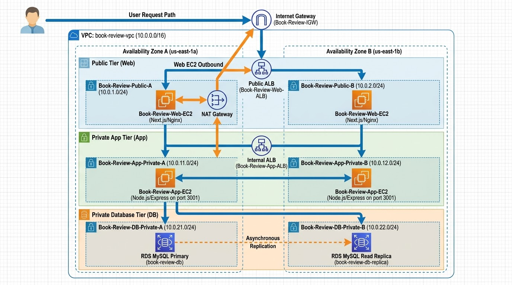
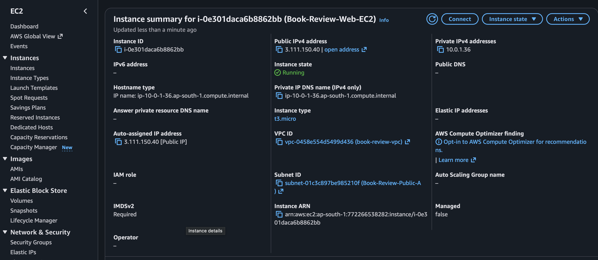
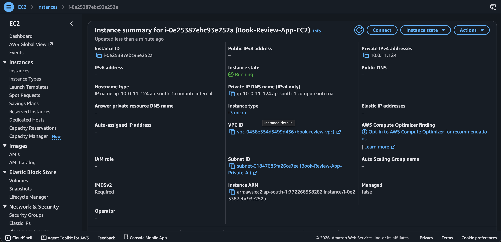
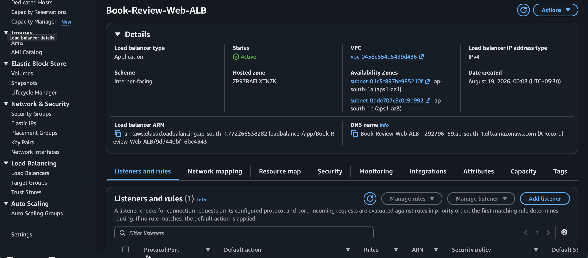
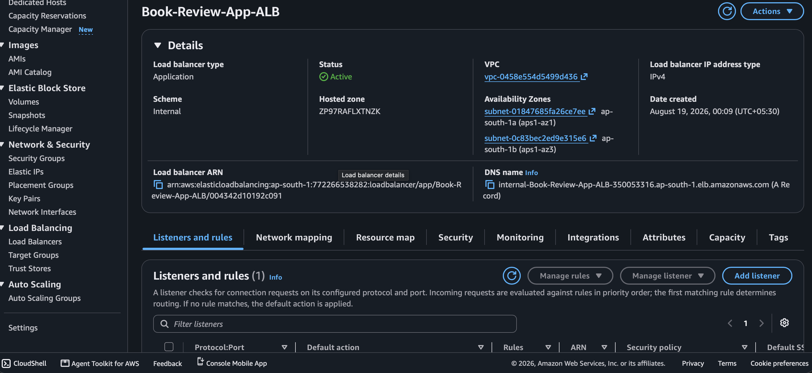
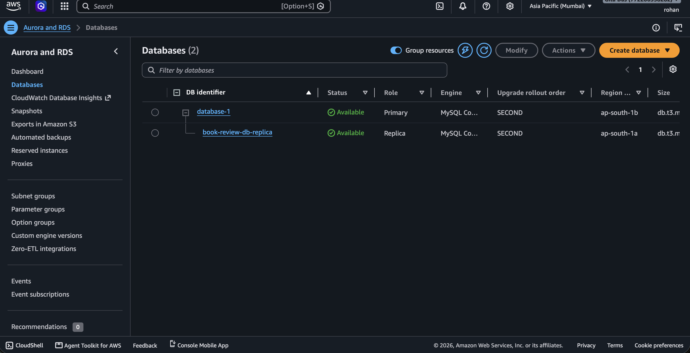
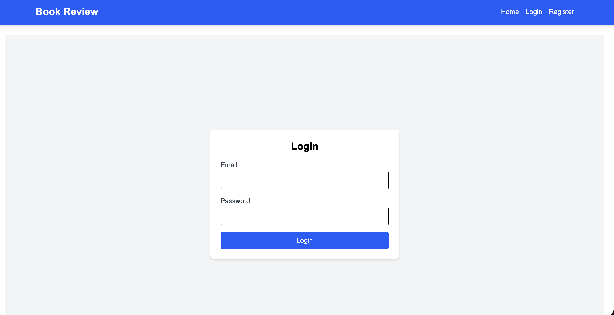
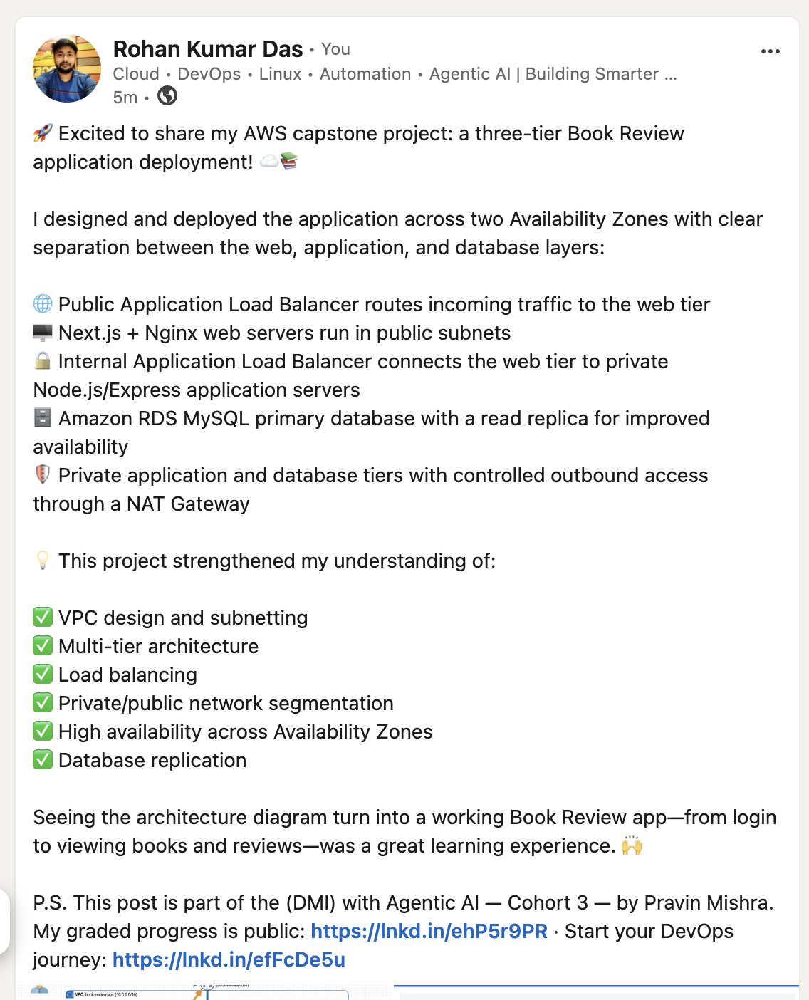

# Assignment 6 — Capstone Assignment — Deploy Book Review App (Three-Tier Architecture) on AWS

Part of the DevOps Micro Internship (DMI) Cohort 3 with Agentic AI

---

## Purpose

This is the most important assignment of the course. You will deploy the Book Review App in a fully production-style three-tier architecture on AWS: a Next.js Web Tier behind Nginx and a public ALB, a private Node.js/Express App Tier behind an internal ALB, and a private Multi-AZ MySQL RDS database with a read replica. You are expected to design, deploy, isolate, debug, and document the result independently.

---

# Task 1 — Architecture Diagram

## Goal

Create an architecture diagram showing the custom VPC (10.0.0.0/16), the six subnets across two Availability Zones (two public Web Tier, two private App Tier, two private Database Tier), the public ALB, Web Tier EC2/Nginx, internal ALB, private App Tier EC2, private Multi-AZ RDS with its read replica, and the permitted traffic flow.

### Evidence

#### Diagram image or link

---

# Task 2 — AWS Region & Services Used

## Goal

Record the AWS Region used and list every AWS service used across networking, compute, load balancing, security, and the database.

### Notes

**Region:**

ap-south-1 (Asia Pacific - Mumbai) region

---

**Services:**

Amazon VPC, VPC Subnets, Internet Gateway & NAT Gateway, Amazon EC2, Elastic Load Balancing (ELB), Target Groups, Amazon RDS (Relational Database Service)
---

# Task 3 — Public Entry Point

## Goal

Confirm the Book Review App loads through the public ALB DNS name.

### Evidence

#### Public ALB DNS

Paste your public ALB DNS name here:

http://Book-Review-Web-ALB-1292796159.ap-south-1.elb.amazonaws.com

---

# Task 4 — Evidence Screenshots

## Goal

Capture visual proof of every tier and load balancer.

### Evidence

#### Web EC2

---

#### App EC2

---

#### Public ALB

---

#### Internal ALB

---

#### RDS + Replica

---

#### App UI proof

---

# Task 5 — Summary

## Goal

Summarize what worked in the final deployment, the issues encountered and how each was fixed, and the tools or sources used to research and debug.

### Notes

**What worked:**

Robust High-Availability Network Layer: Our custom VPC (book-review-vpc) with six subnets successfully segmented the web, app, and database tiers across two active Availability Zones (ap-south-1a and ap-south-1b), establishing a highly secure networking baseline with redundant routing tables and gateways.

Highly Resilient Database Tier: The managed MySQL RDS deployment functioned perfectly, replicating write operations from our primary DB instance (database-1) in Mumbai AZ-B asynchronously to our Read Replica database (book-review-db-replica) in AZ-A to safely offload and scale read queries.

Path-Based Application Traffic Routing: Network traffic cleanly traversed our architecture: public internet users successfully reached Nginx on the Web EC2 via the internet-facing Public ALB, and Nginx acted as a reverse proxy to route frontend page requests locally and forward API calls securely through the Internal ALB to our Express backend on port 3001.

System Persistence & Boot Survivability: Implementing PM2 globally and linking it to Ubuntu's systemd manager ensured that our frontend and backend processes continued running as independent background daemons and would automatically recover after server reboots
---

**Issues + fixes:**

Application Processes Terminating on SSH Exit:
Issue: Initially launching the backend with node src/server.js and the frontend with npm start meant application processes were bound to active SSH sessions; closing the terminals killed the servers and took the platform down.

Fix: Started both apps under PM2 daemon control (pm2 start), ran pm2 startup to integrate with Ubuntu's systemd, and executed pm2 save to preserve the persistent process lists.

Nginx Serving Default Landing Page instead of App UI:
Issue: Nginx on the Web EC2 kept serving its default "Welcome to nginx" page instead of your Next.js application because the custom configuration file existed in sites-available but was not active.

Fix: Created a symbolic link using sudo ln -s to link the block into /etc/nginx/sites-enabled/, deleted Nginx's default site file, ran sudo nginx -t to verify the configuration syntax, and restarted the Nginx service.

Mismatched API Routes (Avoided Path Stripping):
Issue: Configuring Nginx with an incorrect forwarding path pattern risked stripping the /api prefix when sending traffic to the private Internal ALB, which would cause the backend to return 404 errors.

Fix: Deliberately left the trailing slash off the proxy_pass target block in the Nginx configuration, forcing Nginx to forward the full, original request path directly to the application layer.

Client-Side API Path Doubling (/api/api/):
Issue: Live browser testing exposed a path-doubling bug on client-side API requests (e.g. attempting to fetch /api/api/books), rendering the browser unable to load dynamic data despite command-line tests passing.

Fix: Configured .env.local on the Web EC2 with NEXT_PUBLIC_API_URL=/api to enforce relative routing
, then ran npm run build to bake this same-origin path directly into the compiled Next.js client-side bundles prior to restarting the server.

---

**Tools/sources used:**

Layered CLI curl Diagnostics: Used systematically across multiple network boundaries—testing the Express API locally (localhost:3001), the Next.js UI locally (localhost:3000), the Nginx reverse proxy locally (localhost/api/books), and finally the Public ALB DNS endpoint—to pinpoint exactly which network hop was blocking traffic.

Browser Console Inspections: Executed end-to-end functional flows in a live web browser (testing account registration, user logins, and posting book reviews) to catch client-side JavaScript execution bugs that simple command-line triggers missed.

PM2 Process Tooling: Utilised pm2 status, pm2 logs, and pm2 restart to capture output streams, debug crash tracebacks, and seamlessly apply updated environment settings.

MySQL Command-Line Client: Deployed mysql-client with SSL certificate verification from inside the App EC2 to test private security group connectivity, inspect existing databases, and execute the CREATE DATABASE book_review_db; schema initialization before launching Express.

---

# LinkedIn Post (Required)

## Goal

Publish a LinkedIn post sharing the capstone deployment, including the public ALB DNS (or a redacted screenshot), three to five lines on what you built and why it is production-style, and one proof screenshot.

## Evidence

#### LinkedIn Post URL

https://lnkd.in/p/dayyBt3i

---

#### Screenshot of LinkedIn post

---

# Submission Instructions

- Add all required screenshots and links in your submission
- Do not expose passwords, RDS credentials, connection strings, private keys, or account IDs

---

# Completion Checklist

- [✅] Task 1: Architecture diagram completed
- [✅] Task 2: AWS Region and services documented
- [✅] Task 3: Public ALB DNS confirmed working
- [✅] Task 4: All six evidence screenshots captured (Web Tier, App Tier, both ALBs, RDS + replica, app UI)
- [✅] Task 5: Deployment summary completed (what worked, issues/fixes, tools/sources)
- [✅] LinkedIn post published and URL submitted
- [✅] App Tier and Database Tier confirmed not publicly accessible
- [✅] No sensitive data exposed

---

## 📌 About DMI & CloudAdvisory

DevOps Micro Internship (DMI) is a project-based DevOps program run by Pravin Mishra (The CloudAdvisory) focused on real-world execution, systems thinking, and career readiness.

It helps learners build strong DevOps foundations with hands-on experience.

---

## 📌 Resources

- 🌐 DMI Official Website: https://dmi.pravinmishra.com?utm_source=github&utm_medium=readme  
- 🎓 University: https://university.pravinmishra.com?utm_source=github&utm_medium=readme  
- 💬 Discord Community: https://discord.pravinmishra.com?utm_source=github&utm_medium=readme  
- 📝 Blog: https://dmi.pravinmishra.com/blog?utm_source=github&utm_medium=readme  
- ▶️ YouTube Playlist: https://www.youtube.com/playlist?list=PLFeSNDtI4Cho  
- 🔗 Pravin Mishra (LinkedIn): https://www.linkedin.com/in/pravin-mishra-aws-trainer/  
- 🏢 CloudAdvisory (LinkedIn): https://www.linkedin.com/company/thecloudadvisory/

---

*This submission is part of DevOps Micro Internship (DMI) Cohort 3 — Agentic AI Track.*