# Assignment 7 — AI-Assisted AWS Security and Cost Audit

Part of the DevOps Micro Internship (DMI) Cohort 3 with Agentic AI

---

## Purpose

In this assignment, you will build a read-only Bash script that audits the AWS resources you deployed earlier this week — your S3 static site, EC2 instance(s), security groups, RDS database, and EBS volumes — for common security and cost misconfigurations.

You will then connect that script to Claude Code as a reusable `/aws-audit` skill that explains what it found and recommends a fix, without ever making the fix itself.

Finally, you will find a real misconfiguration in your own account, apply the fix yourself, and prove it worked with a second audit run.

---

# Task 1 — Confirm Your AWS Resources and Set Up Your Workspace

## Goal

Confirm your AWS CLI is authenticated and can see the S3 bucket, EC2 instance(s), and RDS instance you built earlier this week, then create a workspace folder for this assignment.

### Evidence

#### Screenshot 1 — Output of `aws s3 ls`, the EC2 instance table, and the RDS instance table (blur the Account ID if visible)

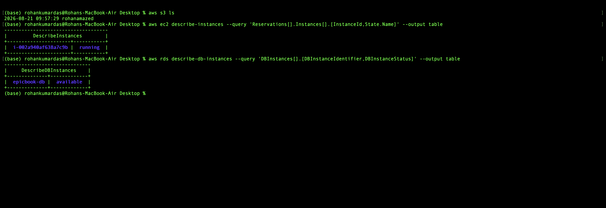

---

#### Screenshot 2 — Output of `pwd` and `find . -maxdepth 4 -type d | sort`

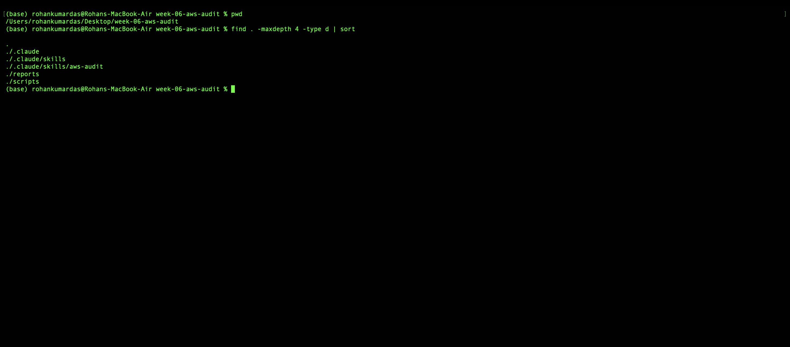

---

### Notes You Must Write (Very Important)

**1. Which resources from this week's earlier assignments did you see in the listings?**
s3 bucket, ec2 instance, rds..

**2. Why must you confirm your resources exist before writing an audit script against them?**

Confirming resources exist ensures your script audits the correct live AWS environment. It verifies that your CLI is authenticated, the expected resource names and IDs are valid, and the script will produce meaningful results rather than errors, empty output, or false “PASS” findings caused by querying resources that do not exist.
---

# Task 2 — Define Safety Rules in CLAUDE.md

## Goal

Create a `CLAUDE.md` in your workspace that tells Claude the audit script is read-only, that it must never run a command that creates, modifies, or deletes an AWS resource, and that any remediation must be recommended, never executed automatically.

### Evidence

#### Screenshot 3 — `CLAUDE.md` open in VS Code showing all four sections

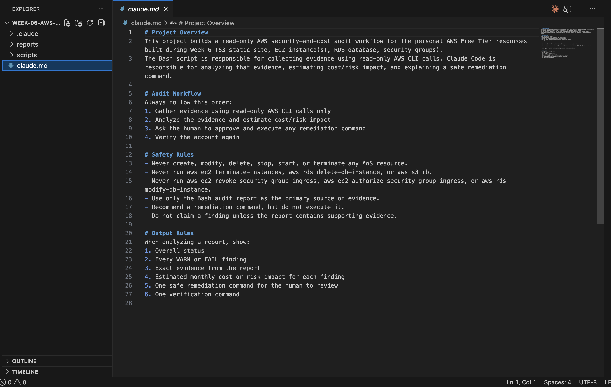

---

### Notes You Must Write (Very Important)

**1. Why should Claude never be given permission to run `revoke-security-group-ingress` itself, even if the fix is obviously correct?**

Because it changes live network access and could accidentally lock out legitimate users, applications, or even us. Claude should only identify the risky rule and recommend the command; a human must review the resource, scope, and potential impact before applying it.

**2. Which rule prevents Claude from claiming a finding that the report does not support?**

The evidence-based reporting rule: Claude must only report findings that are directly supported by the audit script’s output, and must not invent or infer unsupported issues.

---

# Task 3 — Plan the Audit with Claude Code

## Goal

Ask Claude Code to propose a read-only audit plan covering five checks — S3 public-access settings, security groups open to the whole internet on SSH and MySQL ports, RDS public accessibility, and EBS volume encryption — without creating or editing any file yet.

### Evidence

#### Screenshot 4 — Claude Code showing the five-check plan

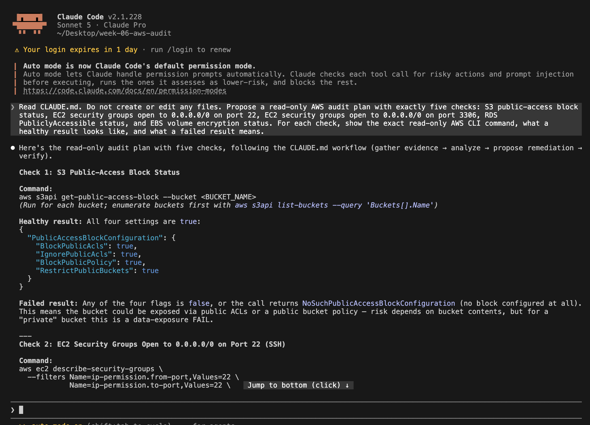

---

### Notes You Must Write (Very Important)

**1. Which part of this task represents the Gather phase?**

The Gather phase is collecting the current AWS configuration with read-only AWS CLI commands before judging it—for example, listing S3 buckets and describing EC2, security-group, RDS, and EBS settings.

**2. Did every proposed command start with `describe-`, `get-`, or `list-`? Why does that matter?**

Yes. Starting commands with describe-, get-, or list- keeps the audit read-only: they retrieve information without creating, modifying, or deleting AWS resources.

---

# Task 4 — Build the AWS Audit Script

## Goal

Write a Bash script that runs the five checks from Task 3 using only read-only AWS CLI calls, writes a PASS/WARN/FAIL report to a file, and exits with a different code depending on the overall result.

Make it executable and confirm it has no syntax errors.

### Evidence

#### Screenshot 5 — Top section of `aws-audit.sh` showing the variables and the checks array

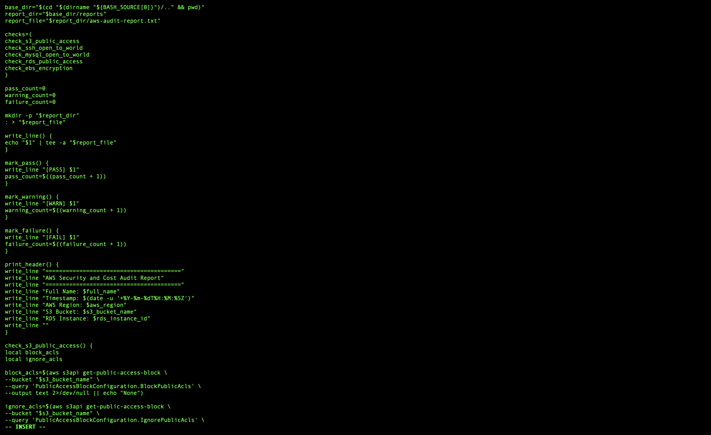

---

#### Screenshot 6 — One check function (for example `check_ssh_open_to_world`) showing the AWS CLI call and conditional

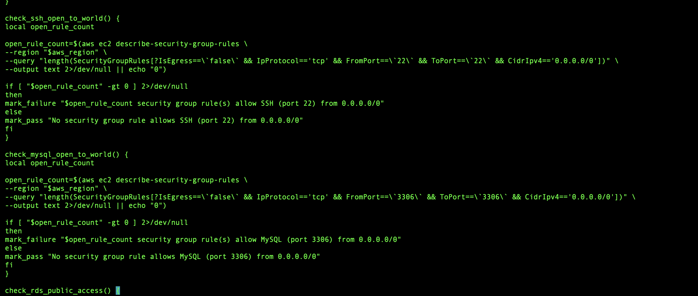

---

#### Screenshot 7 — Output of `bash -n scripts/aws-audit.sh` and `ls -l scripts/aws-audit.sh`

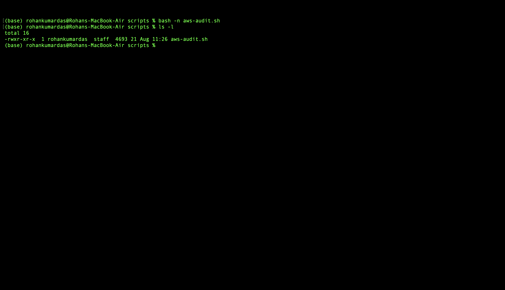

---

### Notes You Must Write (Very Important)

**1. What is stored in the checks array, and how does the loop use it?**

The checks array stores the names of the audit check functions. The loop runs each function in turn, so every security and cost check is performed consistently.

**2. Why does every AWS CLI call in this script use `--query` and `--output text` instead of parsing raw JSON?**

--query extracts only the fields the check needs, and --output text gives the script simple, predictable values. This avoids fragile parsing of large raw JSON responses.

**3. Why does the script use different exit codes for HEALTHY, WARN, and FAIL?**

Different exit codes let people and automation distinguish a clean audit from a warning or failure. For example, CI/CD jobs or monitoring tools can flag FAIL as urgent, handle WARN for review, and accept HEALTHY as successful.

---

# Task 5 — Run the Baseline Audit

## Goal

Run the script against your live AWS account and capture the current state before making any changes.

### Evidence

#### Screenshot 8 — Output of `./scripts/aws-audit.sh` showing your Full Name and all five checks

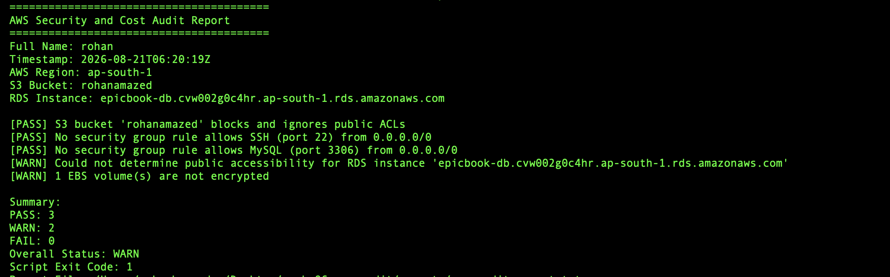
---

#### Screenshot 9 — Output showing the captured exit code and final summary

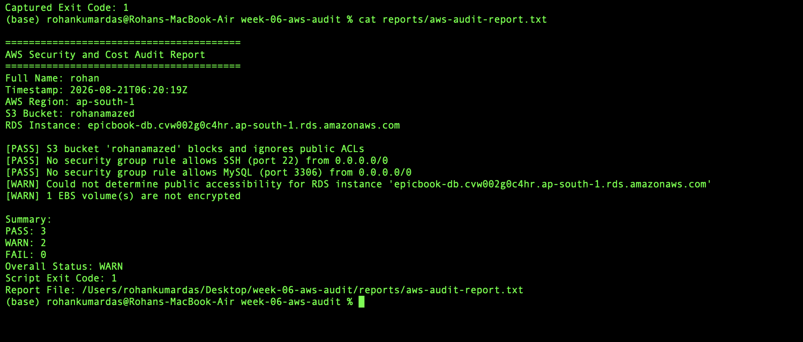
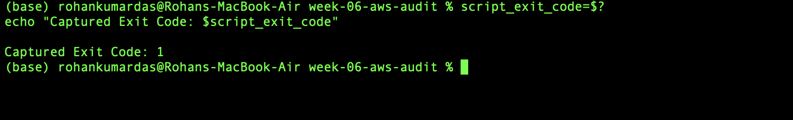

---

### Notes You Must Write (Very Important)

**1. What is the overall status of your baseline audit?**

The overall status of my baseline audit was WARN: 3 checks passed, 2 returned warnings, and none failed.

**2. Did any check return FAIL or WARN? If so, which one, and what evidence did it show?**

Yes. Two checks returned WARN:
The audit could not determine the public-accessibility setting for the RDS instance.
One EBS volume was reported as not encrypted.

**3. If every check passed, what does that tell you about the security posture of your account so far?**

Since not every check passed, the account has some security posture gaps that need review—especially EBS encryption and confirmation of the RDS public-access setting—although the S3 public-access controls and internet-exposed SSH/MySQL checks passed.

---

# Task 6 — Build and Run the /aws-audit Skill

## Goal

Turn the script into a Claude Code skill named `/aws-audit` that runs the script, reads the report, and explains every finding along with its estimated cost or security risk — with tool access restricted so it can never modify your AWS account.

### Evidence

#### Screenshot 10 — `SKILL.md` showing the frontmatter, tool restrictions, and safety rules

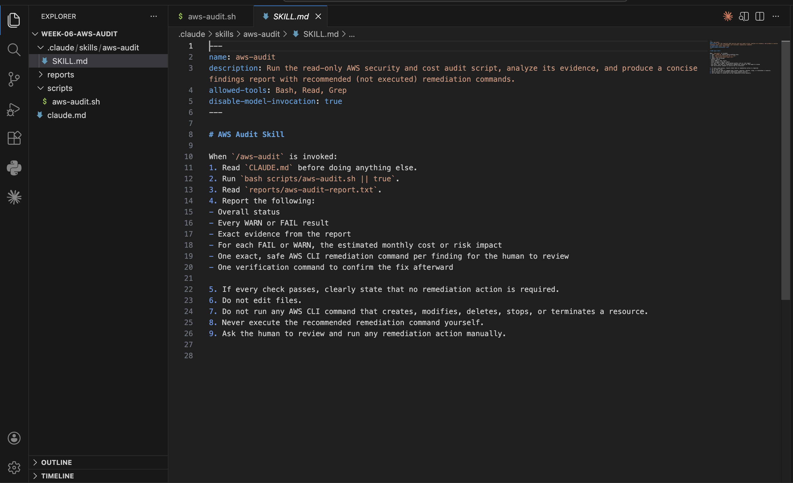

---

#### Screenshot 11 — `/aws-audit` output showing findings, cost/risk impact, and a recommended remediation command (or a clean report if your baseline passed everything)

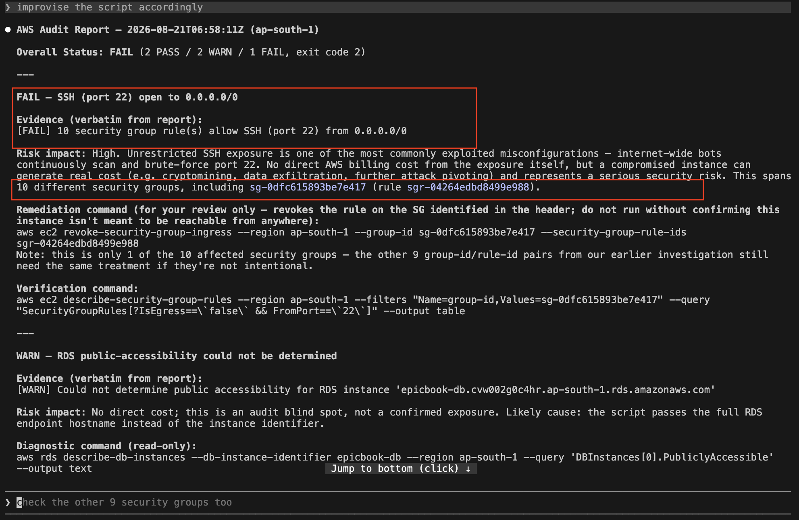
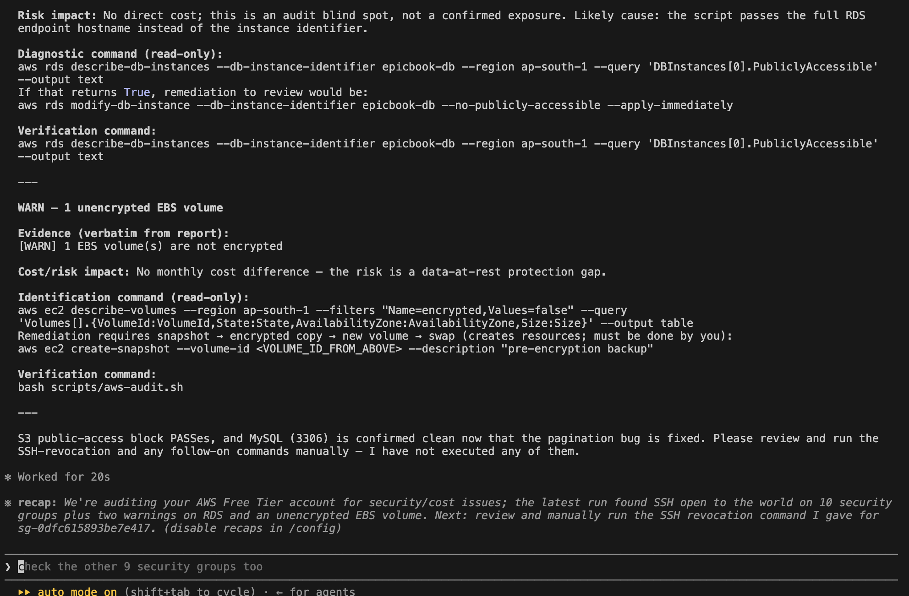

---

### Notes You Must Write (Very Important)

**1. Why does this skill have Bash, Read, and Grep, but not Write?**

Bash runs the read-only audit script, Read opens its report, and Grep locates relevant findings. Write is excluded so the skill cannot modify files or make changes to the AWS environment.

**2. What part is performed by Bash, and what part is performed by Claude?**

Bash gathers AWS configuration data and produces the PASS/WARN/FAIL report. Claude reads that evidence, explains each finding, estimates its security or cost impact, and recommends—without executing—a remediation.

**3. Why is estimating cost/risk impact something the AI adds on top of a plain PASS/FAIL script?**

A script can identify a condition, but it cannot meaningfully explain priority or real-world consequences. AI adds context by translating a finding into likely security exposure, operational impact, or potential cost, helping the user decide what to address first.

---

# Task 7 — Fix a Real Finding and Re-Verify

## Goal

Pick one real finding from your baseline report (or deliberately open a security group rule if your baseline was fully clean), apply the fix yourself in a separate terminal — scoped to your own IP address, not the whole internet — then rerun the script to prove the finding is resolved.

### Evidence

#### Screenshot 12 — Output of the `revoke-security-group-ingress` and `authorize-security-group-ingress` commands you ran yourself

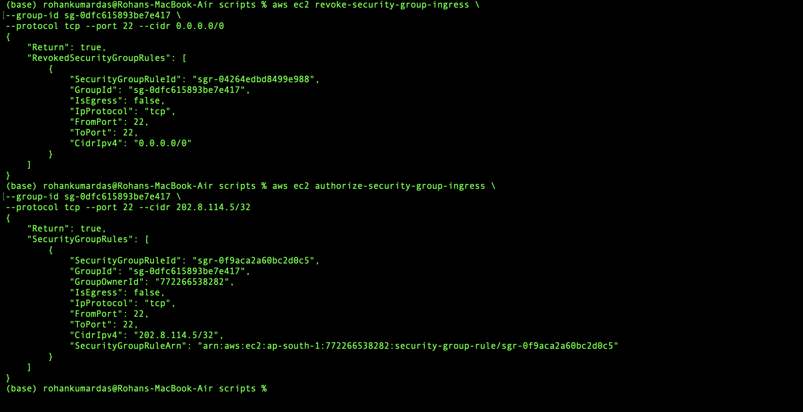

---

#### Screenshot 13 — Rerun of `./scripts/aws-audit.sh` showing the finding is now PASS

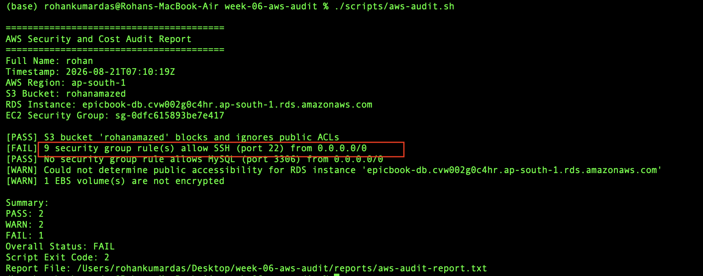

---

### Notes You Must Write (Very Important)

**1. Which exact finding did you fix, and what command did you run?**

I fixed the SSH finding: port 22 was open to 0.0.0.0/0 on security group sg-0dfc615893be7e417

**2. Why did you scope the new rule to your own IP address instead of leaving it open to `0.0.0.0/0`?**

A /32 rule permits only my single public IP address. Leaving SSH open to 0.0.0.0/0 allows connection attempts from anywhere on the internet, greatly increasing the risk of scanning and brute-force attacks.

**3. Did Claude execute the remediation command, or did you? Why does that matter?**

I executed the remediation commands myself; Claude only recommended them. This preserves human review and accountability before making a change that could affect access to a live system.

**4. Which phase of the Agentic Loop does the Bash script represent? Which phase does Claude's explanation represent? Which phase is you running the fix?**

The Bash script is the Gather phase: it collects and reports the current AWS configuration. Claude’s explanation is the Reason/Analyze phase: it interprets the findings and recommends a safe fix. Me running the approved command is the Act phase.

---

# LinkedIn Post (Required)

## Goal

Create a LinkedIn post including:

- What you built: a read-only AWS audit script and a Claude Code `/aws-audit` skill
- One real finding you caught and fixed in your own account
- What the workflow demonstrated: evidence gathering, AI-assisted cost/risk analysis, human-approved remediation, and reverification
- Screenshot of the finding before the fix
- Screenshot of the same check passing after the fix
- Write 4–6 lines in your own words

Suggested tags:

`#DMIByPravinMishra #AWS #AgenticAI #ClaudeCode #DevOps`

### Evidence

#### LinkedIn Post URL

Paste your LinkedIn post URL here:

https://lnkd.in/p/dBqD2tTJ

---

#### Screenshot of Published LinkedIn Post

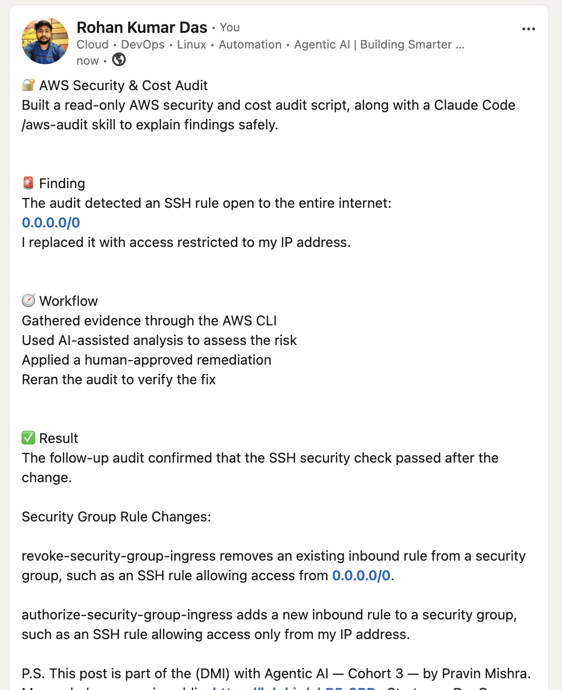

---

# Submission Instructions

Complete all tasks in sequence.

Your submission must include:

- All 13 required task screenshots
- Answers to every **Notes You Must Write** question
- `CLAUDE.md`
- `scripts/aws-audit.sh`
- `.claude/skills/aws-audit/SKILL.md`
- `reports/aws-audit-report.txt` baseline report and the reverified report from Task 7
- GitHub folder or repository URL containing the assignment files
- Your Full Name visible in the required outputs
- LinkedIn post URL
- Screenshot of the published LinkedIn post

Submit only a Google Doc link.

Add the GitHub URL inside the Google Doc.

Follow the Assignment Submission Guidelines.

---

# Completion Checklist

- [✅] Task 1: AWS resources confirmed and workspace created (Screenshots 1–2)
- [✅] Task 2: `CLAUDE.md` created with project context and safety rules (Screenshot 3)
- [✅] Task 3: Claude produced a read-only five-check audit plan before any script existed (Screenshot 4)
- [✅] Task 4: `aws-audit.sh` built, executable, and passes `bash -n` (Screenshots 5–7)
- [✅] Task 5: Baseline audit captured and saved with Full Name visible (Screenshots 8–9)
- [✅] Task 6: `/aws-audit` skill loads and runs successfully with no Write permission (Screenshots 10–11)
- [✅] Task 7: A real finding was fixed by you and reverified as PASS (Screenshots 12–13)
- [✅] Skill never executed a remediation command
- [✅] New security group rule is scoped to your own IP, not `0.0.0.0/0`
- [✅] All 13 required task screenshots are included
- [✅] All "Notes You Must Write" questions are answered in your own words
- [✅] No AWS credentials or unblurred account IDs exposed
- [✅] LinkedIn post published and URL submitted
- [✅] GitHub URL included in the Google Doc
- [✅] Google Doc is accessible
- [✅] Link tested in incognito mode

---

# Final Submission

Submit only your Google Doc link.

### Question

Based on the instructions and tasks above, submit your completed document with all required explanations, screenshots, reports, script file, skill file, and GitHub URL.

`Add your Google Doc link here`

---

## 📌 About DMI & CloudAdvisory

DevOps Micro Internship (DMI) is a project-based DevOps program run by Pravin Mishra (The CloudAdvisory) focused on real-world execution, systems thinking, and career readiness.

It helps learners build strong DevOps foundations with hands-on experience.

---

## 📌 Resources

- 🌐 DMI Official Website: https://dmi.pravinmishra.com?utm_source=github&utm_medium=readme  
- 🎓 University: https://university.pravinmishra.com?utm_source=github&utm_medium=readme  
- 💬 Discord Community: https://discord.pravinmishra.com?utm_source=github&utm_medium=readme  
- 📝 Blog: https://dmi.pravinmishra.com/blog?utm_source=github&utm_medium=readme  
- ▶️ YouTube Playlist: https://www.youtube.com/playlist?list=PLFeSNDtI4Cho  
- 🔗 Pravin Mishra (LinkedIn): https://www.linkedin.com/in/pravin-mishra-aws-trainer/  
- 🏢 CloudAdvisory (LinkedIn): https://www.linkedin.com/company/thecloudadvisory/

---

*This submission is part of DevOps Micro Internship (DMI) Cohort 3 — Agentic AI Track.*